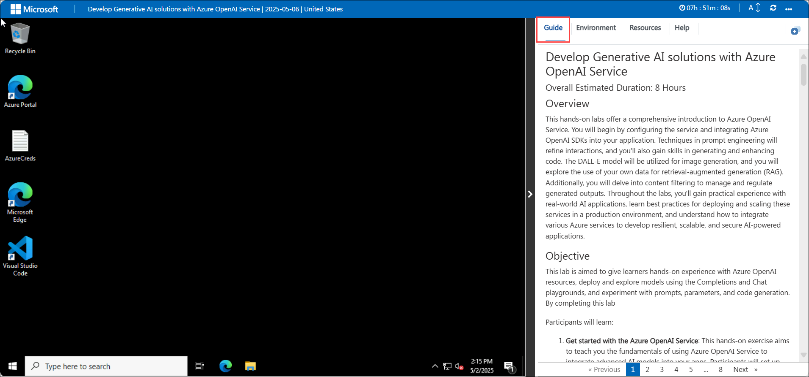
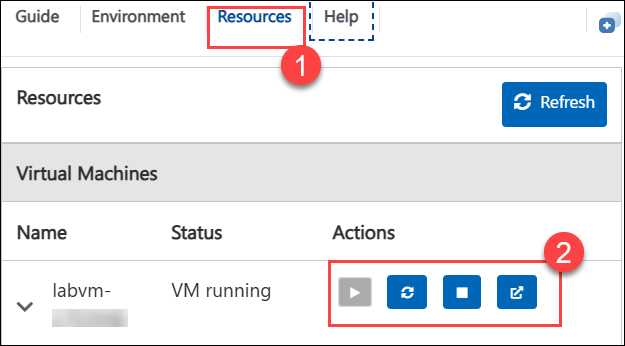
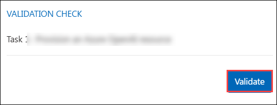
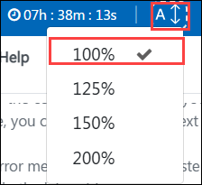

# Develop Generative AI solutions with Azure OpenAI Service

## Overall Estimated Duration: 8 Hours

## Overview

This hands-on lab offers a comprehensive introduction to the Azure OpenAI Service. You will begin by configuring the service and integrating Azure OpenAI SDKs into your application. Techniques in prompt engineering will refine interactions, and you'll also gain skills in generating and enhancing code. The DALL-E model will be utilized for image generation, and you will explore the use of your own data for retrieval-augmented generation (RAG). Additionally, you will delve into content filtering to manage and regulate generated outputs. Throughout the labs, you'll gain practical experience with real-world AI applications, learn best practices for deploying and scaling these services in a production environment, and understand how to integrate various Azure services to develop resilient, scalable, and secure AI-powered applications.

## Objective 

This lab is aimed at giving learners hands-on experience with Azure OpenAI resources, deploying and exploring models using the Completions and Chat playgrounds, and experimenting with prompts, parameters, and code generation. By completing this lab

Participants will learn:

1. **Get started with the Azure OpenAI Service**: This hands-on exercise aims to teach you the fundamentals of using Azure OpenAI Service to integrate advanced AI models into your apps. Participants will set up and begin utilizing the Azure OpenAI Service to integrate AI models into their applications.

2. **Use Azure OpenAI SDKs in your app**: This hands-on exercise demonstrates how to integrate Azure OpenAI SDKs into your application to improve AI capabilities. Participants will integrate and use Azure OpenAI SDKs within their application.

3. **Utilize prompt engineering in your app**: This hands-on exercise demonstrates how to use prompt engineering methods to improve AI interactions in your application. Participants will use prompt engineering strategies to enhance the performance and relevance of AI.

4. **Generate and improve code with Azure OpenAI Service**: The goal of this hands-on exercise is to demonstrate how to effectively generate and refine code using Azure OpenAI. Participants will improve their abilities to create and refine code with Azure OpenAI Service tools and approaches.

5. **Generate images with a DALL-E model**: The goal of this hands-on activity is to produce and alter images using the DALL-E model. To attain the intended visual results, participants will develop and alter images using the DALL-E model.

6. **Add your data for RAG using Azure OpenAI Service**: This hands-on exercise will help you integrate your data with the Azure OpenAI Service for Retrieval-Augmented Generation (RAG) to improve AI responses. Participants will integrate data into the Azure OpenAI Service to boost AI-powered retrieval and generation.

7. **Explore content filters in Azure OpenAI**: This hands-on exercise demonstrates how to construct and maintain content filters in Azure OpenAI to control and refine generated outputs. Participants will learn about and implement content filters in Azure OpenAI to control and refine created material.

## Prerequisites

Participants should have:

1. **Development Skills**: Basic programming knowledge and experience with APIs and SDKs.
2. **AI Concepts**: Understanding prompt engineering, code development, and image generation using models such as DALL-E.
3. **Content Management**: Understanding data integration for RAG and content filtering techniques.
   
## Architecture

This lab provides robust functionalities for leveraging AI within Azure. Azure OpenAI integrates your data with large language models, enabling customized and secure interactions tailored to your needs. Azure OpenAI Models offer pre-trained and customizable models for various applications, such as text generation and language translation. Azure CloudShell provides an online, browser-based shell for managing Azure resources and running scripts, streamlining cloud management. DALL-E generates images from textual descriptions using advanced AI technology, enhancing creative capabilities. Finally, prompt engineering refines input prompts to optimize AI model responses, ensuring accuracy and relevance in outputs.

## Architecture Diagram

## Explanation of Components

The architecture for this lab involves the following key components:

- **Azure OpenAI**: Integrates your data with massive language models, allowing for personalized and secure interactions. Allows for fine-tuning of AI models with your own datasets, resulting in specialized and relevant outputs for your business needs.
- **Azure OpenAI Models**: Provides pre-trained and customisable big language models for a variety of AI applications, including text generation, sentiment analysis, and language translation, with the option to tailor models to specific use cases.
- **Azure CloudShell**: Offers an online, browser-based shell for managing Azure resources and running scripts. Allows you to deploy, manage, and automate Azure services directly from your web browser, eliminating the need for local installations.
- **DALL-E**: DALL-E uses artificial intelligence technology to generate visuals from written descriptions. Enhances creativity by translating word inputs into distinct and coherent pictures.
- **Prompt Engineering**: Prompt engineering fine-tunes input prompts to improve AI model replies, ensuring accurate and relevant outputs by optimizing how prompts are produced and delivered to AI models.
- **AI chat**: AI chat, also known as an AI chatbot or conversational AI, is a technology that uses artificial intelligence to facilitate automated, human-like conversations between machines and users. These systems are designed to understand and interpret natural language inputs, enabling them to respond in a way that simulates a real conversation.

# Getting Started with the lab
 
Welcome to your Develop Generative AI Solutions with Azure OpenAI service workshop! We've prepared a seamless environment for you to explore and learn about the connection between artificial intelligence (AI), Responsible AI, and text, code, and image generation. Let's begin by making the most of this experience:
 
## Accessing Your Lab Environment
 
Once you're ready to dive in, your virtual machine and lab guide will be right at your fingertips within your web browser.

   

### Virtual Machine & Lab Guide
 
Your virtual machine is your workhorse throughout the workshop. The lab guide is your roadmap to success.
 
## Exploring Your Lab Resources
 
To get a better understanding of your lab resources and credentials, navigate to the **Environment** tab.
 
   
 
## Utilizing the Split Window Feature
 
For convenience, you can open the lab guide in a separate window by selecting the **Split Window** button from the Top right corner.
 
 
 
## Managing Your Virtual Machine
 
Feel free to **Start, Stop, or Restart** your virtual machine as needed from the **Resources** tab. Your experience is in your hands!
 

## Lab Validation

After completing the task, hit the **Validate** button integrated within your lab guide. If you receive a success message, you can proceed to the next task; if not, carefully read the error message and retry the step, following the instructions in the lab guide.

   

## Lab Guide Zoom In/Zoom Out

1. To adjust the zoom level for the environment page, click the **A↕: 100%** icon located next to the timer in the lab environment.

   

## Let's Get Started with Azure Portal

1. On your virtual machine, click on the Azure Portal icon as shown below:

   .png)
   
1. You'll see the **Sign into Microsoft Azure** tab. Here, enter your credentials:
 
   - **Email/Username:** <inject key="AzureAdUserEmail"></inject>
 
       
 
1. Next, provide your password:
 
   - **Password:** <inject key="AzureAdUserPassword"></inject>
 
       
 
1. If prompted to **Stay signed in?** , you can click **Yes**.
 
1. If a **Welcome to Microsoft Azure** pop-up window appears, simply click **Cancel** to skip the tour.

1. Click **Next** from the bottom right corner to embark on your Lab journey!

   .png)

### Support Contact
The CloudLabs support team is available 24/7, 365 days a year, via email and live chat to ensure seamless assistance at any time. We offer dedicated support channels tailored specifically for both learners and instructors, ensuring that all your needs are promptly and efficiently addressed.
 
Learner Support Contacts:
 
- Email Support: cloudlabs-support@spektrasystems.com
- Live Chat Support: https://cloudlabs.ai/labs-support
 
### Happy learning!
