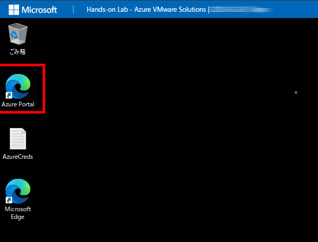
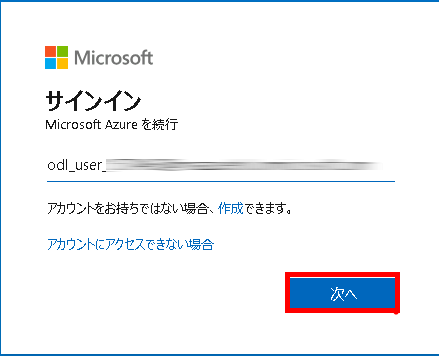
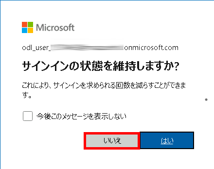

# Getting Started with Your Develop Generative AI Solutions with Azure OpenAI Service Workshop
 
Welcome to your Develop Generative AI Solutions with Azure OpenAI service workshop! We've prepared a seamless environment for you to explore and learn about the connection between artificial intelligence (AI), Responsible AI, and text, code, and image generation. Let's begin by making the most of this experience:
 
## Accessing Your Lab Environment
 
Once you're ready to dive in, your virtual machine and lab guide will be right at your fingertips within your web browser.

   

### 仮想マシンとラボガイド

仮想マシンはワークショップ全体での作業の要です。ラボガイドは成功への道しるべです。

## ラボリソースの探索

ラボリソースとアカウント情報を確認するために、**「環境」** タブに移動します。

   
 
## 分割ウィンドウ機能の利用

便利なように、右上隅の **「Split Window」** ボタンを選択して、ラボガイドを別のウィンドウで開くことができます。

   
 
## 仮想マシンの管理

必要に応じて、**「リソース」** タブから仮想マシンを開始、停止、または再起動できます。体験はあなたの手の中にあります！

   

## Lab Validation

1. After completing the task, hit the **Validate** button under Validation tab integrated within your lab guide. If you receive a success message, you can proceed to the next task, if not, carefully read the error message and retry the step, following the instructions in the lab guide.

   

1. You can also validate the task by navigating to the **Lab Validation** tab, from the upper right corner in the lab guide section.

   

1. If you need any assistance, please contact us at labs-support@spektrasystems.com.

## Lab Duration Extension

1. To extend the duration of the lab, kindly click the **Hourglass** icon in the top right corner of the lab environment. 

    

    >**Note:** You will get the **Hourglass** icon when 10 minutes are remaining in the lab.

2. Click **OK** to extend your lab duration.
 
   

3. If you have not extended the duration prior to when the lab is about to end, a pop-up will appear, giving you the option to extend. Click **OK** to proceed.

## Lab Guide Zoom In/Zoom Out

1. To adjust the zoom level for the environment page, click the **A↕ : 100%** icon located next to the timer in the lab environment.

   

## Azure ポータルにアクセスする  

1. **LabVM/ARCHost VM 内のAzure ポータルのショートカットをダブルクリックし、 Microsoft Edge を起動します。**  
   
   
2. サインイン画面が表示されたら以下の情報を入力します。  
   - **メール/ユーザー名:** `<inject key="AzureAdUserEmail">`  

     
3. サインイン画面が表示されたら以下の情報を入力します。  
   - **パスワード:** `<inject key="AzureAdUserPassword">`  

     
4. ポップアップ「**Stay Signed in?**」が表示されたら **「いいえ」** を選択します。  
     

5. ポップアップ「**You have free Azure Advisor recommendations!**」が表示された場合は閉じます。  

6. 「**Microsoft Azureへようこそ**」が表示された場合は「後で行う」をクリックしてツアーをスキップします。
7. Click "Next" from the bottom right corner to embark on your Lab journey!

   .png)

Now you're all set to explore the powerful world of technology. Feel free to reach out if you have any questions along the way.
## サポート連絡先  

クラウドラボサポートチームは、24時間365日対応しており、メールやライブチャットでサポートを提供します。

### サポート連絡先  
- **メールサポート:** [cloudlabs-support@spektrasystems.com](mailto:cloudlabs-support@spektrasystems.com)  
- **ライブチャットサポート:** [CloudLabs サポート](https://cloudlabs.ai/labs-support)  

**ハッピーラーニング！🎉**  
