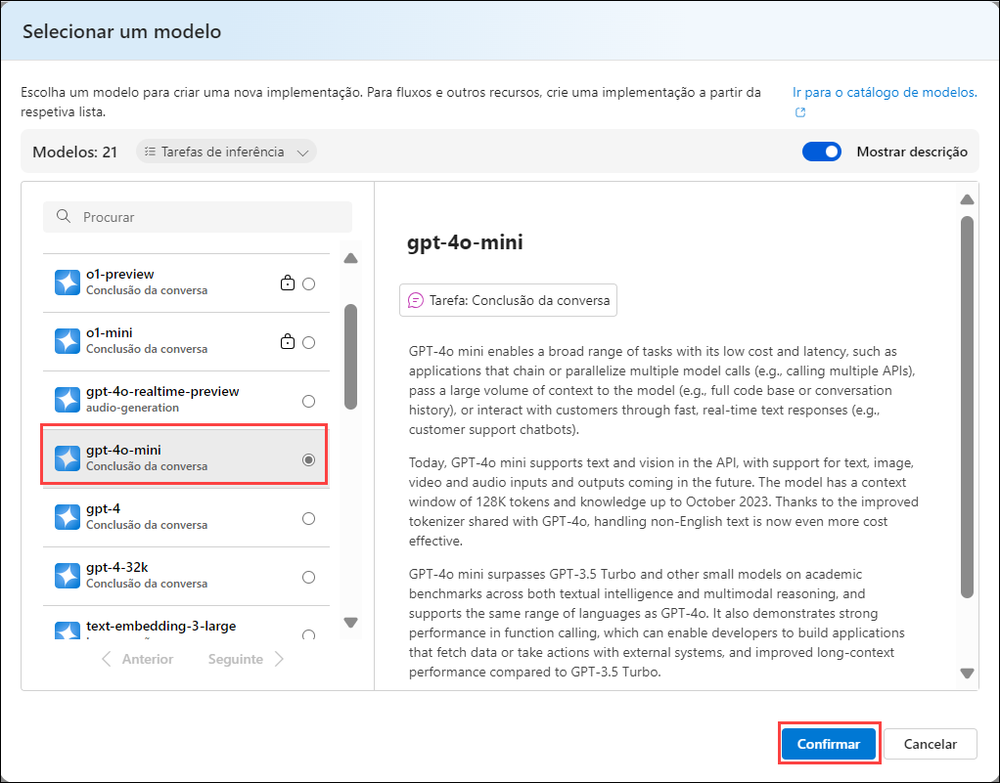
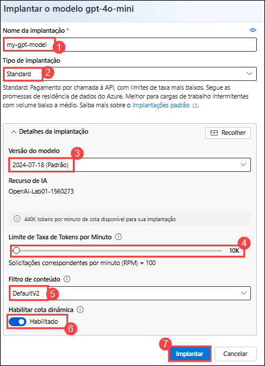
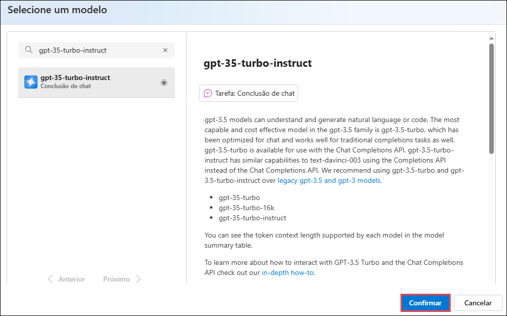
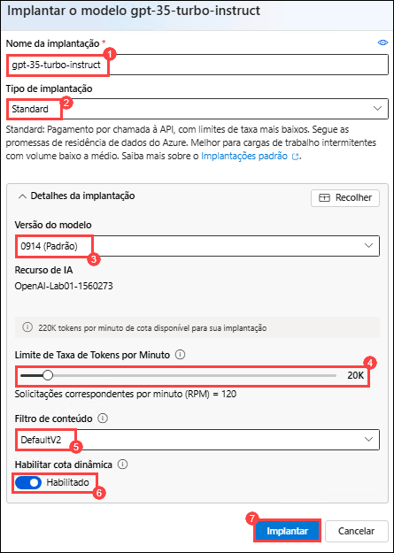
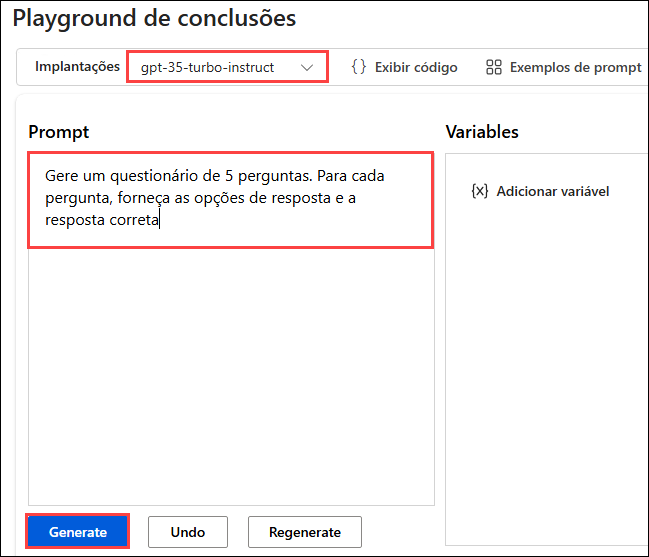
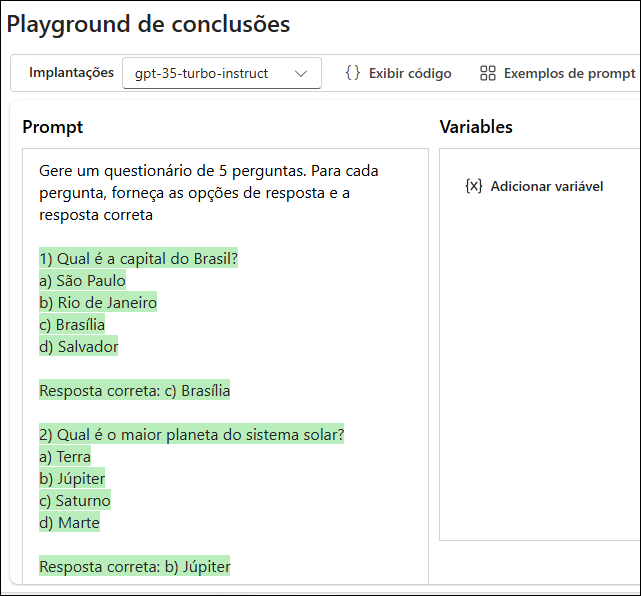
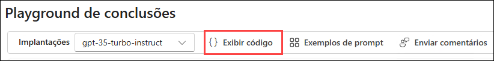

# Laboratório 01: Iniciar com o Serviço Azure OpenAI

### Duração Estimada: 40 minutos

## Cenário do Laboratório
O Serviço Azure OpenAI traz os modelos de IA generativa desenvolvidos pela OpenAI para a plataforma Azure, permitindo que você desenvolva soluções de IA poderosas que se beneficiam da segurança, escalabilidade e integração dos serviços fornecidos pela plataforma de nuvem Azure. Neste exercício, você aprenderá como começar a usar o Azure OpenAI provisionando o serviço como um recurso do Azure e usando o Azure AI Foundry portal para implantar e explorar modelos OpenAI.

## Objetivos do Laboratório
Neste laboratório, você completará as seguintes tarefas:

- Tarefa 1: Provisionar um recurso Azure OpenAI
- Tarefa 2: Implantar um modelo
- Tarefa 3: Explorar um modelo no playground de Completações
- Tarefa 4: Usar o playground de Chat
- Tarefa 5: Explorar prompts e parâmetros
- Tarefa 6: Explorar a geração de código

## Tarefa 1: Provisionar um recurso Azure OpenAI

Antes de usar os modelos do Azure OpenAI, você deve provisionar um recurso Azure OpenAI na sua assinatura do Azure.

1. No **portal do Azure**, pesquise por **Azure OpenAI (1)** e selecione **OpenAI (2)**.

   .png)

2. Na tela **Azure AI services | OpenAI**, clique em **+ Criar**.

   .png)

3. Crie um recurso **Azure OpenAI** com as seguintes configurações:
   
    - **Assinatura**: Padrão - Assinatura pré-atribuída.
    - **Grupo de recursos**: openai-<inject key="DeploymentID" enableCopy="false"></inject>
    - **Região**: **Swedencentral**
    - **Nome**: OpenAI-Lab01-<inject key="DeploymentID" enableCopy="false"></inject>
    - **Tipo de preço**: Standard S0
  
      .png)

4. Clique em **Próxima** três vezes e clique em **Criar**.

   .png)

5. Aguarde a conclusão da implementação. Depois, vá para o recurso Azure OpenAI implementado através do portal de Azure.

#### Validação

> **Parabéns** por completar a tarefa! Agora é hora de validá-la. Aqui estão os passos:
> - Clique no botão Validar para a tarefa correspondente. Se você receber uma mensagem de sucesso, pode prosseguir para a próxima tarefa. 
> - Caso contrário, leia atentamente a mensagem de erro e tente novamente seguindo as instruções do guia do laboratório.
> - Se precisar de assistência, entre em contato conosco pelo cloudlabs-support@spektrasystems.com. Estamos disponíveis 24/7 para ajudar você.

   <validation step="1fa0e87b-eb46-463d-b63b-edf6e2282e16" />

## Tarefa 2: Implementar um modelo

O Azure OpenAI fornece um portal baseado na web chamado **Azure AI Foundry portal**, que você pode usar para Implementar, gerenciar e explorar modelos. Você começará sua exploração do Azure OpenAI usando o Azure AI Foundry portal para Implementar um modelo.

1. No **portal do Azure**, pesquise por **OpenAI** e selecione **OpenAI**.

   .png)

2. Na tela **Azure AI services | OpenAI**, selecione **OpenAI-Lab01-<inject key="DeploymentID" enableCopy="false"></inject>**

   .png)

3. No painel de recursos do Azure OpenAI, clique em **Go to Azure AI Foundry portal** para navegar até o **Azure AI Foundry portal**.

    

4. Clique em **Implantações (1)** no painel de navegação à esquerda, clique em **+ Implante o modelo (2)**, selecione **Implantar o modelo básico (3)**.  

   

5. Na janela **Selecionar um modelo**, selecione **gpt-4o-mini** e clique em **Confirmar**.

   

6. Na interface de **Implantar o modelo**, insira os seguintes detalhes:
    
    - Na interface pop-up do modelo de implantação, insira os seguintes detalhes:
    
    - Nome da implantação: **my-gpt-model (1)**

    - Tipo de implantação: **Standard (2)**
    
    - Versão do modelo: **2024-07-18(default) (3)**
    
    - Limite de Taxa de Tokens por Minuto: **10K (4)**

    - Filtro de conteudo: **DefaultV2 (5)** 
    
    - Habilitar cota dinâmica: **Habilitado (6)**
    
    - Clique em **Implantar (7)**
      
      

5. Clique na seta para trás no modelo recém-criado e selecione **Implantações (1)** no painel de navegação à esquerda, clique em **+ Implante o modelo (2)**, selecione **Implantar o modelo básico (3)**.  

   

7. Na janela **Selecionar um modelo**, selecione **gpt-35-turbo-instruct** e clique em **Confirmar**.

      
   
8. Na interface de **Implantar o modelo**, insira os seguintes detalhes:
    
    - Nome da implantação: **gpt-35-turbo-instruct (1)**

    - Tipo de implantação: **Standard (2)**
    
    - Versão do modelo: **0914 (Padrao) (3)**
    
    - Limite de Taxa de Tokens por Minuto: **20K (4)**

    - Filtro de conteudo: **DefaultV2 (5)**  
    
    - Habilitar cota dinâmica: **Habilitado (6)**
    
    - Clique em **Implantar (7)**
      
         

10. Eles implantarão modelos que você pode experimentar tanto para tarefas de bate-papo quanto para tarefas de conclusão à medida que avança.

      > **Observação**: você pode ignorar qualquer erro relacionado à atribuição de funções para visualizar os limites de cota.

#### Validação

> **Parabéns** por completar a tarefa! Agora é hora de validá-la. Aqui estão os passos:
> - Clique no botão Validar para a tarefa correspondente. Se você receber uma mensagem de sucesso, pode prosseguir para a próxima tarefa. 
> - Caso contrário, leia atentamente a mensagem de erro e tente novamente seguindo as instruções do guia do laboratório.
> - Se precisar de assistência, entre em contato conosco pelo cloudlabs-support@spektrasystems.com. Estamos disponíveis 24/7 para ajudar você.

   <validation step="3b4a472e-f956-45d8-b828-3e2cc01c2e88" />

## Tarefa 3: Explorar um modelo no playground de Completações

Os *Playgrounds* são interfaces úteis no Azure AI Foundry portal que você pode usar para experimentar seus modelos implementados sem precisar desenvolver a sua aplicação cliente.

1. No Azure OpenAI Foundry, no painel esquerdo em **Playgrounds**, selecione **Conclusões**.

2. Na página **Conclusões**, certifique-se de que sua implantação **gpt-35-turbo-instruct** esteja selecionada, digite `Gerar um questionário de 5 perguntas Para cada pergunta, forneça as opções de resposta e a resposta correta` no campo prompt e clique em **Gerar**.

      

      > **Observação:** O exemplo de texto resumido consiste em um *prompt* que fornece algum texto para informar ao modelo que tipo de resposta é necessária e inclui algumas informações contextuais.

3. A resposta consiste em um questionário baseado no exemplo do prompt.

      

>**Nota** : O resultado do chat pode variar. A captura de tela é fornecida apenas para referência e pode não refletir exatamente o mesmo resultado.

   >**Observação**: Você pode usar o botão **Regenerar** para reenviar o prompt (novas alterações foram feitas) e observe que a resposta pode ser diferente da original. Um modelo generativo de IA pode produzir uma nova linguagem cada vez que é chamado.

4. Na parte inferior da página, anote o número de *tokens* detectados no texto. Tokens são as unidades básicas de um prompt – essencialmente palavras ou partes de palavras no texto.

5. Use o botão **Visualizar código** para visualizar o código que um aplicativo cliente usaria para enviar o prompt. Você pode selecionar sua linguagem de programação preferida. O prompt contém o texto que você enviou ao modelo. A solicitação é enviada à API *Completions* do seu serviço Azure OpenAI.

      

      .png)

6. Feche o **Código de Amostra**.

## Tarefa 4: Use o playground de Chat

O playground *Chat* fornece uma interface de chatbot para os modelos GPT 3.5 e superiores. Ele usa a API *ChatCompletions* em vez da antiga API *Completions*.

1. Na seção **Playground**, selecione **Chat** e certifique-se de que o modelo **my-gpt-model** esteja selecionado no painel de configuração.

2. Na seção **Configuração**, na caixa **Forneça instruções e contexto ao modelo**, substitua o texto atual pela seguinte afirmação: `O sistema é um professor de IA que ajuda as pessoas a aprender sobre IA`, clique em * *Aplique as alterações** e clique em **Continuar**.

3. Na seção **Configuração**, clique na caixa **Adicionar seção** e, em seguida, clique em **Exemplos**.

   

4. Digite a seguinte mensagem e resposta nas caixas designadas:

    - **Usuário**: `Quais são os diferentes tipos de inteligência artificial?`
    
    - **Assistente**: `Existem três tipos principais de inteligência artificial: IA estreita ou fraca (como assistentes virtuais como Siri ou Alexa, software de reconhecimento de imagem e filtros de spam), IA geral ou forte (IA projetada para ser tão inteligente quanto um ser humano. Este tipo da IA ​​não existe atualmente e é puramente teórica) e Superinteligência Artificial (IA que é mais inteligente do que qualquer ser humano e pode realizar tarefas que estão além da compreensão humana. Este tipo de IA também é puramente teórica e ainda não foi desenvolvida) .`

      .png)

      > **Nota**: Exemplos de poucos-tiros são usados para fornecer ao modelo exemplos dos tipos de respostas esperadas. O modelo tentará refletir o tom e o estilo dos exemplos em suas próprias respostas.
  
5. Salve as alterações clicando em **Aplicar alterações** e posteriormente clique em **Continuar** para iniciar uma nova sessão e definir o contexto comportamental do sistema de chat.

   

7. Na caixa de consulta na parte inferior da página, digite o texto `O que é inteligência artificial?`. Use o botão **Enviar** para enviar a mensagem e visualizar a resposta.

      > **Observação**: você pode receber uma resposta informando que a implantação da API ainda não está pronta. Nesse caso, aguarde alguns minutos e tente novamente.

8. Revise a resposta e envie a seguinte mensagem para continuar a conversa: `Como isso está relacionado ao aprendizado de máquina?`

9. Revise a resposta, observando que o contexto da interação anterior é retido (para que o modelo entenda que “isso” se refere à inteligência artificial).

10. Use o botão **Ver código** para visualizar o código da interação. O prompt consiste na mensagem do *sistema*, nos exemplos rápidos de mensagens do *usuário* e do *assistente* e na sequência de mensagens do *usuário* e do *assistente* na sessão de bate-papo até o momento.

## Tarefa 5: Explore prompts e parâmetros

Você pode usar o prompt e os parâmetros para maximizar a probabilidade de gerar a resposta que você precisa.

1. No painel **Configuração**, selecione **Parâmetros (1)**, defina os seguintes valores de parâmetro:

    - **Resposta máxima: (2)**: 500
    - **Temperatura (3)**: 0

      

2. Envie a seguinte mensagem na sessão de chat 

      ```
      Escreva três questões de múltipla escolha com base no texto a seguir.
      
      A maioria das soluções de visão computacional é baseada em modelos de aprendizado de máquina que podem ser aplicados à entrada visual de câmeras, vídeos ou imagens.
      
      - A classificação de imagens envolve o treinamento de um modelo de aprendizado de máquina para classificar imagens com base em seu conteúdo. Por exemplo, em uma solução de monitoramento de tráfego você pode usar um modelo de classificação de imagens para classificar imagens com base no tipo de veículo que elas contêm, como táxis, ônibus, ciclistas e assim por diante.
      
      - Os modelos de aprendizado de máquina para detecção de objetos são treinados para classificar objetos individuais em uma imagem e identificar sua localização com uma caixa delimitadora. Por exemplo, uma solução de monitoramento de tráfego pode usar a detecção de objetos para identificar a localização de diferentes classes de veículos.
      
      - A segmentação semântica é uma técnica avançada de aprendizado de máquina na qual pixels individuais da imagem são classificados de acordo com o objeto ao qual pertencem. Por exemplo, uma solução de monitoramento de tráfego pode sobrepor imagens de tráfego com camadas de “máscara” para destacar diferentes veículos usando cores específicas.
      ```

3. Revise os resultados, que devem consistir em perguntas de múltipla escolha que um professor poderia usar para testar os alunos sobre os tópicos de visão computacional no prompt. A resposta total deve ser menor do que o comprimento máximo especificado como parâmetro.

4. Observe o seguinte sobre o prompt e os parâmetros que você usou:

    - O prompt especifica que a saída desejada deve ser três perguntas de múltipla escolha.
    
    - Os parâmetros incluem *Temperatura*, que controla o grau em que a geração de resposta inclui um elemento de aleatoriedade. O valor de **0** usado na sua submissão minimiza a aleatoriedade, resultando em respostas estáveis e previsíveis.

      .png)

## Tarefa 6: Explore a geração de código

Além de gerar respostas em linguagem natural, você pode usar modelos GPT para gerar código.

1. No **painel Configuração**, em **Mensagem do sistema**, insira a mensagem do sistema: `Você é um desenvolvedor Python.` e salve as alterações clicando em **Aplicar alterações** e clique em **Continuar ** quando solicitado.
  
   

3. No painel **Sessão de chat**, selecione **Limpar chat** para limpar o histórico de chat e iniciar uma nova sessão.

   .png)

4. Envie a seguinte mensagem do usuário:

    ```
    Write a Python function named Multiply that multiplies two numeric parameters.
    ```
    
5. Revise a resposta, que deve incluir um código Python de exemplo que atenda ao requisito no prompt.

     .png)

## Resumo

Neste laboratório, você completou o seguinte:
- Provisionou um recurso Azure OpenAI
- Implementou um modelo Azure OpenAI dentro do estúdio Azure OpenAI
- Usou o playground de chat para utilizar as funcionalidades de prompts, parâmetros e geração de código

### Você completou com sucesso o laboratório.
