# Lab 01: Get started with Azure OpenAI Service

## Estimated Duration: 80 minutes

## Lab Overview
Azure OpenAI Service brings the generative AI models developed by OpenAI to the Azure platform, enabling you to develop powerful AI solutions that benefit from the security, scalability, and integration of services provided by the Azure cloud platform. In this exercise, you'll learn how to get started with Azure OpenAI by provisioning the service as an Azure resource and using the Azure AI Foundry portal to deploy and explore OpenAI models.

## Lab objectives
In this lab, you will complete the following tasks:

- Task 1: Provision an Azure OpenAI resource
- Task 2: Deploy a model
- Task 3: Explore a model in the Completions playground
- Task 4: Use the Chat playground
- Task 5: Explore prompts and parameters 
- Task 6: Explore code generation

### Task 1: Provision an Azure OpenAI resource

In this task, you'll create an Azure resource in the Azure portal, selecting the OpenAI service and configuring settings such as region and pricing tier. This setup allows you to integrate OpenAI's advanced language models into your applications.

1. In the **Azure portal**, search for **Azure OpenAI (1)** and select **Azure OpenAI (2)**.

   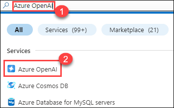

1. On **AI Foundry | Azure OpenAI** page, click on **+ Create**.

   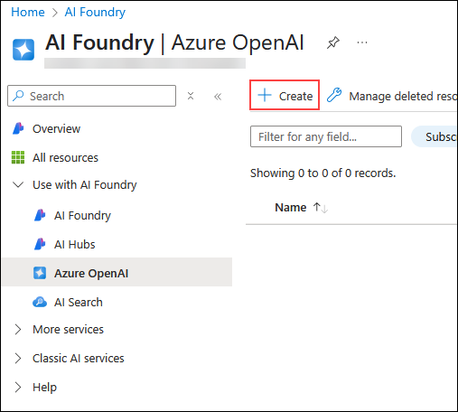

1. Create an **Azure OpenAI** resource with the following settings:

   | Settings | Action |
   | -- | -- |
   | **Subscription (1)** | Default - Pre-assigned subscription. |
   | **Resource group (2)** | openai-<inject key="DeploymentID" enableCopy="false"></inject> |
   | **Region (3)** | **Swedencentral** |
   | **Name (4)** | OpenAI-Lab01-<inject key="DeploymentID" enableCopy="false"></inject> |
   | **Pricing tier (5)** | Standard S0 |

   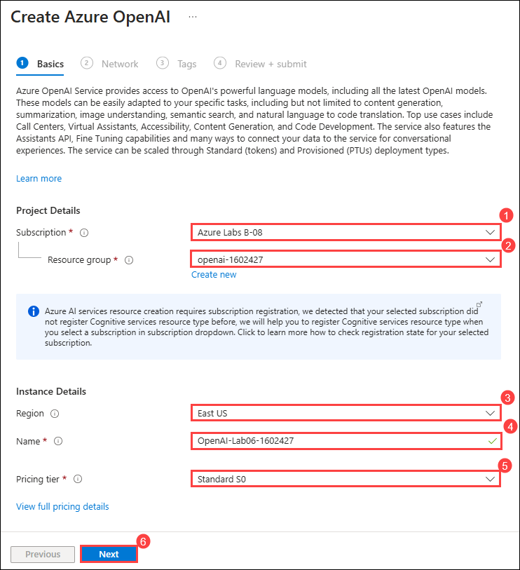

1. Click on **Next (6)** thrice and then click on **Create**.

1. Wait for the deployment to complete. Once it's finished, click the **Go to resource** button to navigate to the deployed Azure OpenAI resource in the Azure portal.

> **Congratulations** on completing the task! Now, it's time to validate it. Here are the steps:
> - Hit the Validate button for the corresponding task. If you receive a success message, you can proceed to the next task. 
> - If not, carefully read the error message and retry the step, following the instructions in the lab guide. 
> - If you need any assistance, please contact us at cloudlabs-support@spektrasystems.com. We are available 24/7 to help you out.

<validation step="9ab1a143-84ef-420e-8713-2cacb6c0a63a" />

### Task 2: Deploy a model

In this task, you'll deploy a specific AI model instance within your Azure OpenAI resource to integrate advanced language capabilities into your applications.

1. In the Azure OpenAI resource page, click on **Go to Azure AI Foundry portal**, which will navigate to the **Azure AI Foundry portal**.

   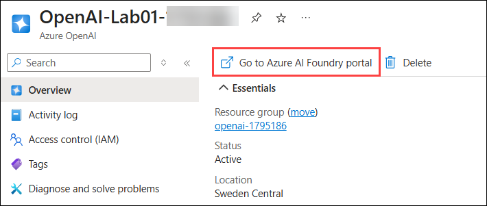

1. On the **Azure AI Foundry portal** page, select **Deployments (1)** under **Shared resources** from the left pane. Then, click **+ Deploy model (2)** and choose **Deploy base model (3)**.

   [](../media/dev-08.png)

1. On the Select a model page, search for **gpt-4o (1)** model, select **gpt-4o (chat completion) (2)** model from the list, and then click on **Confirm (3)**.

   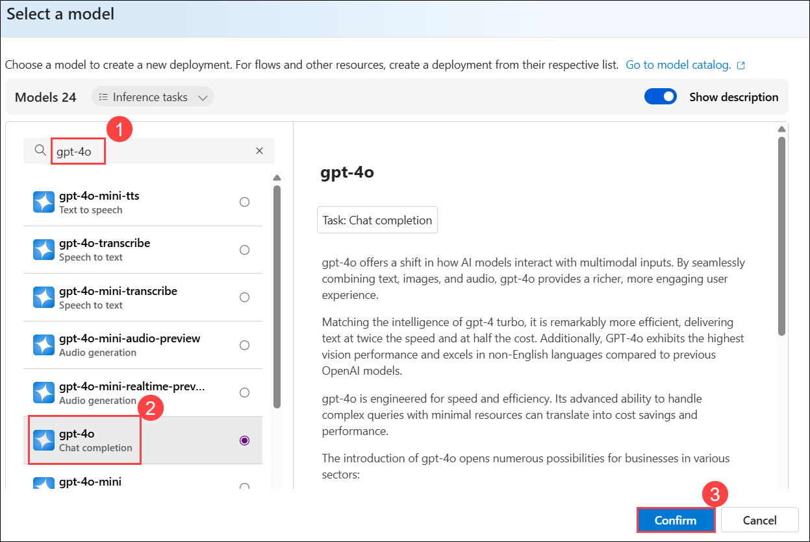

1. On the **Deploy gpt-4o** interface, click on **Customize (1)** and enter the details as mentioned below, then click on **Deploy (9)**:

   | Settings | Action |
   | -- | -- |
   | **Deployment name (2)** | my-gpt-model |
   | **Deployment type (3)** | Standard |
   | **Model version upgrade policy (4)** | Upgrade once new default version becomes available. |
   | **Model version (5)** | 2024-11-20 |
   | **Tokens per Minute Rate Limit (thousands) (6)** | 10K |
   | **Content Filter (7)** | DefaultV2 |
   | **Enable dynamic quota(8)** | Enabled |
  
      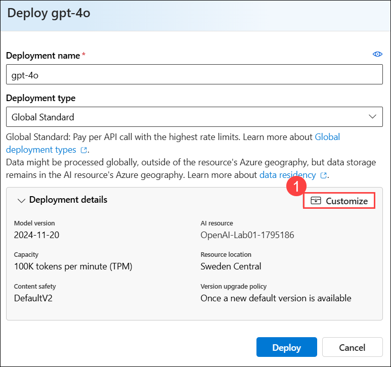

      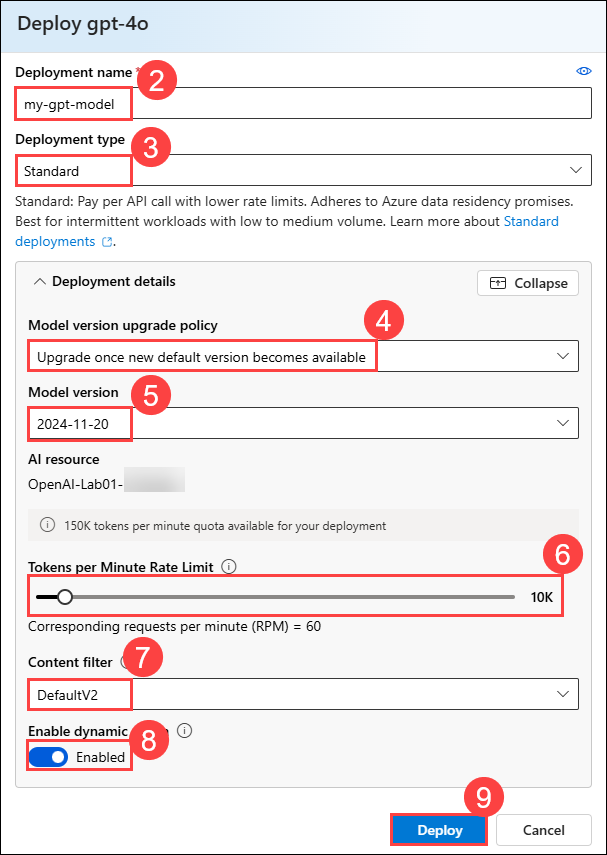

   > **Note:** gpt-4o is supported only for chat completions, and it is not supported for the completions API.

1. Click the back arrow on the newly created model, then select **Deployments (1)** under **Shared Resources** in the left pane. After that, click **+ Deploy model (2)** and choose **Deploy base model (3)**.

     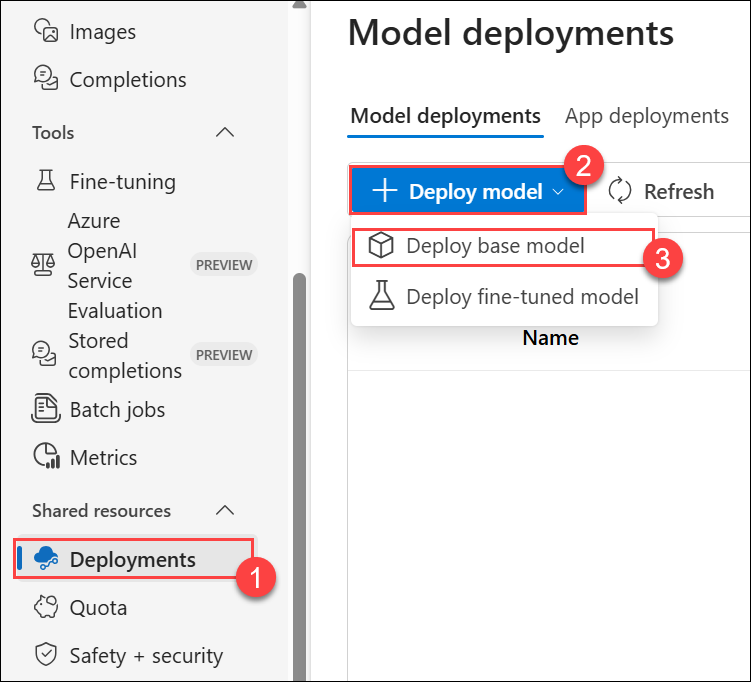

1. On the Select a model page, search for **gpt-35-turbo-instruct (1)** model, select **gpt-35-turbo-instruct (chat completion) (2)** model from the list, and then click on **Confirm (3)**.

     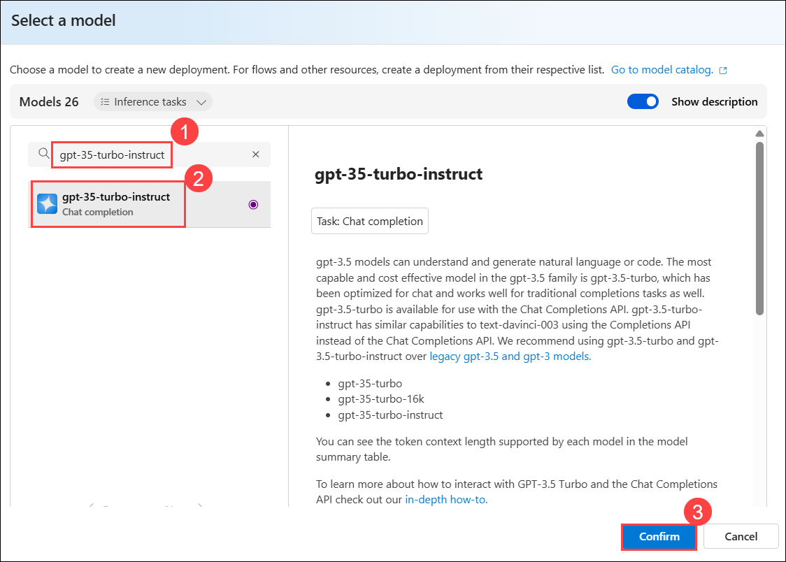
   
1. On the **Deploy gpt-35-turbo-instruct** interface, click on **Customize (1)** and enter the details as mentioned below, then click on **Deploy (9)** :

   | Settings | Action |
   | -- | -- |
   | **Deployment name (2)** | gpt-35-turbo-instruct |
   | **Deployment type (3)** | Standard |
   | **Model version upgrade policy (4)** | Upgrade once new default version becomes available. |
   | **Model version (5)** | 0914 (Default) |
   | **Tokens per Minute Rate Limit (thousands) (6)** | 20K |
   | **Content Filter (7)** | DefaultV2 |
   | **Enable dynamic quota(8)** | Enabled |

      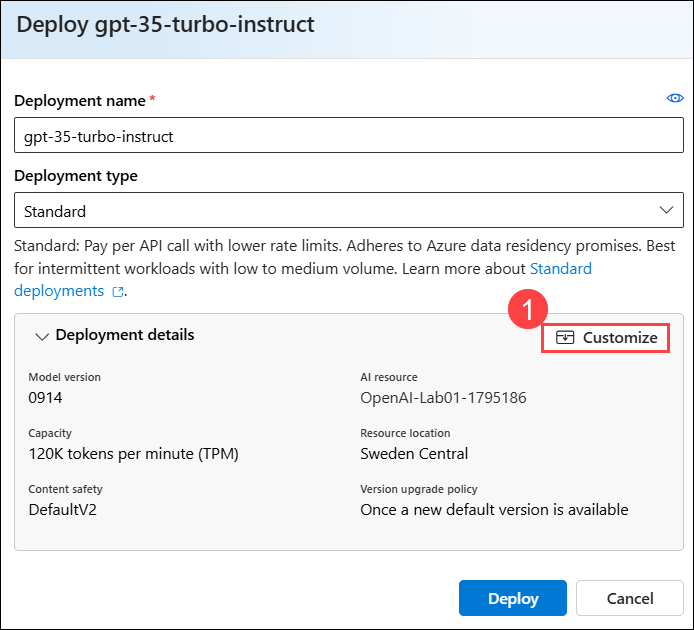

      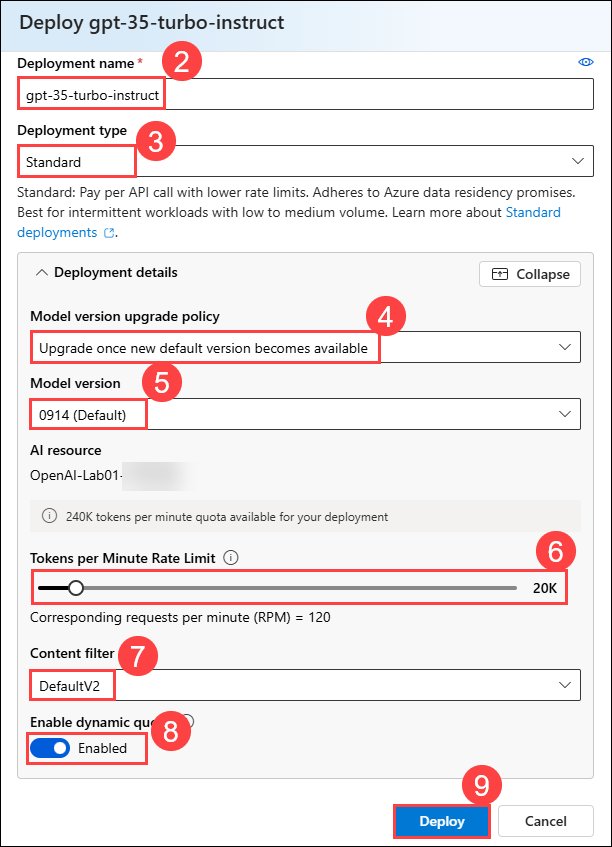

1. These will deploy models that you can experiment with for both chat and completion tasks as you go along.

      > **Note**: You can ignore any error related to the assignment of roles to view the quota limits.
   
> **Congratulations** on completing the task! Now, it's time to validate it. Here are the steps
> - Hit the Validate button for the corresponding task. If you receive a success message, you can proceed to the next task. 
> - If not, carefully read the error message and retry the step, following the instructions in the lab guide.
> - If you need any assistance, please contact us at cloudlabs-support@spektrasystems.com. We are available 24/7 to help you out.

<validation step="f0c29243-24d0-4f47-a237-0e8982262203" />

### Task 3: Explore a model in the Completions playground

In this task, you'll explore a model in the Completions playground that involves interacting with the AI model to test and refine its responses using real-time input and output examples.

1. In the Azure AI Foundry portal, in the left pane under **Playground**, select **Completions (1)**.

2. In the **Completions playground** page, ensure your **gpt-35-turbo-instruct (2)** deployment is selected. Copy and paste the below-mentioned prompt **(3)**.

   ```
   Generate a quiz of 5 questions.  For each question, provide me with the answer options and the correct answer.
   ```

   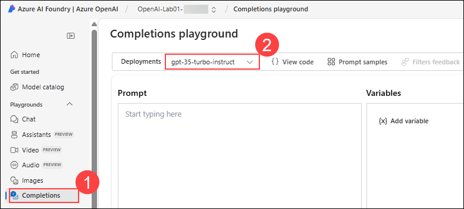

      >**Note:** The summarized text sample consists of a *prompt* that provides some text to tell the model what kind of response is required and includes some contextual information.

3. Click on the **Generate** button to submit the prompt to the model and retrieve a response (you may need to scroll down). The response consists of a quiz based on the example in the prompt.

      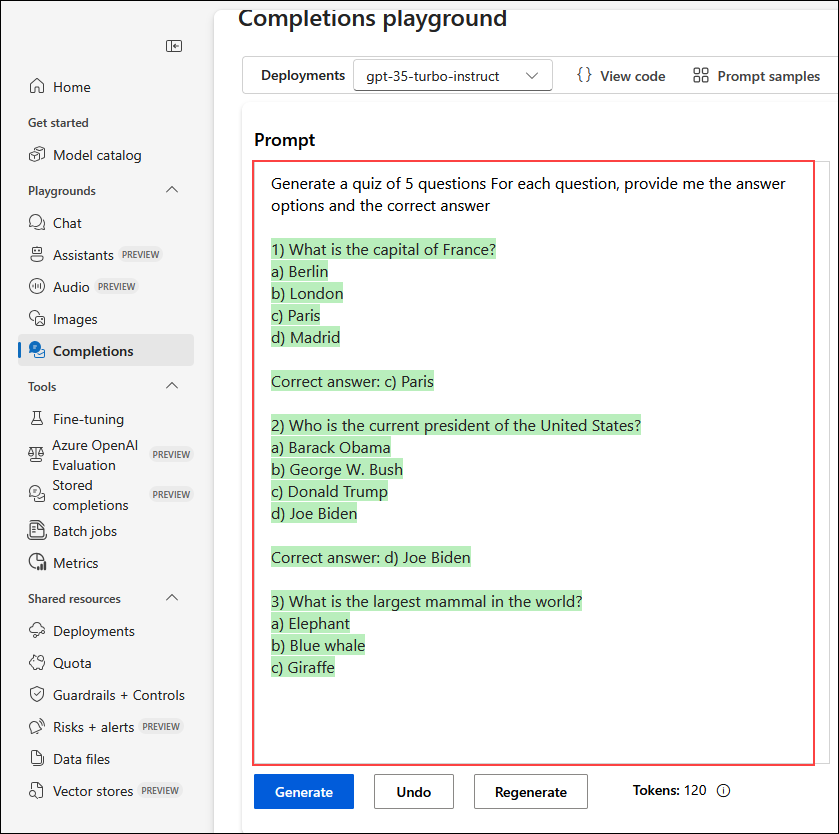

      >**Note**: You can use the **Regenerate** button to resubmit the prompt(new changes have been made), and note that the response may vary from the original one. A generative AI model can produce new language each time it's called. At the bottom of the page, note the number of *tokens* detected in the text. Tokens are the basic units of a prompt essentially words or word parts in the text.

4. Use the **View Code** button to view the code that a client application would use to submit the prompt. You can select your preferred programming language. The prompt contains the text you submitted to the model. The request is submitted to the *Completions* API for your Azure OpenAI service.

      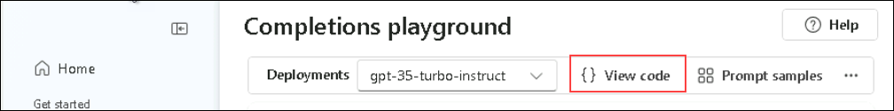

      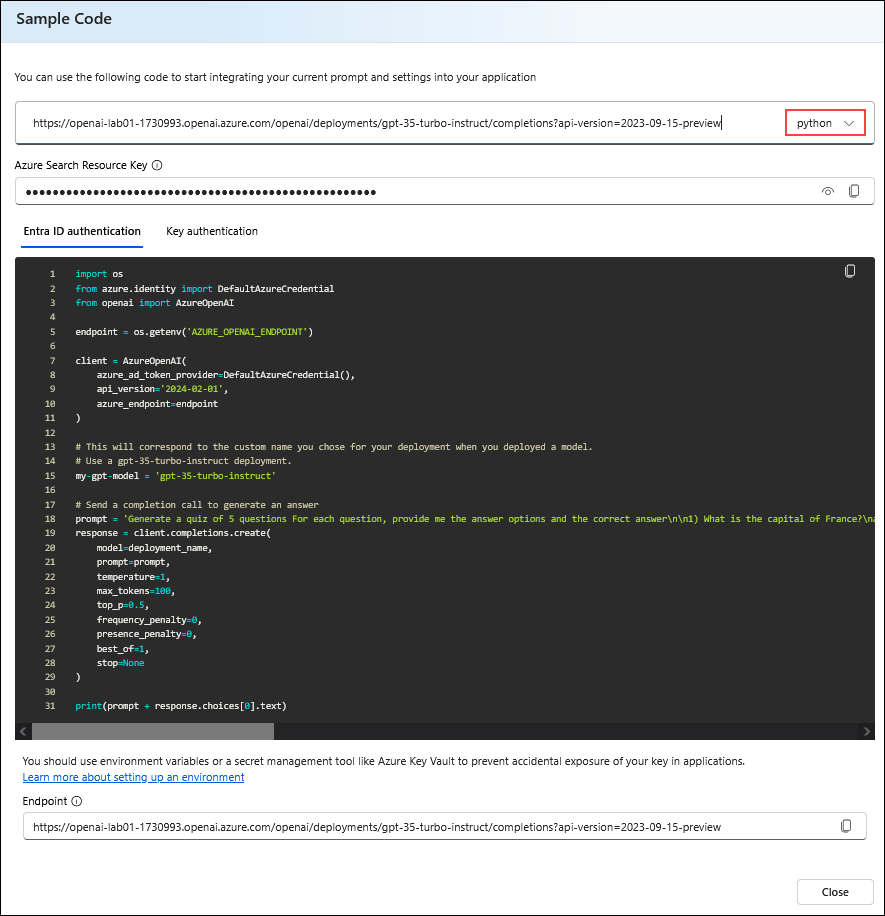
    
5. Close the **Sample Code**.

### Task 4: Use the Chat playground

In this task, you'll use the Chat playground to interact with and test the AI model's conversational abilities through a simulated chat interface.

1. In the **Playground** section from the left pane, select the **Chat** page, and ensure that the **my-gpt-model (1)** model is selected in the Deployment pane.

2. In the **Setup** section, in the **Give the model instructions and context** box, replace the current text with the following statement **(2)**:

   ```
   The system is an AI teacher that helps people learn about AI.
   ```
   
      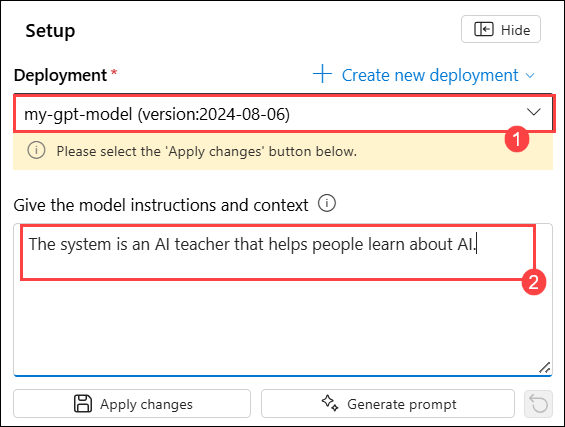

3. Select the **+ Add section (1)** box, then click on **Examples (2)**. Enter the following message and response in the designated boxes:

      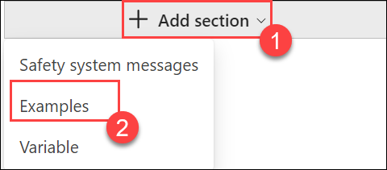

4. Enter the following message and response in the designated boxes:

    - **User (1)**:
      ```
         What are the different types of artificial intelligence?
      ```
    
    - **Assistant (2)**:
      ```
         There are three main types of artificial intelligence: Narrow or Weak AI (such as virtual assistants like Siri or Alexa, image recognition software, and spam filters), General or Strong AI (AI designed to be as intelligent as a human being. This type of AI does not currently exist and is purely theoretical), and Artificial Superintelligence (AI that is more intelligent than any human being and can perform tasks that are beyond human comprehension. This type of AI is also purely theoretical and has not yet been developed).
      ```

      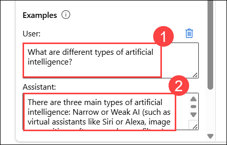

      >**Note**: Few-shot examples are used to provide the model with examples of the types of responses that are expected. The model will attempt to reflect the tone and style of the examples in its own responses.

5. Save the changes by clicking on **Apply changes** and on **Update system message?** pop-up, click on **Continue**.

    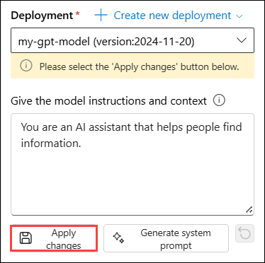
   
6. In the query box on the right side of the page, enter the text **(1)** as mentioned below. Use the **Send (2)** button to submit the message and view the response.

   ```
      What is artificial intelligence?
   ```

   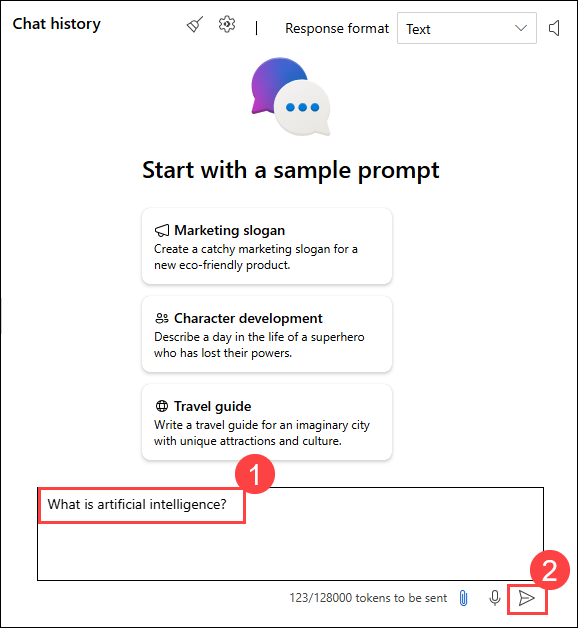

   > **Note**: You may receive a response that the API deployment is not yet ready. If so, wait for a few minutes and try again.

7. Review the response and then submit the following message to continue the conversation:

   ```
      How is it related to machine learning?`
   ```

8. Review the response, noting that context from the previous interaction is retained (so the model understands that "it" refers to artificial intelligence).

### Task 5: Explore prompts and parameters

In this task, you'll explore prompts and parameters by experimenting with different inputs and settings to fine-tune the AI model's responses and behavior.

1. In the **Setup** pane select **Parameters** , set the following parameter values:
    
   - **Temperature (1)**: 0
    
   - **Max response (2)**: 500

      > **Note:** You may need to scroll down to see the parameters option.

        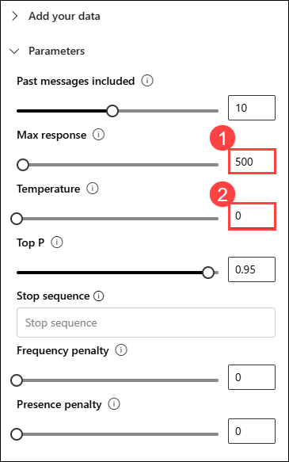
      
2. Submit the following message in the chat session

   ```
   Write three multiple-choice questions based on the following text.

   Most computer vision solutions are based on machine learning models that can be applied to visual input from cameras, videos, or images.

   - Image classification involves training a machine learning model to classify images based on their contents. For example, in a traffic monitoring solution, you might use an image classification model to classify images based on the type of vehicle they contain, such as taxis, buses, cyclists, and so on.

   - Object detection machine learning models are trained to classify individual objects within an image and identify their location with a bounding box. For example, a traffic monitoring solution might use object detection to identify the location of different classes of vehicles.

   - Semantic segmentation is an advanced machine learning technique in which individual pixels in the image are classified according to the object to which they belong. For example, a traffic monitoring solution might overlay traffic images with "mask" layers to highlight different vehicles using specific colors. 
   ```

3. Review the results, which should consist of multiple-choice questions that a teacher could use to test students on the computer vision topics in the prompt. The total response should be smaller than the maximum length you specified as a parameter.

   
   
4. Observe the following about the prompt and parameters you used:
   - The prompt specifically states that the desired output should be three multiple-choice questions.
   - The parameters include *Temperature*, which controls the degree to which response generation includes an element of randomness. The value of **0** used in your submission minimizes randomness, resulting in stable, predictable responses.

### Task 6: Explore code generation

In this task, you'll explore code generation by testing the AI model’s ability to generate and suggest code snippets based on various programming prompts and requirements.

1. In the **Setup** section, keeping the Deployments as **my-gpt-model (1)**; in the **Give the model instructions and context** box, replace the current text with the following statement: `You are a Python developer.` **(2)** and save the changes by clicking on **Apply Changes (3)**. When prompted with **Update system message?**, click **Continue** to proceed.

   

2. In the **Chat session** pane, select the **Clear chat** button, then select **Clear** in the **Clear chat?** pop-up window to clear the chat history and start a new session.

   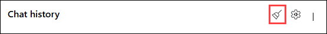

3. Submit the following user message:

   ```
   Write a Python function named Multiply that multiplies two numeric parameters.
   ```

4. Review the response, which should include sample Python code that meets the requirement in the prompt.

   

## Summary

In this lab, you have accomplished the following:
- Provision an Azure OpenAI resource
- Deploy an Azure OpenAI model within the Azure AI Foundry portal
- Use the chat playground to utilize the functionalities of prompts, parameters, and code-generation

### Congratulations on successfully completing the lab! Click Next >> to continue to the next lab.
   .png)
