# ラボ 01: Azure OpenAI サービスの使い方を始める

## ラボシナリオ
Azure OpenAI サービスは、OpenAI によって開発された生成AIモデルをAzureプラットフォームに導入し、Azureクラウドプラットフォームが提供するセキュリティ、スケーラビリティ、およびサービスの統合を利用した強力なAIソリューションの開発を可能にします。この演習では、Azureリソースとしてサービスをプロビジョニングし、Azure AI Foundryポータルを使用してOpenAIモデルをデプロイおよび探索する方法を学びます。

## ラボの目的
このラボでは、次のタスクを完了します：

- タスク 1: Azure OpenAI リソースをプロビジョニングする
- タスク 2: モデルをデプロイする
- タスク 3: Completions プレイグラウンドでモデルを探索する
- タスク 4: Chat プレイグラウンドを使用する
- タスク 5: プロンプトとパラメータを探索する
- タスク 6: コード生成を探索する

## 推定時間: 60 分

### タスク 1: Azure OpenAI リソースをプロビジョニングする

このタスクでは、AzureポータルでAzureリソースを作成し、OpenAIサービスを選択し、リージョンや価格帯などの設定を構成します。このセットアップにより、OpenAIの高度な言語モデルをアプリケーションに統合できるようになります。

1. **Azure ポータル** で **Azure OpenAI** を検索し、**Azure OpenAI** を選択します。

   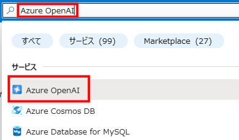

2. **Azure AI Services | Azure OpenAI** ブレードで、**作成** をクリックします。

   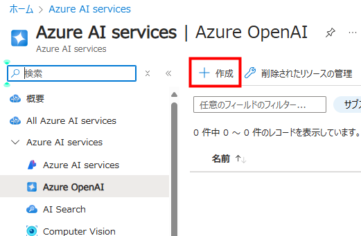

3. 次の設定で **Azure OpenAI** リソースを作成します：
      - **サブスクリプション**: デフォルト - 事前割り当てのサブスクリプション。
      - **リソース グループ**: openai-<inject key="DeploymentID" enableCopy="false"></inject>
      - **リージョン**: **Swedencentral**
      - **名前**: OpenAI-Lab01-<inject key="DeploymentID" enableCopy="false"></inject>
      - **価格レベル**: Standard S0
  
           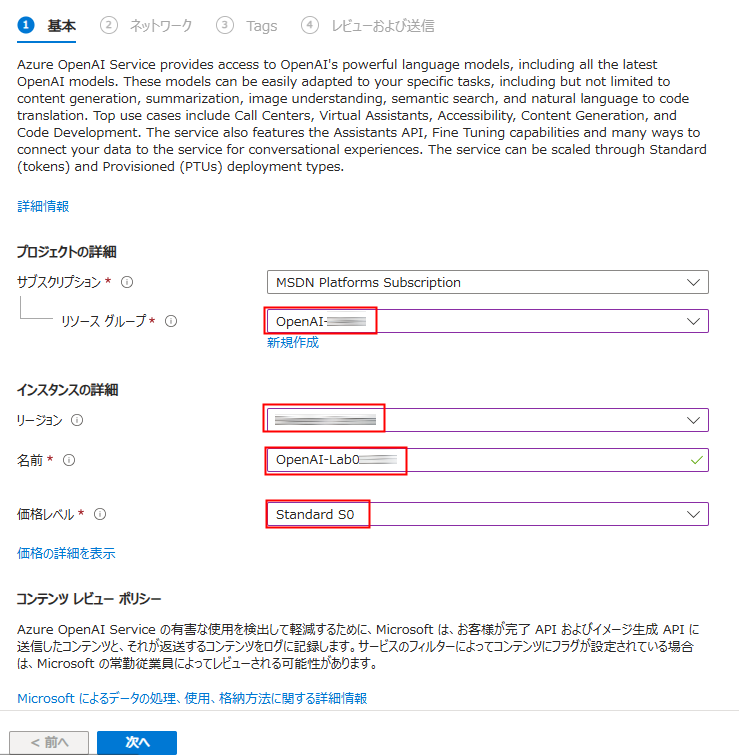

4. **次へ** を3回クリックし、**作成** をクリックします。

5. デプロイメントが完了するのを待ちます。その後、AzureポータルでデプロイされたAzure OpenAIリソースに移動します。

   > **おめでとうございます** タスクを完了しました！次は、それを検証する時間です。以下の手順に従ってください：
   > - 対応するタスクの 「検証」 ボタンを押します。成功メッセージが表示された場合、次のタスクに進むことができます。
   > - そうでない場合は、エラーメッセージを注意深く読み、ラボガイドの指示に従ってステップを再試行してください。
   > - サポートが必要な場合は、cloudlabs-support@spektrasystems.com にお問い合わせください。24 時間年中無休でお手伝いします。

   <validation step="9ab1a143-84ef-420e-8713-2cacb6c0a63a" />

### タスク 2: モデルをデプロイする

このタスクでは、アプリケーションに高度な言語機能を統合するために、Azure OpenAIリソース内に特定のAIモデルインスタンスをデプロイします。

1. **Azure ポータル** で **Azure OpenAI** を検索し、**Azure OpenAI** を選択します。

      

2. **Azure AI Services** ページで、左側のブレードから **Azure OpenAI (1)** が選択されていることを確認します。その後、OpenAI-Lab01-<inject key="DeploymentID" enableCopy="false"></inject> を選択します。

      

3. Azure OpenAI リソースペインで、**Go to Azure AI Foundry portal** をクリックすると、**Azure AI Foundry portal** に移動します。

      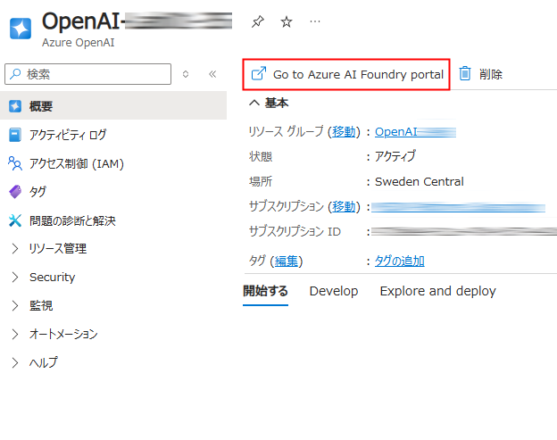

4. **Azure AI Foundry portal** ページで、左側のペインから **共有リソース** の下にある **デプロイ** を選択します。その後、**+モデルのデプロイ** をクリックし、**基本モデルをデプロイする** を選択します。

      

5. **gpt-4o-mini** を検索し、**確認** をクリックします。

   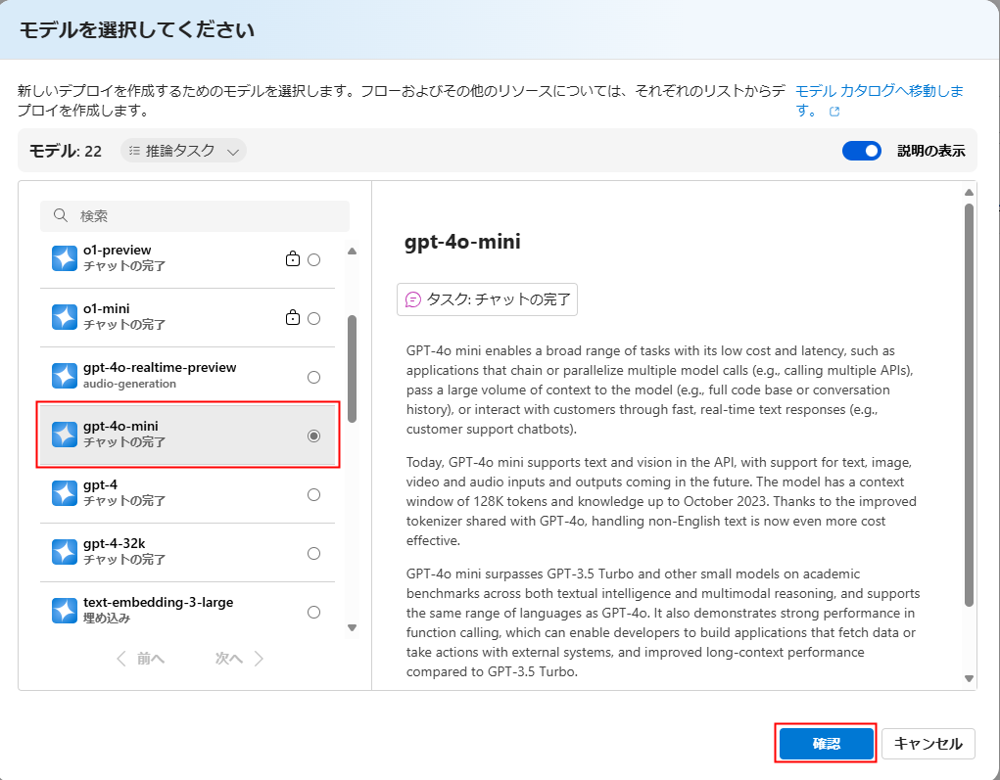
   
6. **モデルをデプロイする** ポップアップインターフェイス内で、次の詳細を入力します：
      - **デプロイ名**: my-gpt-model (1)
      - **デプロイの種類**: Standard(2)
      - **カスタマイズ** をクリックします。
      - **モデル バージョン**:2024-07-18(デフォルト) (3)
      - **1分あたりのトーケン数レート制限 (千)**: 10K (4)
      - **コンテンツ フィルター**: DefaultV2 (5)
      - **動的クォータを有効にする**: 有効 (6)
      - **デプロイ** をクリックします (7)
  
           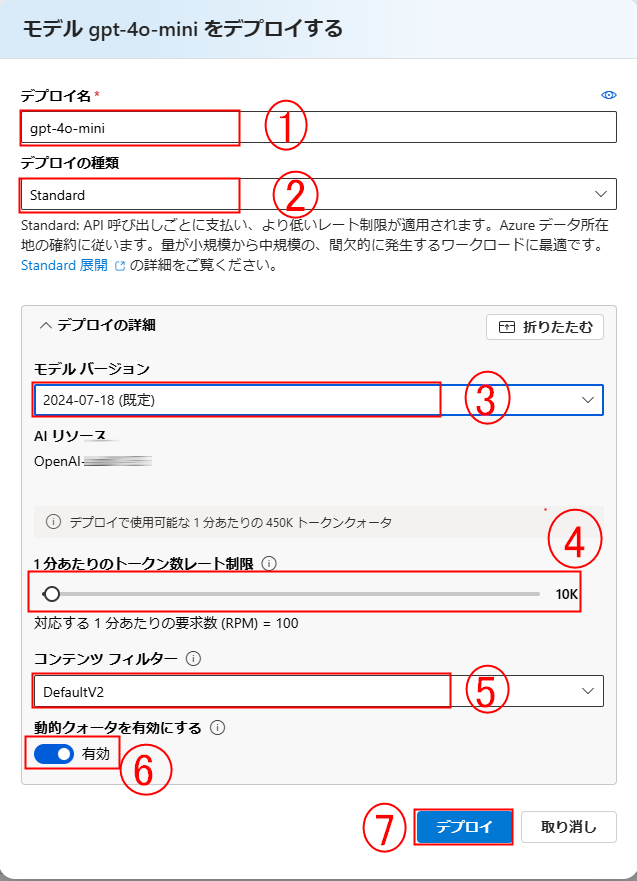

           >**注意** : gpt-4o-mini はチャット補完にのみ対応しており、補完APIには対応していません。

7. 新しく作成されたモデルのバックアローをクリックし、左側のペインの **共有リソース** の下にある **デプロイ** を選択します。その後、**+モデルのデプロイ** をクリックし、**基本モデルをデプロイする** を選択します。

      

9. **gpt-35-turbo-instruct** を検索し、**確認** をクリックします。

   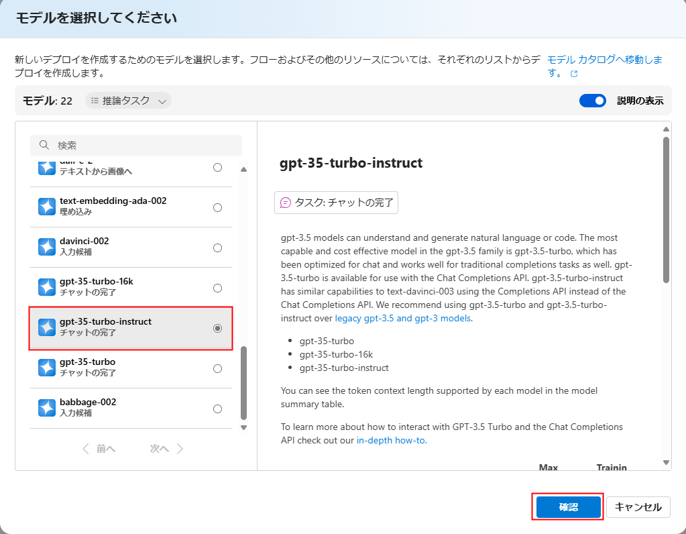
   
9. **Deploy model** ポップアップインターフェイス内で、次の詳細を入力します：
      - **デプロイ名**: gpt-35-turbo-instruct (1)
      - **デプロイ種類**: Standard(2)
      - **カスタマイズ** をクリックします。
      - **モデル バージョン**: 0914 (デフォルト) (3)
      - **1分あたりのトーケン数レート制限 (千)**: 20K (4)
      - **動的クォータを有効にする**: 有効 (5)
      - **デプロイ** をクリックします (6)
  
        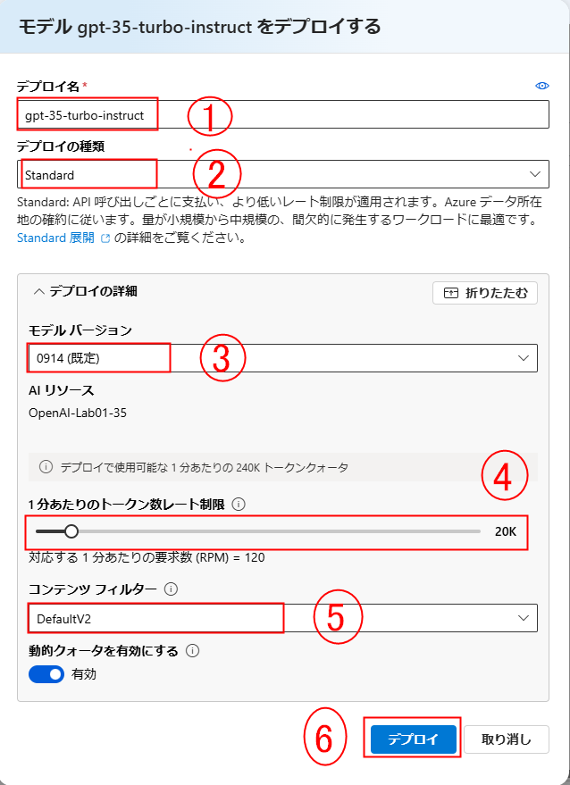

10. これにより、チャットおよび補完タスクの両方で試すことができるモデルがデプロイされます。

      > **注意**: クォータ制限を表示するためのロールの割り当てに関するエラーは無視して構いません。 

   
   > **おめでとうございます** タスクを完了しました！次は、それを検証する時間です。以下の手順に従ってください：
   > - 対応するタスクの 検証 ボタンを押します。成功メッセージが表示された場合、次のタスクに進むことができます。
   > - そうでない場合は、エラーメッセージを注意深く読み、ラボガイドの指示に従ってステップを再試行してください。
   > - サポートが必要な場合は、cloudlabs-support@spektrasystems.com にお問い合わせください。24 時間年中無休でお手伝いします。

   <validation step="f0c29243-24d0-4f47-a237-0e8982262203" />

### タスク 3: Completions プレイグラウンドでモデルを探索する

このタスクでは、AIモデルと対話し、リアルタイムの入力と出力の例を使用してその応答をテストおよび調整します。

1. Azure AI Foundry ポータルで、左側のペインの **プレイグラウンド** の下にある **入力候補** を選択します。

2. **入力候補 プレイグラウンド** ページで、**gpt-35-turbo-instruct** デプロイメントが選択されていることを確認し、プロンプトに `Generate a quiz of 5 questions  For each question, provide me the answer options and the correct answer` をコピー＆ペーストします。
   >**任意:** 日本語訳のプロンプトは`5つの質問からなるクイズを作成してください。各質問について、回答の選択肢と正解を教えてください。`

   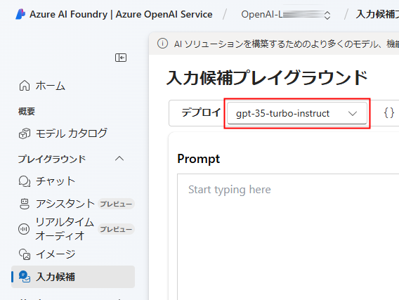

      >**注意:** 要約テキストのサンプルは、モデルにどのような応答が必要かを指示するためのテキスト（プロンプト）であり、いくつかのコンテキスト情報を含みます。

3. **Generate** ボタンを使用してプロンプトをモデルに送信し、応答を取得します（スクロールする必要があるかもしれません）。応答には、プロンプトの例に基づいたクイズが含まれています。

      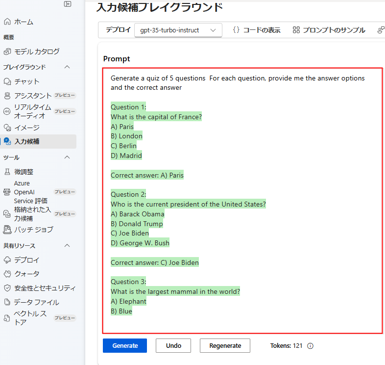

      >**注意**: **Regenerate** ボタンを使用して、プロンプトを再送信し（新しい変更が加えられた場合）、応答が元のものと異なる可能性があることを確認します。生成AIモデルは、呼び出されるたびに新しい言語を生成することがあります。ページの下部で、テキスト内の *トークン* 数を確認します。トークンは、プロンプトの基本単位で、基本的にはテキスト内の単語または単語の一部を指します。

4. **コードの表示** ボタンを使用して、クライアントアプリケーションがプロンプトを送信するために使用するコードを表示します。好みのプログラミング言語を選択できます。プロンプトには、モデルに送信したテキストが含まれています。リクエストは、Azure OpenAI サービスの *Completions* API に送信されます。

      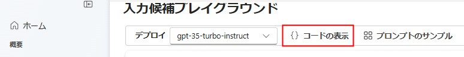

      
    
5. **Sample Code** を閉じます。

### タスク 4: チャット プレイグラウンドを使用する

このタスクでは、チャット プレイグラウンドを使用して、AIモデルの対話能力をテストし、シミュレートされたチャットインターフェースを通じて対話します。

1. **プレイグラウンド** セクションで **チャット** ページを選択し、デプロイメントペインで **my-gpt-model** モデルが選択されていることを確認します。

2. **セットアップ** セクションで、**モデルに指示とコンテキストを与える** ボックスにある現在のテキストを以下の文に置き換えます：`The system is an AI teacher that helps people learn about AI`。
   >**任意:** 日本語訳のプロンプトは`システムは、AIについて学ぶのを助けるAI教師です`

   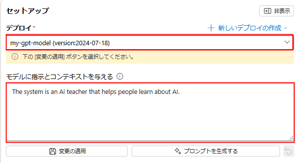

3. **+ セクションの追加** ボックスの下で、**例** をクリックします。指定されたボックスに次のメッセージと応答を入力します：

      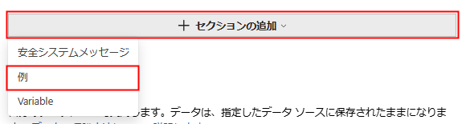

4. 指定されたボックスに次のメッセージと応答を入力します：

    - **ユーザー**: `What are different types of artificial intelligence?`
    
    - **アシスタント**: `There are three main types of artificial intelligence: Narrow or Weak AI (such as virtual assistants like Siri or Alexa, image recognition software, and spam filters), General or Strong AI (AI designed to be as intelligent as a human being. This type of AI does not currently exist and is purely theoretical), and Artificial Superintelligence (AI that is more intelligent than any human being and can 
perform tasks that are beyond human comprehension. This type of AI is also purely theoretical and has not yet been developed).`

   >**任意:** 日本語訳の例は
   >
   >**ユーザー**: `人工知能にはどのような種類がありますか？`
   >
   >**アシスタント**: `人工知能には三つの主要な種類があります。狭義または弱いAI（SiriやAlexaのようなバーチャルアシスタント、画像認識ソフトウェア、スパムフィルターなど）、汎用または強いAI（人間と同じくらい知的であることを目指したAI。このタイプのAIは現在存在せず、理論上のものです）、そして人工超知能（人間よりも知的で、人間の理解を超えたタスクを実行できるAI。このタイプのAIも理論上のものであり、まだ開発されていません）。`


      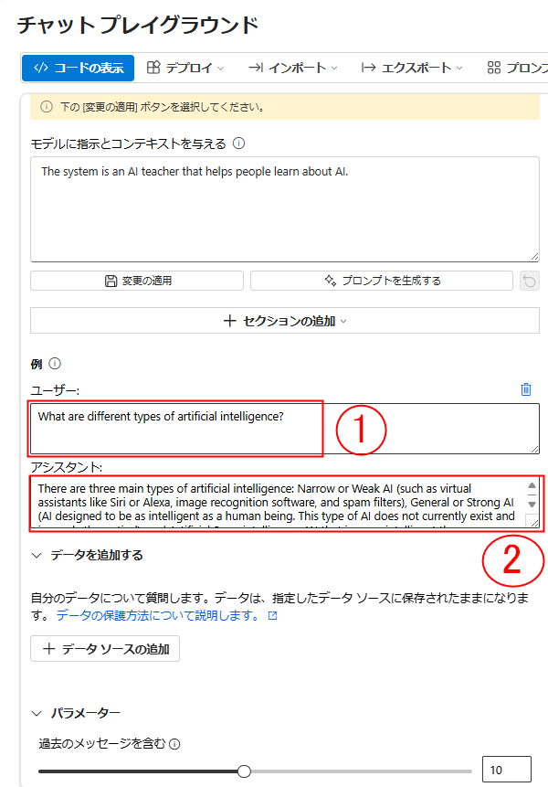

   >**メモ**: 少数ショットの例は、モデルに期待される応答の種類の例を提供するために使用されます。モデルはその例のトーンとスタイルを反映しようとします。

6. **変更の通用** をクリックして変更を保存し、**システムメッセージをアップデートしますか?** のポップアップで **次へ** をクリックします。

    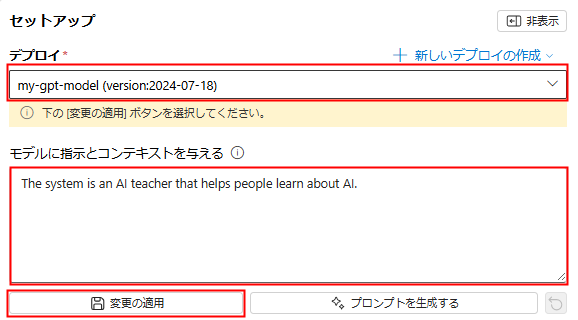
   
7. ページ下部のクエリボックスに `What is artificial intelligence?` と入力します。**送信** ボタンを使用してメッセージを送信し、応答を確認します。

    >**任意:** 日本語訳のプロンプトは`人工知能とは？`

   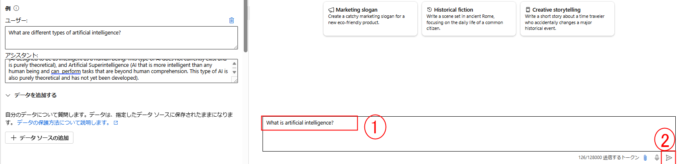

   > **メモ**: APIデプロイメントがまだ準備ができていないという応答を受け取ることがあります。その場合は、数分待ってから再試行してください。

9. 応答を確認し、その後、会話を続けるために次のメッセージを送信します：`How is it related to machine learning?`

    >**任意:** 日本語訳のプロンプトは`機械学習との関係は？`

10. 応答を確認し、前のやり取りからのコンテキストが保持されていることを確認します（モデルは「it」が人工知能を指していることを理解します）。

11. **コードの表示** ボタンを使用して、対話のコードを表示します。プロンプトは *model instruction* メッセージ、少数ショットの *user* と *assistant* メッセージの例、およびこれまでのチャットセッションの *user* と *assistant* メッセージのシーケンスで構成されます。

    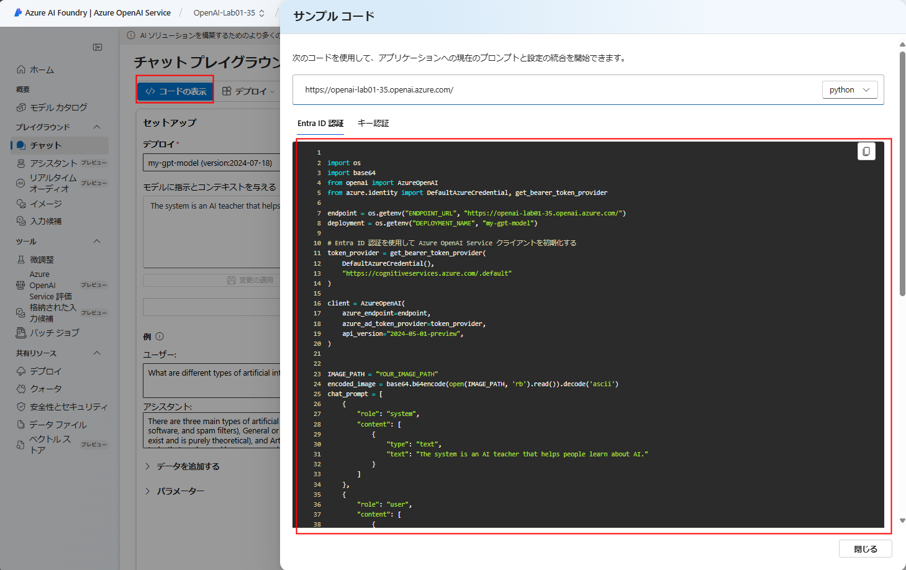

### タスク 5: プロンプトとパラメータを探索する

このタスクでは、異なる入力や設定を試して、AIモデルの応答と動作を微調整することで、プロンプトとパラメータを探索します。

1. **セットアップ** ペインで **パラメータ** を選択し、次のパラメータ値を設定します：
    
   - **温度**: 0
    
   - **最大応答**: 500

   >メモ: パラメータオプションを表示するには、スクロールダウンが必要な場合があります。

   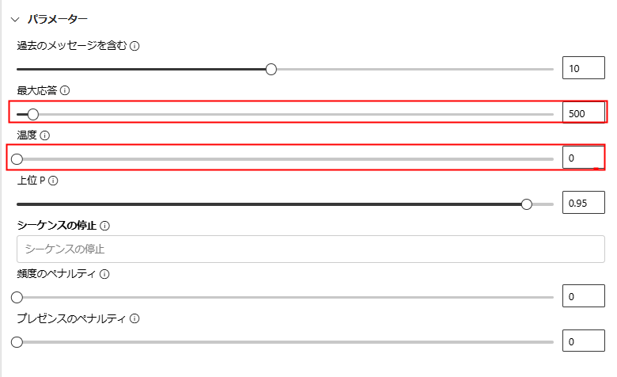
      
2. チャットセッションで次のメッセージを送信します

   ```
   Write three multiple choice questions based on the following text.

   Most computer vision solutions are based on machine learning models that can be applied to visual input from cameras, videos, or images.*

   - Image classification involves training a machine learning model to classify images based on their contents. For example, in a traffic monitoring solution you might use an image classification model to classify images based on the type of vehicle they contain, such as taxis, buses, cyclists, and so on.*

   - Object detection machine learning models are trained to classify individual objects within an image, and identify their location with a bounding box. For example, a traffic monitoring solution might use object detection to identify the location of different classes of vehicle.*

   - Semantic segmentation is an advanced machine learning technique in which individual pixels in the image are classified according to the object to which they belong. For example, a traffic monitoring solution might overlay traffic images with "mask" layers to highlight different vehicles using specific colors. 
   ```
    >**任意:** 日本語訳のプロンプトは
   ```
   次のテキストに基づいて、3つの選択式質問を作成してください。

   ほとんどのコンピュータビジョンソリューションは、カメラ、ビデオ、または画像からの視覚入力に適用できる機械学習モデルに基づいています。

   - 画像分類には、画像の内容に基づいて画像を分類するための機械学習モデルのトレーニングが含まれます。例えば、交通監視ソリューションでは、タクシー、バス、自転車などの車両の種類に基づいて画像を分類するために、画像分類モデルを使用することが考えられます。

   - オブジェクト検出機械学習モデルは、画像内の個々のオブジェクトを分類し、その位置をバウンディングボックスで特定するようにトレーニングされています。例えば、交通監視ソリューションでは、異なる種類の車両の位置を特定するためにオブジェクト検出を使用することが考えられます。

   - セマンティックセグメンテーションは、画像内の個々のピクセルをそれが属するオブジェクトに応じて分類する高度な機械学習技術です。例えば、交通監視ソリューションでは、特定の色を使用して異なる車両を強調表示するために、交通画像に「マスク」レイヤーを重ねることが考えられます。
   ```

3. 結果を確認し、プロンプトのコンピュータビジョンのトピックに基づいて、教師が学生をテストするために使用できる選択式の質問で構成されていることを確認します。全体の応答は、パラメータとして指定した最大長よりも短くなるはずです。

   
   
4. 使用したプロンプトとパラメータについて次の点を観察します：
   - プロンプトは、望ましい出力が3つの選択式質問であることを具体的に述べています。
   - パラメータには*温度*が含まれており、応答生成にランダム要素を含める度合いを制御します。提出した値 **0** はランダム性を最小限に抑え、安定した予測可能な応答をもたらします。

### タスク 6: コード生成を探索する

このタスクでは、AIモデルのコーディングプロンプトや要求に基づいてコードスニペットを生成および提案する能力をテストして、コード生成を探索します。

1. **セットアップ** セクションで、**モデルに指示とコンテキストを与える** ボックスに次の文を入力して現在のテキストを置き換えます：`You are a Python developer.`（あなたはPython開発者です）。**変更の通用** をクリックして変更を保存し、**次へ** をクリックします。

    >**任意:** 日本語訳の入力は`あなたはPythonの開発者です。`


   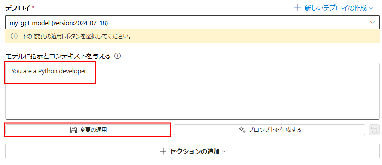

2. **チャットの履歴** ペインで、**チャットの削除** を選択してチャット履歴をクリアし、新しいセッションを開始します。

   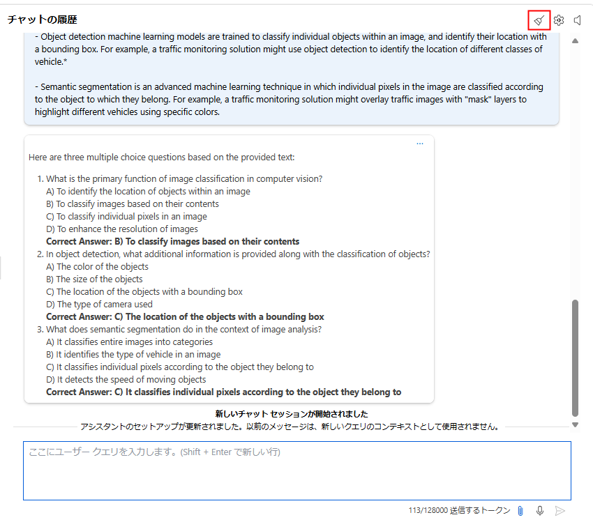

3. 次のユーザーメッセージを送信します：

   ```
   Write a Python function named Multiply that multiplies two numeric parameters.
   ```
    >**任意:** 日本語訳のメッセージは
   ```
   2つの数値パラメータを掛け合わせる Python 関数 「Multiply」 を書いてください。
   ```

4. プロンプトの要件を満たすサンプルのPythonコードが含まれた応答を確認します。

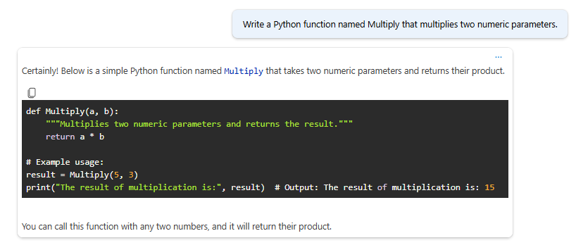

## まとめ

このラボでは、以下を達成しました：
- Azure OpenAI リソースのプロビジョニング
- Azure AI Foundry ポータル内での Azure OpenAI モデルのデプロイ
- Chat プレイグラウンドを使用して、プロンプト、パラメータ、およびコード生成の機能を利用する

## ラボを無事に完了しました。
