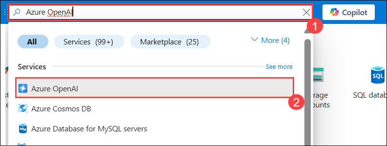
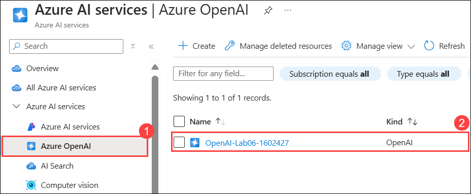

# ラボ 01: Azure OpenAI Service でのスタート

## ラボシナリオ
Azure OpenAI Service は、OpenAI が開発した生成AIモデルを Azure プラットフォームに導入し、Azure クラウドが提供するセキュリティ、スケーラビリティ、およびサービス統合を活用して強力な AI ソリューションを開発できるようにします。この演習では、Azure OpenAI のセットアップと Azure OpenAI Studio を使用してモデルをデプロイおよび操作する手順を学びます。

## ラボの目的
このラボでは、以下のタスクを完了します：

- タスク 1: Azure OpenAI リソースを作成する  
- タスク 2: モデルをデプロイする  
- タスク 3: Completions playground でモデルを操作する  
- タスク 4: Chat playground を使用する  
- タスク 5: プロンプトとパラメータを探索する  
- タスク 6: コード生成を試す  

## 所要時間: 約 60 分

---

## タスク 1: Azure OpenAI リソースを作成する

このタスクでは、Azure ポータルで Azure OpenAI リソースを作成します。OpenAI サービスを選択し、地域や価格設定を行うことで、OpenAI の高度な言語モデルをアプリケーションに統合できるようになります。

### 手順:

1. **Azure ポータル**で「**OpenAI**」を検索し、「**Azure OpenAI**」を選択します。

   

2. 「**Azure AI Services | Azure OpenAI**」ブレードで「**作成 (Create)**」をクリックします。

   

3. 以下の設定を使用して **Azure OpenAI** リソースを作成します：  
   - **Subscription**: デフォルト（事前に割り当てられたサブスクリプション）
   - **Resource group**: `openai-<DeploymentID>`
   - **Region**: **East US**
   - **Name**: `OpenAI-Lab01-<DeploymentID>`
   - **Pricing tier**: **Standard S0**

   

4. 「Next」を 3 回クリックし、「作成 (Create)」を選択します。

5. デプロイが完了するまで待ち、Azure ポータルでデプロイした Azure OpenAI リソースへ移動します。

<validation step="9ab1a143-84ef-420e-8713-2cacb6c0a63a" />

> **おめでとうございます！** タスクが完了しました。検証手順に進みましょう。

---

## タスク 2: モデルをデプロイする

このタスクでは、Azure OpenAI リソース内に AI モデルをデプロイし、AI 言語モデルの高度な機能をアプリケーションに統合します。

### 手順:

1. Azure ポータルで「**OpenAI**」を検索し、「**Azure OpenAI**」を選択します。

   

2. 「**Azure AI Services | Azure OpenAI**」ブレードで「**OpenAI-Lab01-<Deployment-id>**」を選択します。

   

3. Azure OpenAI リソース画面で「**Azure OpenAI Studio に移動する (Go to Azure OpenAI Studio)**」をクリックします。

   

4. 「**Explore the new experience**」を選択します。

   

5. 「**Deployments**」ページで「**+ Deploy model**」をクリックし、「**Deploy base Model (2)**」を選択します。

   

6. 検索バーで「**GPT-35-TURBO**」を入力し、「**Confirm**」をクリックします。

   

7. ポップアップで以下の設定を入力します：  
   - **Deployment name**: `my-gpt-model`  
   - **Model version**: **Auto-update to default (0301)**  
   - **Deployment type**: **Standard**  
   - **Tokens per Minute Rate Limit (thousands)**: `10K`  
   - **Enable dynamic quota**: **Enabled**  
   - 「Deploy」をクリックします。

   

> **注意:** GPT-35-Turbo-16k はチャットコンプリーション専用です。

8. デプロイが完了するまで待ちます。

> **補足:** Azure OpenAI には複数のモデルが存在し、特定のタスクやアプリケーションに適した性能を提供します。今回使用するモデル「GPT-35-Turbo」は自然言語要約やコード生成に適しています。

<validation step="f0c29243-24d0-4f47-a237-0e8982262203" />

> **おめでとうございます！** タスクが完了しました。検証手順に進みましょう。

---

## タスク 3: Completions playground でモデルを試す

このタスクでは、モデルがどのように応答するかをリアルタイムでテストし、AI モデルの性能や挙動を探索します。

### 手順:

1. Azure OpenAI Studio で「**Playground**」→「**Completions**」を選択します。

2. 「Completions」ページで、「**my-gpt-model**」が選択されていることを確認し、「**Generate a quiz**」を入力して **Generate** ボタンを押します。

   

3. 結果が生成されるので確認します。

   

4. 「**View Code**」ボタンを押し、生成されたコードを確認します。

   

## タスク 4: Chat playground を使用する

このタスクでは、AI モデルの会話能力を Chat Playground インターフェースで試します。

### 手順:

1. Playground の「Chat」タブで「my-gpt-model」を選択します。

2. 「System Message」に `The system is an AI teacher that helps people learn about AI` を設定します。

3. サンプルメッセージを設定してテストします。

   

4. クエリ入力後、「Send」をクリックし応答をテストします。

## タスク 5 & 6: パラメータ設定、コード生成探索

このタスクでは、パラメータ設定やモデルが生成するコードスニペットを試します。

- パラメータを調整し、応答を最適化します。
- コード生成テンプレートを使用して Python コードを生成します。

詳細な手順に従いながら設定とコード生成タスクを完了します。

## 総括
このラボで達成したこと：
- Azure OpenAI リソースの作成
- モデルを Azure OpenAI Studio にデプロイする
- Playground を活用して AI モデルを探索し、AI プロンプトやパラメータ調整、コード生成を試すことができました。

**これでラボが完了しました！お疲れ様でした！** 🎉
