# Lab 02: Use Azure OpenAI SDKs in your app

### Estimated Duration: 120 Minutes

In the lab, you will perform the role of a software developer who has been tasked to implement an app that can use generative AI to help provide hiking recommendations. The techniques used in the exercise can be applied to any app that utilizes Azure OpenAI APIs.

With the Azure OpenAI Service, developers can create chatbots, language models, and other applications that excel at understanding natural human language. The Azure OpenAI provides access to pre-trained AI models, as well as a suite of APIs and tools for customizing and fine-tuning these models to meet the specific requirements of your application. In this exercise, you'll learn how to deploy a model in Azure OpenAI and use it in your application.

## Lab Objectives

In this lab, you will complete the following tasks:

- Task 1: Provision an Azure OpenAI resource
- Task 2: Set up an application in Cloud Shell
- Task 3: Configure your application
- Task 4: Test your application

## Task 1: Provision an Azure OpenAI resource

Before you can use Azure OpenAI models, you must provision an Azure OpenAI resource in your Azure subscription.

1. In the **Azure portal**, search for **OpenAI (1)** and select **Azure OpenAI (2)**.

   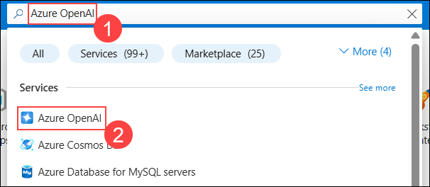

1. On the **Azure AI Services** page, ensure that **Azure OpenAI (1)** is selected from the left pane. Then, select **OpenAI-Lab01-<inject key="DeploymentID" enableCopy="false"></inject> (2)**

   .png)

1. To capture the Keys and Endpoints values, on **OpenAI-Lab01-<inject key="DeploymentID" enableCopy="false"></inject>** blade:
      - Select **Keys and Endpoint (1)** under **Resource Management**.
      - Click on **Show Keys (2)**.
      - Copy **Key 1 (3)** and ensure to paste it into a text editor such as Notepad for future reference.
      - Finally, copy the **Endpoint (4)** API URL by clicking on copy to clipboard. Please paste it in a text editor such as Notepad for later use.

        .png "Keys and Endpoints")

## Task 2: Set up an application in Cloud Shell

To show how to integrate with an Azure OpenAI model, we'll use a short command-line application that runs in Cloud Shell on Azure. Open up a new browser tab to work with Cloud Shell.

1. In the [Azure portal](https://portal.azure.com?azure-portal=true), select the **[>_]** (*Cloud Shell*) button at the top of the page to the right of the search box. A Cloud Shell pane will open at the bottom of the portal.

    

    >**Note**: If you can't find Cloud Shell, click on the **ellipsis (1)** and then select **Cloud Shell (2)** from the menu.

    .png)


1. The first time you open the Cloud Shell, you may be prompted to choose the type of shell you want to use (*Bash* or *PowerShell*). Select **Bash**. If you don't see this option, skip the step.

    .png)

1. Within the Getting Started page, select **Mount storage account (1)**, select your **Subscription (2)** from the dropdown and click **Apply (3)**.

   

1. Within the **Mount storage account** page, select **I want to create a storage account (1)** and click **Next (2)**.

   

1. Within the **Create storage account** page, enter the following details:

    - Subscription: Default- Choose the only existing subscription assigned for this lab **(1)**.
    - Resource group: Select **openai-<inject key="DeploymentID" enableCopy="false"></inject> (2)**
    - Region: **<inject key="Region" enableCopy="false" /> (3)**
    - Storage account name: **storage<inject key="DeploymentID" enableCopy="false"></inject> (4)**
    - File share: Create a new file share named **none** **(5)**
    - Click **Create** (6)

        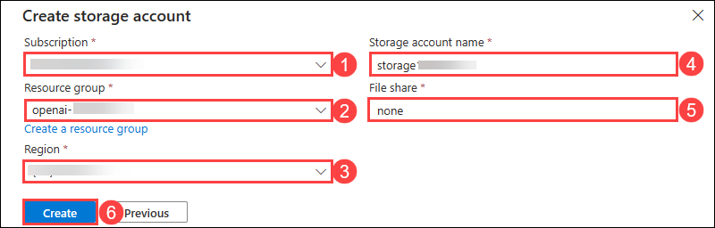

1. Note that you can resize the cloud shell by dragging the separator bar at the top of the page, or by using the **&#8212;**, **&#9723;**, and **X** icons at the top right of the page to minimize, maximize, and close the pane. For more information about using the Azure Cloud Shell, see the [Azure Cloud Shell documentation](https://docs.microsoft.com/azure/cloud-shell/overview). 

1. Once the terminal opens, click on **Settings (1)** and select **Go to Classic Version (2)**.

    

1. Once the terminal starts, enter the below-mentioned command to download the sample application and save it to a folder called `azure-openai`.

    ```bash
   rm -r azure-openai -f
   git clone https://github.com/microsoftlearning/mslearn-openai mslearn-openai
    ```

    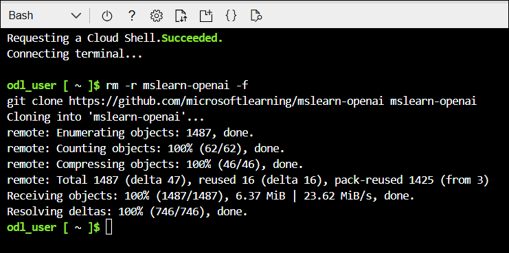    
  
1. The files are downloaded to a folder named **mslearn-openai**. Navigate to the lab files for this exercise using the following command.

    ```bash
   cd mslearn-openai/Labfiles/01-app-develop
    ```

    Applications for both C# and Python have been provided, as well as a sample text file you'll use to test the summarization. Both apps feature the same functionality.

1. Open the built-in code editor, and observe the text file that you'll be summarizing with your model. Use the following command to open the lab files in the code editor.

    ```bash
    code .
    ```

> **Congratulations** on completing the task! Now, it's time to validate it. Here are the steps:
> - Hit the Validate button for the corresponding task. If you receive a success message, you can proceed to the next task. 
> - If not, carefully read the error message and retry the step, following the instructions in the lab guide.
> - If you need any assistance, please contact us at cloudlabs-support@spektrasystems.com. We are available 24/7 to help you out.

<validation step="bd2f25c6-d67e-4553-a8ed-32e9f0162e26" />

## Task 3: Configure your application

For this exercise, you'll complete some key parts of the application to enable using your Azure OpenAI resource.

1. In the code editor, expand the **CSharp** or **Python** folder, depending on your language preference.

1. If you are using the **C#** language, kindly open the **CSharp.csproj** file and replace it with the following code and save the file.

   ```
   <Project Sdk="Microsoft.NET.Sdk">
   
   <PropertyGroup>
   <OutputType>Exe</OutputType>
   <TargetFramework>net9.0</TargetFramework>
   <ImplicitUsings>enable</ImplicitUsings>
   <Nullable>enable</Nullable>
   </PropertyGroup>
   
    <ItemGroup>
    <PackageReference Include="Azure.AI.OpenAI" Version="2.1.0" />
    <PackageReference Include="Microsoft.Extensions.Configuration" Version="8.0.*" />
    <PackageReference Include="Microsoft.Extensions.Configuration.Json" Version="8.0.*" />
    </ItemGroup>
   
    <ItemGroup>
      <None Update="appsettings.json">
        <CopyToOutputDirectory>PreserveNewest</CopyToOutputDirectory>
       </None>
     </ItemGroup>
   
    </Project> 
   ```

1. Open the configuration file for your language

    - C#: `appsettings.json`
    
    - Python: `.env`
    
1. Update the configuration values to include the **endpoint** and **key** from the Azure OpenAI resource you created, as well as the model name that you deployed, `my-gpt-model`. Then save the file by right-clicking on the blank space in the file text editor and hit **Save**.

    - **C#**:
     
      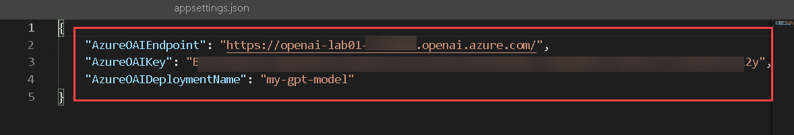   

    - **Python**:
     
      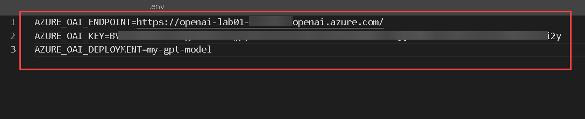 

       > **Note**: You can get the Azure OpenAI endpoint and key values from the Azure OpenAI resource's **Key and Endpoint** section under **Resource Management**.

1. Navigate back to the Cloudshell and install the necessary packages for your preferred language:

    **C#** : 

    ```bash
    cd CSharp
    dotnet add package Azure.AI.OpenAI --version 2.1.0
    ```

    **Python** : 

    ```bash
    cd Python
    python -m venv labenv
   ./labenv/bin/Activate.ps1
    pip install python-dotenv openai==1.65.2 --user
    ```

1. Navigate to your preferred language folder, replace the comment **Add Azure OpenAI package** with code to add the Azure OpenAI SDK library:

    **C#**: Program.cs

    ```csharp
    // Add Azure OpenAI packages
    using Azure.AI.OpenAI;
    using OpenAI.Chat;
    ```

     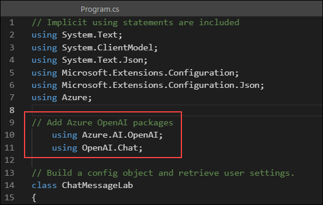 

    **Python**: application.py

    ```python
    # Add Azure OpenAI package
    from openai import AsyncAzureOpenAI
    ```

     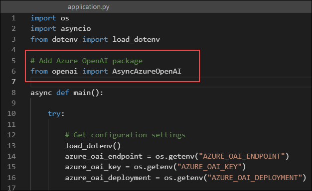      

1.  In the application code for your language, find the comment **Configure the Azure OpenAI client**, and add code to configure the Azure OpenAI client:

    **C#**: Program.cs

    ```csharp
    // Configure the Azure OpenAI client
    AzureOpenAIClient azureClient = new (new Uri(oaiEndpoint), new ApiKeyCredential(oaiKey));
    ChatClient chatClient = azureClient.GetChatClient(oaiDeploymentName);
    ```

     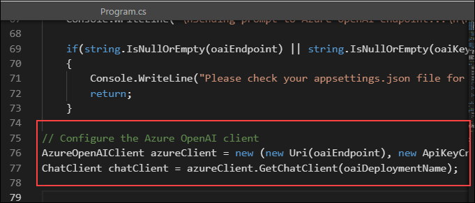  

    **Python**: application.py

    ```python
    # Configure the Azure OpenAI client
    client = AsyncAzureOpenAI(
       azure_endpoint = azure_oai_endpoint, 
       api_key=azure_oai_key,  
       api_version="2024-02-15-preview"
      )
    ```

     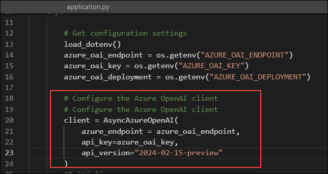   

      >**Note**: Make sure to indent the code by eliminating any extra white spaces after pasting it into the code editor.
    
1. In the function that calls the **Azure OpenAI model**, under the comment **Get response from Azure OpenAI**, add the code to format and send the request to the model.

    **C#**: Program.cs

    ```csharp
      // Get response from Azure OpenAI
      ChatCompletionOptions chatCompletionOptions = new ChatCompletionOptions()
      {
         Temperature = 0.7f,
         MaxOutputTokenCount = 800
      };
      
      ChatCompletion completion = chatClient.CompleteChat(
         [
             new SystemChatMessage(systemMessage),
             new UserChatMessage(userMessage)
         ],
         chatCompletionOptions
      );
      
      Console.WriteLine($"{completion.Role}: {completion.Content[0].Text}");
    ```

     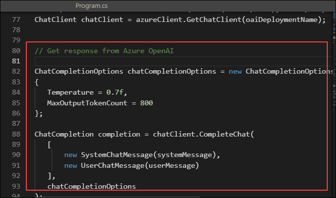      

    **Python**: application.py

    ```python
    # Get response from Azure OpenAI
      messages =[
         {"role": "system", "content": system_message},
         {"role": "user", "content": user_message},
      ]
      
      print("\nSending request to Azure OpenAI model...\n")
      
      # Call the Azure OpenAI model
      response = await client.chat.completions.create(
         model=model,
         messages=messages,
         temperature=0.7,
         max_tokens=800
      )
    ```

     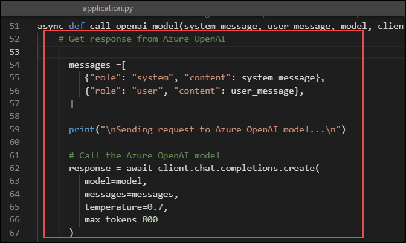  

1. Before you can save the file, please make sure your code looks similar to the code provided below.

    **C#**: Program.cs
      
      ```CSharp
      // Implicit using statements are included
      using System.Text;
      using System.ClientModel;
      using System.Text.Json;
      using Microsoft.Extensions.Configuration;
      using Microsoft.Extensions.Configuration.Json;
      using Azure;
      
      // Add Azure OpenAI packages
          using Azure.AI.OpenAI;
          using OpenAI.Chat;
      
      // Build a config object and retrieve user settings.
      class ChatMessageLab
      {
      
      static string? oaiEndpoint;
      static string? oaiKey;
      static string? oaiDeploymentName;
          static void Main(string[] args)
      {
      IConfiguration config = new ConfigurationBuilder()
          .AddJsonFile("appsettings.json")
          .Build();
      
      oaiEndpoint = config["AzureOAIEndpoint"];
      oaiKey = config["AzureOAIKey"];
      oaiDeploymentName = config["AzureOAIDeploymentName"];
      
      //Initialize messages list
      
      do {
          // Pause for system message update
          Console.WriteLine("-----------\nPausing the app to allow you to change the system prompt.\nPress any key to continue...");
          Console.ReadKey();
          
          Console.WriteLine("\nUsing system message from system.txt");
          string systemMessage = System.IO.File.ReadAllText("system.txt"); 
          systemMessage = systemMessage.Trim();
      
          Console.WriteLine("\nEnter user message or type 'quit' to exit:");
          string userMessage = Console.ReadLine() ?? "";
          userMessage = userMessage.Trim();
          
          if (systemMessage.ToLower() == "quit" || userMessage.ToLower() == "quit")
          {
              break;
          }
          else if (string.IsNullOrEmpty(systemMessage) || string.IsNullOrEmpty(userMessage))
          {
              Console.WriteLine("Please enter a system and user message.");
              continue;
          }
          else
          {
              // Format and send the request to the model
      
              GetResponseFromOpenAI(systemMessage, userMessage);
          }
      } while (true);
      
      }
      
      // Define the function that gets the response from Azure OpenAI endpoint
      private static void GetResponseFromOpenAI(string systemMessage, string userMessage)  
      {   
          Console.WriteLine("\nSending prompt to Azure OpenAI endpoint...\n\n");
      
          if(string.IsNullOrEmpty(oaiEndpoint) || string.IsNullOrEmpty(oaiKey) || string.IsNullOrEmpty(oaiDeploymentName) )
          {
              Console.WriteLine("Please check your appsettings.json file for missing or incorrect values.");
              return;
          }
      
      // Configure the Azure OpenAI client
      AzureOpenAIClient azureClient = new (new Uri(oaiEndpoint), new ApiKeyCredential(oaiKey));
      ChatClient chatClient = azureClient.GetChatClient(oaiDeploymentName);
      
      
      // Get response from Azure OpenAI
      
      ChatCompletionOptions chatCompletionOptions = new ChatCompletionOptions()
      {
         Temperature = 0.7f,
         MaxOutputTokenCount = 800
      };
      
      ChatCompletion completion = chatClient.CompleteChat(
         [
             new SystemChatMessage(systemMessage),
             new UserChatMessage(userMessage)
         ],
         chatCompletionOptions
      );
      
      Console.WriteLine($"{completion.Role}: {completion.Content[0].Text}");
      
      
      
      }
      
      }

      ```
    
   **Python**: application.py

      ```Python
      import os
      import asyncio
      from dotenv import load_dotenv
      
      # Add Azure OpenAI package
      from openai import AsyncAzureOpenAI
      
      async def main(): 
          try: 
              # Get configuration settings 
              load_dotenv()
              azure_oai_endpoint = os.getenv("AZURE_OAI_ENDPOINT")
              azure_oai_key = os.getenv("AZURE_OAI_KEY")
              azure_oai_deployment = os.getenv("AZURE_OAI_DEPLOYMENT")
              
              # Configure the Azure OpenAI client
              client = AsyncAzureOpenAI(
                  azure_endpoint=azure_oai_endpoint, 
                  api_key=azure_oai_key,  
                  api_version="2024-02-15-preview"
              )
      
              while True:
                  # Pause the app to allow the user to enter the system prompt
                  print("------------------\nPausing the app to allow you to change the system prompt.\nPress enter to continue...")
                  input()
      
                  # Read in system message and prompt for user message
                  system_text = open(file="system.txt", encoding="utf8").read().strip()
                  user_text = input("Enter user message, or 'quit' to exit: ")
                  if user_text.lower() == 'quit' or system_text.lower() == 'quit':
                      print('Exiting program...')
                      break
      
                  # Format and send the request to the model
                  await call_openai_model(
                      system_message=system_text, 
                      user_message=user_text, 
                      model=azure_oai_deployment, 
                      client=client
                  )
      
          except Exception as ex:
              print(ex)
      
      # Define the function that will get the response from Azure OpenAI endpoint
      async def call_openai_model(system_message, user_message, model, client):
          # Get response from Azure OpenAI
          messages = [
              {"role": "system", "content": system_message},
              {"role": "user", "content": user_message},
          ]
          
          print("\nSending request to Azure OpenAI model...\n")
          
          # Call the Azure OpenAI model
          response = await client.chat.completions.create(
              model=model,
              messages=messages,
              temperature=0.7,
              max_tokens=800
          )
      
          print("Response:\n" + response.choices[0].message.content + "\n")
      
      if __name__ == '__main__': 
          asyncio.run(main())

      ```
    
1. To save the changes made to the file, right-click on the blank space in the file text editor and hit **Save**

   >**Note:** Make sure to indent the code by eliminating any extra white spaces after pasting it into the code editor.

## Task 4: Test your application

Now that your app has been set up, you can just run it to send your request to your model and observe the response. You'll notice the only difference between the different options is the content of the prompt; all other parameters (such as token count and temperature) remain the same for each request.

1. In the folder of your preferred language, open the **system.txt** file. For each of the interactions, you'll enter the **System message** in this file and save it. Each iteration will pause first for you to change the system message.

1. In the interactive terminal pane, ensure the folder context is the folder for your preferred language. Then, enter the following command to run the application.

    - **C#**: `dotnet run`
    
    - **Python**: `python application.py`

      > **Tip**: You can use the **Maximize panel size** (**^**) icon in the terminal toolbar to see more of the console text.

1. For the first iteration, enter the following prompts:

   **System message:**
   ```
   You are an AI assistant
   ```
   
   **User message:**
   ```
   Write an intro for a new wildlife Rescue 
   ```

1. Observe the output. The AI model will likely produce a good generic introduction to a wildlife rescue.

1. Next, enter the following prompts, which specify a format for the response:

   **System message:**
   ```
   You are an AI assistant helping to write emails
   ```

   **User message:**
   ```
   Write a promotional email for a new wildlife rescue, including the following:-Rescue name is Contoso - It specializes in elephants - Call for donations to be given at our website
   ```

1. Observe the output. This time, you'll likely see the format of an email with the specific animals included, as well as the call for donations.

1. Next, enter the following prompts that additionally specify the content:

   **System message:**
   ```
   You are an AI assistant helping to write emails
   ```

   **User message:**
   ```
   Write a promotional email for a new wildlife rescue, including the following: - Rescue name is Contoso - It specializes in elephants, as well as zebras and giraffes - Call for donations to be given at our website - Include a list of the current animals we have at our rescue after the signature, in the form of a table. These animals include elephants, zebras, gorillas, lizards, and jackrabbits.
   ```
1. Observe the output, and see how the email has changed based on your clear instructions.   

1. Next, enter the following prompts where we add details about tone to the system message:

   **System message:**
   ```
   You are an AI assistant that helps write promotional emails to generate interest in a new business. Your tone is light, chit-chat oriented, and you always include at least two jokes.
   ```

   **User message:**
   ```
   Write a promotional email for a new wildlife rescue, including the following: - Rescue name is Contoso - It specializes in elephants, as well as zebras and giraffes - Call for donations to be given at our website - Include a list of the current animals we have at our rescue after the signature, in the form of a table. These animals include elephants, zebras, gorillas, lizards, and jackrabbits..
   ```

1. Observe the output. This time, you'll likely see the email in a similar format, but with a much more informal tone. You'll likely even see jokes included!

## Summary

In this lab, you have accomplished the following:
- Provision an Azure OpenAI resource
- Deploy an OpenAI model within the Azure AI Foundry portal
- Integrate Azure OpenAI models into your applications

### You have successfully completed the lab.
