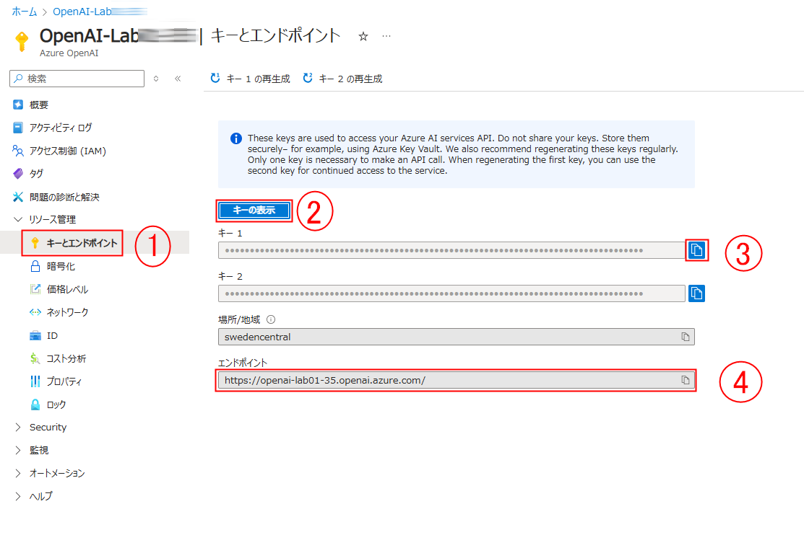
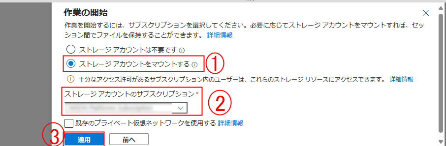
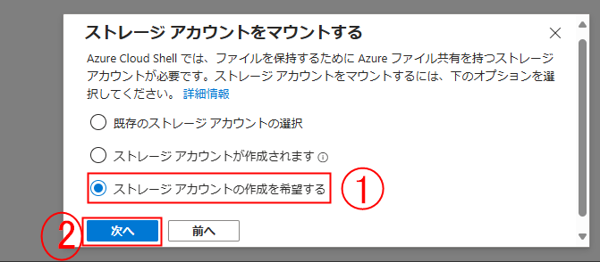
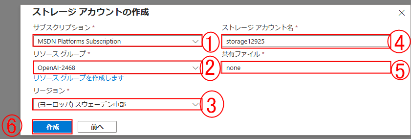

# ラボ 02: Azure OpenAI SDK をアプリで使用する

## ラボシナリオ
Azure OpenAI サービスを使用すると、開発者はチャットボット、言語モデル、およびその他の自然な人間の言語を理解するアプリケーションを作成できます。Azure OpenAI では、事前にトレーニングされた AI モデルへのアクセスと、これらのモデルをカスタマイズおよび微調整してアプリケーションの特定の要件を満たすための一連の API およびツールが提供されます。この演習では、Azure OpenAI でモデルをデプロイし、それを自分のアプリケーションで使用する方法を学びます。

この演習のシナリオでは、生成 AI を使用してハイキングの推薦を提供するアプリを実装するように指示されたソフトウェア開発者の役割を果たします。演習で使用される技術は、Azure OpenAI API を使用するアプリに適用できます。

## ラボの目的
このラボでは、次のタスクを完了します：

- タスク 1: Azure OpenAI リソースのキーとエンドポイントを取得する
- タスク 2: Cloud Shell でアプリケーションをセットアップする
- タスク 3: アプリケーションを構成する
- タスク 4: アプリケーションをテストする
- タスク 5: 会話履歴を維持する

## 推定時間: 60 分

### タスク 1: Azure OpenAI リソースのキーとエンドポイントを取得する

このタスクでは、Azure OpenAI リソースのキーとエンドポイントを取得します

1. Azure ポータルで **Azure OpenAI** を検索し、Azure OpenAI を選択します。

1. 既存の Azure OpenAI リソースを選択し、以下の手順に従って OpenAI リソースのキーとエンドポイントをコピーします。

      - **リソース管理** の下にある **キーとエンドポイント (1)** を選択します。
      - **キーの表示 (2)** をクリックします。
      - **キー 1 (3)** をコピーし、将来の参照のためにメモ帳などのテキストエディタに貼り付けます。
      - 最後に、クリップボードにコピーするために **エンドポイント (4)** API URL をコピーします。後で使用するためにメモ帳などのテキストエディタに貼り付けます。

           

### タスク 2: Cloud Shell でアプリケーションをセットアップする

このタスクでは、Azure の Cloud Shell で実行される短いコマンドラインアプリケーションを使用して Azure OpenAI モデルと統合します。Cloud Shell を使用するために新しいブラウザタブを開きます。

1. [Azure ポータル](https://portal.azure.com?azure-portal=true) で、ページの上部の検索ボックスの右側にある **[>_]** (*Cloud Shell*) ボタンを選択します。Cloud Shell ペインがポータルの下部に開きます。

    

2. Cloud Shell を初めて開くときに、使用するシェルの種類（*Bash* または *PowerShell*）を選択するように求められる場合があります。**Bash** を選択します。このオプションが表示されない場合は、手順をスキップします。

3. 作業の開始 ペインで **ストレージ アカウントをマウントする** を選択し、ドロップダウンから **ストレージアカウントのサブスクリプション** を選択して **通用** をクリックします。

   

4. **ストレージアカウントをマウントする** ペインで、**ストレージアカウントの作成を希望する** を選択し、**次へ** をクリックします。

   

5. **ストレージアカウントの作成** ペインで、次の詳細を入力します：

    - **サブスクリプション**: デフォルト - このラボに割り当てられた唯一のサブスクリプションを選択します (1)。
    - **リソースグループ**: openai-<inject key="DeploymentID" enableCopy="false"></inject> を選択します (2)
    - **リージョン**: <inject key="Region" enableCopy="false" /> (3)
    - **ストレージアカウント名**: storage<inject key="DeploymentID" enableCopy="false"></inject> (4)
    - **共有ファイル**: **none** という名前の新しいファイル共有を作成します (5)
    - **作成** をクリックします (6)

    

6. Cloud Shell ペインの左上に表示されているシェルの種類が *Bash* に切り替わっていることを確認します。*PowerShell* の場合は、ドロップダウンメニューを使用して *Bash* に切り替えます。

7. Cloud Shell のサイズを変更するには、ペインの上部のセパレーターバーをドラッグするか、ペインの右上にある **&#8212;**, **&#9723;**, および **X** アイコンを使用して、最小化、最大化、および閉じることができます。Azure Cloud Shell の使用に関する詳細については、[Azure Cloud Shell ドキュメント](https://docs.microsoft.com/azure/cloud-shell/overview) を参照してください。 

8. ターミナルが開いたら、**設定** をクリックし、**クラシックバージョンに移動** を選択します。

   

9. ターミナルが開始したら、次のコマンドを入力してサンプルアプリケーションをダウンロードし、`azure-openai` というフォルダに保存します。

    ```bash
   rm -r azure-openai -f
   git clone https://github.com/MicrosoftLearning/mslearn-openai azure-openai
    ```

10. ファイルは **azure-openai** というフォルダにダウンロードされます。次のコマンドを使用して、この演習のラボファイルに移動します。

    ```bash
    cd azure-openai/Labfiles/02-azure-openai-api
    ```

      C# と Python の両方のアプリケーションが提供されており、要約をテストするためのサンプルテキストファイルも含まれています。どちらのアプリも同じ機能を備えています。

11. 組み込みのコードエディタを開き、モデルで要約するテキストファイルが `text-files/sample-text.txt` にあることを確認します。次のコマンドを使用して、コードエディタでラボファイルを開きます。
   
   ```bash
   code .
   ```

> **おめでとうございます** タスクの完了です！次に、それを検証する時です。手順は以下の通りです：
> - 該当するタスクの [Validate] ボタンを押します。成功メッセージが表示された場合、次のタスクに進むことができます。
> - そうでない場合、エラーメッセージを注意深く読み、ラボガイドの指示に従って手順を再試行します。
> - 支援が必要な場合は、cloudlabs-support@spektrasystems.com にご連絡ください。24時間365日対応しています。

   <validation step="fc003b3d-0ba1-468e-9271-917c42e5eabb" />

### タスク 3: アプリケーションを構成する

このタスクでは、Azure OpenAI リソースを使用できるように、アプリケーションの主要部分を完成させます。

1. コードエディタで、言語の好みに応じて **CSharp** または **Python** フォルダを展開します。

2. 使用している言語の設定ファイルを開きます

    - C#: `appsettings.json`
    - Python: `.env`
    
3. Azure OpenAI リソースから取得した **endpoint** と **key**、およびデプロイしたモデル名 `my-gpt-model` を含めるように構成値を更新します。次に、左ペインのファイルを右クリックして **Save** をクリックしてファイルを保存します。

4. 使用する言語のフォルダに移動し、必要なパッケージをインストールします

    **C#** : 

    ```bash
    cd CSharp
    dotnet add package Azure.AI.OpenAI --version 1.0.0-beta.14
    ```

    **Python** : 

    ```bash
    cd Python
    pip install python-dotenv
    pip install openai==1.56.2
    ```

5. 好みの言語のフォルダに移動し、コードファイルを選択して必要なライブラリを追加します。

    **C#**: Program.cs

    ```csharp
    // Add Azure OpenAI package
    using Azure.AI.OpenAI;
    ```

    **Python**: test-openai-model.py

    ```python
    # Add Azure OpenAI package
    from openai import AzureOpenAI
    ```

6. 使用する言語のアプリケーションコード内で、コメント ***Initialize the Azure OpenAI client...*** を次のコードに置き換えて、クライアントを初期化し、システムメッセージを定義します。

    **C#**: Program.cs

    ```csharp
    // Initialize the Azure OpenAI client
    OpenAIClient client = new OpenAIClient(new Uri(oaiEndpoint), new AzureKeyCredential(oaiKey));
    
    // System message to provide context to the model
    string systemMessage = "I am a hiking enthusiast named Forest who helps people discover hikes in their area. If no area is specified, I will default to near Rainier National Park. I will then provide three suggestions for nearby hikes that vary in length. I will also share an interesting fact about the local nature on the hikes when making a recommendation.";
    ```

    **Python**: test-openai-model.py

    ```python
    # Initialize the Azure OpenAI client
    client = AzureOpenAI(
            azure_endpoint = azure_oai_endpoint, 
            api_key=azure_oai_key,  
            api_version="2024-02-15-preview"
            )
    
    # Create a system message
    system_message = """I am a hiking enthusiast named Forest who helps people discover hikes in their area. 
        If no area is specified, I will default to near Rainier National Park. 
        I will then provide three suggestions for nearby hikes that vary in length. 
        I will also share an interesting fact about the local nature on the hikes when making a recommendation.
        """
    ```

    >**任意:** 日本語訳のシステムメッセージは
    ```
      私はフォレストという名前のハイキング愛好家で、人々が自分の地域でハイキングコースを見つけるのを助けます。
      特定の地域が指定されていない場合、デフォルトでレーニア国立公園の近くを提案します。
      その後、長さが異なる3つの近くのハイキングコースを提案します。
      また、推薦する際には、地元の自然についての興味深い事実も共有します。
    ```

      >**メモ**: コードエディタに貼り付けた後、余分なスペースを削除してインデントを確認してください。
    
8. コメント ***Add code to send request...*** を必要なコードに置き換え、リクエストを構築し、`messages` や `temperature` などのモデルのさまざまなパラメータを指定します。

    **C#**: Program.cs

    ```csharp
    // Add code to send request...
    // Build completion options object
    ChatCompletionsOptions chatCompletionsOptions = new ChatCompletionsOptions()
    {
        Messages =
        {
            new ChatRequestSystemMessage(systemMessage),
            new ChatRequestUserMessage(inputText),
        },
        MaxTokens = 400,
        Temperature = 0.7f,
        DeploymentName = oaiDeploymentName
    };

    // Send request to Azure OpenAI model
    ChatCompletions response = client.GetChatCompletions(chatCompletionsOptions);

    // Print the response
    string completion = response.Choices[0].Message.Content;
    Console.WriteLine("Response: " + completion + "\n");
    ```

    **Python**: test-openai-model.py

    ```python
    # Add code to send request...
    # Send request to Azure OpenAI model
    response = client.chat.completions.create(
        model=azure_oai_deployment,
        temperature=0.7,
        max_tokens=400,
        messages=[
            {"role": "system", "content": system_message},
            {"role": "user", "content": input_text}
        ]
    )
    generated_text = response.choices[0].message.content

    # Print the response
    print("Response: " + generated_text + "\n")
    ```

9. ファイルに加えた変更を保存するには、コードウィンドウの左ペインからファイルを右クリックし、**Save** をクリックします。

   >**メモ:** コードエディタに貼り付けた後、余分なスペースを削除してインデントを確認してください。

### タスク 4: アプリケーションをテストする

このタスクでは、構成済みのアプリを実行してモデルにリクエストを送信し、応答を確認します。

1. Cloud Shell bash ターミナルで、使用する言語のフォルダに移動します。

2. **C#** 言語を使用している場合は、**CSharp.csproj** ファイルを開き、次のコードに置き換えてファイルを保存します。

   ```
   <Project Sdk="Microsoft.NET.Sdk">
   
   <PropertyGroup>
   <OutputType>Exe</OutputType>
   <TargetFramework>net8.0</TargetFramework>
   <ImplicitUsings>enable</ImplicitUsings>
   <Nullable>enable</Nullable>
   </PropertyGroup>
   
    <ItemGroup>
    <PackageReference Include="Azure.AI.OpenAI" Version="1.0.0-beta.14" />
    <PackageReference Include="Microsoft.Extensions.Configuration" Version="8.0.*" />
    <PackageReference Include="Microsoft.Extensions.Configuration.Json" Version="8.0.*" />
    </ItemGroup>
   
    <ItemGroup>
      <None Update="appsettings.json">
        <CopyToOutputDirectory>PreserveNewest</CopyToOutputDirectory>
       </None>
     </ItemGroup>
   
    </Project> 

   ```
   
3. インタラクティブなターミナルペインで、フォルダーコンテキストが好みの言語のフォルダーであることを確認します。次に、アプリケーションを実行するための次のコマンドを入力します。

    - **C#**: `dotnet run`
    - **Python**: `python test-openai-model.py`

       > **ヒント**: ターミナルのツールバーにある **Maximize panel size** (**^**) アイコンを使用して、コンソールのテキストをより多く表示できます。

4. 指示されたら、`What hike should I do near Rainier?`（レーニアの近くでどのハイキングをすべきですか？）というテキストを入力します。
5. 応答を確認し、応答が*messages*配列に追加されたシステムメッセージのガイドラインに従っていることを確認します。
6. `Where should I hike near Boise? I'm looking for something of easy difficulty, between 2 to 3 miles, with moderate elevation gain.`（ボイジーの近くでどこでハイキングすべきですか？簡単な難易度で、2～3マイルの距離で、適度な高低差のハイキングを探しています。）というプロンプトを入力し、出力を確認します。
7. お好みの言語のコードファイルで、リクエスト内の*temperature*パラメータ値を**1.0**に変更し、ファイルを保存します。
8. 上記のプロンプトを使用してアプリケーションを再度実行し、出力を確認します。

温度を上げると、ランダム性が増し、同じテキストを提供しても応答が変わることがよくあります。同じ入力で温度の異なる値を試して、出力の変化を確認してください。

### タスク 5: 会話履歴を維持する

このタスクでは、会話の履歴をプロンプトに提供して、Azure OpenAI モデルが過去のメッセージを参照できるようにし、API のステートレスな設計にもかかわらず、やり取りのリアリズムを高めます。

1. アプリを再度実行し、`Where is a good hike near Boise?`（ボイジーの近くで良いハイキングはどこですか？）というプロンプトを提供します。
2. 出力を確認し、その後 `How difficult is the second hike you suggested?`（提案した2番目のハイキングはどれくらい難しいですか？）というプロンプトを入力します。
3. モデルからの応答は、おそらく参照しているハイキングがわからないことを示すでしょう。それを修正するために、過去の会話メッセージを参照するようにモデルを有効にできます。
4. アプリケーションで、今後送信するプロンプトに前のプロンプトと応答を追加する必要があります。**system message** の定義の下に次のコードを追加します。

    **C#**: Program.cs

    ```csharp
    // Initialize messages list
    var messagesList = new List<ChatRequestMessage>()
    {
        new ChatRequestSystemMessage(systemMessage),
    };
    ```

    **Python**: test-openai-model.py

    ```python
    # Initialize messages array
    messages_array = [{"role": "system", "content": system_message}]
    ```

5. コメント ***Add code to send request...*** の下にあるコード全体を、C# の場合は**while**ループコマンドの最後まで、Python の場合は **except** コマンドの最後まで次のコードに置き換えてからファイルを保存します。コードはほとんど同じですが、会話履歴を保存するために今度はメッセージ配列を使用します。

    **C#**: Program.cs

    ```csharp
    // Add code to send request...
    // Build completion options object
    messagesList.Add(new ChatRequestUserMessage(inputText));

    ChatCompletionsOptions chatCompletionsOptions = new ChatCompletionsOptions()
    {
        MaxTokens = 1200,
        Temperature = 0.7f,
        DeploymentName = oaiDeploymentName
    };

    // Add messages to the completion options
    foreach (ChatRequestMessage chatMessage in messagesList)
    {
        chatCompletionsOptions.Messages.Add(chatMessage);
    }

    // Send request to Azure OpenAI model
    ChatCompletions response = client.GetChatCompletions(chatCompletionsOptions);

    // Return the response
    string completion = response.Choices[0].Message.Content;

    // Add generated text to messages list
    messagesList.Add(new ChatRequestAssistantMessage(completion));

    Console.WriteLine("Response: " + completion + "\n");
    ```

    **Python**: test-openai-model.py

    ```python
    # Add code to send request...
    # Send request to Azure OpenAI model
    messages_array.append({"role": "user", "content": input_text})

    response = client.chat.completions.create(
        model=azure_oai_deployment,
        temperature=0.7,
        max_tokens=1200,
        messages=messages_array
    )
    generated_text = response.choices[0].message.content
    # Add generated text to messages array
    messages_array.append({"role": "system", "content": generated_text})

    # Print generated text
    print("Summary: " + generated_text + "\n")
    ```

6. 最終にコードは次のようになります：

   **C#**: Program.cs

   ```csharp
   // Implicit using statements are included
      using System.Text;
      using System.Text.Json;
      using Microsoft.Extensions.Configuration;
      using Microsoft.Extensions.Configuration.Json;
      using Azure;
      
      // Add Azure OpenAI package
      using Azure.AI.OpenAI;
      
      // Build a config object and retrieve user settings.
      IConfiguration config = new ConfigurationBuilder()
          .AddJsonFile("appsettings.json")
          .Build();
      string? oaiEndpoint = config["AzureOAIEndpoint"];
      string? oaiKey = config["AzureOAIKey"];
      string? oaiDeploymentName = config["AzureOAIDeploymentName"];
      
      if(string.IsNullOrEmpty(oaiEndpoint) || string.IsNullOrEmpty(oaiKey) || string.IsNullOrEmpty(oaiDeploymentName) )
      {
          Console.WriteLine("Please check your appsettings.json file for missing or incorrect values.");
          return;
      }
      
      // Initialize the Azure OpenAI client...
      // Initialize the Azure OpenAI client
         OpenAIClient client = new OpenAIClient(new Uri(oaiEndpoint), new AzureKeyCredential(oaiKey));
      
      // System message to provide context to the model
      string systemMessage = "I am a hiking enthusiast named Forest who helps people discover hikes in their area. If no area is specified, I will default to near Rainier National Park. I will then provide three suggestions for nearby hikes that vary in length. I will also share an interesting fact about the local nature on the hikes when making a recommendation.";
      
      // Initialize messages list
      var messagesList = new List<ChatRequestMessage>()
      {
          new ChatRequestSystemMessage(systemMessage),
      };
      
      
      do {
          Console.WriteLine("Enter your prompt text (or type 'quit' to exit): ");
          string? inputText = Console.ReadLine();
          if (inputText == "quit") break;
      
          // Generate summary from Azure OpenAI
          if (inputText == null) {
              Console.WriteLine("Please enter a prompt.");
              continue;
          }
          
          Console.WriteLine("\nSending request for summary to Azure OpenAI endpoint...\n\n");
      
          // Add code to send request...
         // Add code to send request...
          // Build completion options object
          messagesList.Add(new ChatRequestUserMessage(inputText));
      
          ChatCompletionsOptions chatCompletionsOptions = new ChatCompletionsOptions()
          {
              MaxTokens = 1200,
              Temperature = 0.7f,
              DeploymentName = oaiDeploymentName
          };
      
          // Add messages to the completion options
          foreach (ChatRequestMessage chatMessage in messagesList)
          {
              chatCompletionsOptions.Messages.Add(chatMessage);
          }
      
          // Send request to Azure OpenAI model
          ChatCompletions response = client.GetChatCompletions(chatCompletionsOptions);
      
          // Return the response
          string completion = response.Choices[0].Message.Content;
      
          // Add generated text to messages list
          messagesList.Add(new ChatRequestAssistantMessage(completion));
      
          Console.WriteLine("Response: " + completion + "\n");
      
      
      } while (true);
      ```

    **Python**: test-openai-model.py

   ```python
    import os
    from dotenv import load_dotenv
   
   # Add Azure OpenAI package
   from openai import AzureOpenAI
   
   def main(): 
           
       try: 
       
           # Get configuration settings 
           load_dotenv()
           azure_oai_endpoint = os.getenv("AZURE_OAI_ENDPOINT")
           azure_oai_key = os.getenv("AZURE_OAI_KEY")
           azure_oai_deployment = os.getenv("AZURE_OAI_DEPLOYMENT")
           
           # Initialize the Azure OpenAI client...
           # Initialize the Azure OpenAI client
           client = AzureOpenAI(
               azure_endpoint=azure_oai_endpoint, 
               api_key=azure_oai_key,  
               api_version="2024-02-15-preview"
           )
       
           # Create a system message
           system_message = """I am a hiking enthusiast named Forest who helps people discover hikes in their area. 
           If no area is specified, I will default to near Rainier National Park. 
           I will then provide three suggestions for nearby hikes that vary in length. 
           I will also share an interesting fact about the local nature on the hikes when making a recommendation.
           """
           # Initialize messages array
           messages_array = [{"role": "system", "content": system_message}]
           
           while True:
               # Get input text
               input_text = input("Enter the prompt (or type 'quit' to exit): ")
               if input_text.lower() == "quit":
                   break
               if len(input_text) == 0:
                   print("Please enter a prompt.")
                   continue
   
               print("\nSending request for summary to Azure OpenAI endpoint...\n\n")
               
               # Add code to send request...
               # Add code to send request...
               # Send request to Azure OpenAI model
               messages_array.append({"role": "user", "content": input_text})
   
               response = client.chat.completions.create(
                   model=azure_oai_deployment,
                   temperature=0.7,
                   max_tokens=1200,
                   messages=messages_array
               )
               generated_text = response.choices[0].message.content
               # Add generated text to messages array
               messages_array.append({"role": "system", "content": generated_text})
   
               # Print generated text
               print("Summary: " + generated_text + "\n")
               
   
       except Exception as ex:
           print(ex)
   
   if __name__ == '__main__': 
       main()
   ```
      >**メモ**: コードエディタに貼り付けた後、余分なスペースを削除してインデントを確認してください。

7. ファイルを保存します。追加したコード内で、以前の入力と応答をプロンプト配列に追加するようになったことに気づいてください。これにより、モデルは会話の履歴を理解できるようになります。
8. ターミナルペインで、アプリケーションを実行するための次のコマンドを入力します。

    - **C#**: `dotnet run`
    - **Python**: `python test-openai-model.py`

9. アプリを再度実行し、`Where is a good hike near Boise?`（ボイジーの近くで良いハイキングはどこですか？）というプロンプトを提供します。
10. 出力を確認し、その後 `How difficult is the second hike you suggested?`（提案した2番目のハイキングはどれくらい難しいですか？）というプロンプトを入力します。
11. モデルが提案した2番目のハイキングについての応答を得ることができ、おそらくより現実的な会話になります。以前の回答を参照して追加のフォローアップ質問をすることができ、その際、履歴がコンテキストを提供してモデルが回答するのに役立ちます。

    > **ヒント**: トークンカウントは1200に設定されているため、会話が長引くと利用可能なトークンが不足し、不完全なプロンプトになります。本番環境で使用する場合は、履歴の長さを最新の入力と応答に制限することで、必要なトークン数を制御するのに役立ちます。

## まとめ

このラボでは、以下を達成しました：
-   Azure OpenAI リソースのキーとエンドポイントを取得しました。
-   Azure AI Foundry ポータル内で OpenAI モデルをデプロイしました。
-   Azure OpenAI モデルをアプリケーションに統合しました。

### ラボを無事に完了しました。
