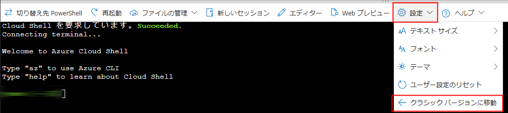

# ラボ 04: Azure OpenAI サービスを使用してコードを生成および改善する

## ラボのシナリオ
Azure OpenAI サービスモデルは、自然言語のプロンプトを使用してコードを生成し、完成したコードのバグを修正し、コードコメントを提供することができます。これらのモデルは、既存のコードを説明し、簡素化して、コードの機能と改善方法を理解するのにも役立ちます。

## ラボの目的
このラボでは、次のタスクを完了します：

- タスク 1: チャットプレイグラウンドでコードを生成する
- タスク 2: Cloud Shell にアプリケーションをセットアップする
- タスク 3: アプリケーションを構成する
- タスク 4: アプリケーションを実行する

## 推定時間: 60 分

### タスク 1: チャットプレイグラウンドでコードを生成する

このタスクでは、アプリケーションで使用する前に、Azure OpenAI がチャットプレイグラウンドでコードを生成および説明する方法を検討します。

1. [Azure AI Foundry ポータル](https://oai.azure.com/?azure-portal=true) で、左ペインの **Chat** プレイグラウンドに移動します。
   
1. 下にスクロールし、**Chat session** セクションに次のプロンプトを入力し、*Enter* キーを押します。

    ```code
   Write a function in python that takes a character and string as input, and returns how many times that character appears in the string
    ```
   >**任意:** 日本語訳のプロンプトは

   ```code
   文字と文字列を入力として受け取り、その文字が文字列に何回現れるかを返すPython関数を書いてください
    ```

1. モデルはおそらく、関数とその関数が何をするか、そしてそれをどのように呼び出すかの説明を含めた応答を返すでしょう。
1. 次に、プロンプト`Do the same thing, but this time write it in C#`(`同じことをしてください。ただし、今回はC#で書いてください`) を送信します。
1. 出力を確認します。モデルはおそらく最初と非常に似た応答を返しますが、今回はC#でコーディングします。別の言語を選択するか、入力文字列を逆にするなど、別のタスクを完了する関数を尋ねることができます。
1. 次に、AIを使用してコードを理解する方法を探ります。見たランダムなRubyで書かれた関数の例を使用します。次のプロンプトをユーザーメッセージとして送信します。

    ```code
    What does the following function do?  
    ---  
    def random_func(n)
      start = [0, 1]
      (n - 2).times do
        start << start[-1] + start[-2]
      end
      start.shuffle.each do |num|
        puts num
      end
    end
    ```
    >**任意:** 日本語訳のプロンプトは`次の関数は何をしますか？`

1. 出力を確認し、その関数が自然言語で何をするかを説明します。

9. プロンプト `Can you simplify the function?`（`関数を簡素化できますか？`） を送信します。モデルは関数のより簡単なバージョンを書きます。

10. プロンプト `Add some comments to the function.`（`関数にコメントを追加してください。`） を送信します。モデルはコードにコメントを追加します。
    
### タスク 2: Cloud Shell にアプリケーションをセットアップする

このタスクでは、Azure の Cloud Shell 上で実行される短いコマンドラインアプリケーションを使用して、Azure OpenAI モデルとの統合方法を示します。Cloud Shell にアクセスするために新しいブラウザタブを開きます。

1. [Azure ポータル](https://portal.azure.com?azure-portal=true) で、ページの右上にある検索ボックスの右側にある **[>_]** (*Cloud Shell*) ボタンを選択します。Cloud Shell ペインがポータルの下部に開きます。

    

2. Cloud Shell ペインの左上に表示されるシェルの種類が *Bash* に切り替わっていることを確認します。*PowerShell* の場合は、ドロップダウンメニューを使用して *Bash* に切り替えます。

   > **メモ**: **Cloud Shell timed out** ポップアップが表示された場合は、**Reconnect** をクリックします。

3. ターミナルが開いたら、**設定** をクリックし、**クラシックバージョンに移動** を選択します。

   

4. ターミナルが起動したら、次のコマンドを入力してサンプルアプリケーションをダウンロードし、`azure-openai` というフォルダーに保存します。

    ```bash
   rm -r azure-openai -f
   git clone https://github.com/MicrosoftLearning/mslearn-openai azure-openai
    ```

5. ファイルは **azure-openai** という名前のフォルダーにダウンロードされます。次のコマンドを使用して、この演習のためのラボファイルに移動します。

    ```bash
   cd azure-openai/Labfiles/04-code-generation
    ```

   > **メモ**: このラボでは、C# と Python の両方のアプリケーションと、使用するサンプルコードが提供されています。

6. 組み込みのコードエディタを開き、`sample-code` で使用するコードファイルを確認できます。次のコマンドを使用して、コードエディタでラボファイルを開きます。

      ```bash
     code .
      ```

### タスク 3: アプリケーションを構成する

このタスクでは、Azure OpenAI リソースを使用するためにアプリケーションの重要な部分を完成させます。

1. コードエディタで、希望する言語のフォルダを展開します。

2. 言語の設定ファイルを開きます。

    - **C#**: `appsettings.json`
    - **Python**: `.env`

3. Azure OpenAI リソースから取得した **エンドポイント** と **キー**、およびデプロイメント名 `my-gpt-model` を含めるように設定値を更新します。次に、左ペインからファイルを右クリックして **保存** をクリックしてファイルを保存します。

4. 使用する言語のフォルダーに移動し、必要なパッケージをインストールします。

    **C#**

    ```bash
   cd CSharp
   dotnet add package Azure.AI.OpenAI --version 1.0.0-beta.14
    ```

    **Python**

      ```bash
    cd Python
    pip install python-dotenv
    pip install openai==1.56.2
    ```

5. 使用する言語のアプリケーションコードで、コメント **Format and send the request to the model..** を次のクライアント構成コードに置き換えます。

    **C#**
    `Program.cs`

   ```csharp
     // Format and send the request to the model
       var chatCompletionsOptions = new ChatCompletionsOptions()
       {
           Messages =
           {
               new ChatRequestSystemMessage(systemPrompt),
               new ChatRequestUserMessage(userPrompt)
           },
           Temperature = 0.7f,
           MaxTokens = 1000,
           DeploymentName = oaiDeploymentName
       };
   
       // Get response from Azure OpenAI
       Response<ChatCompletions> response = await client.GetChatCompletionsAsync(chatCompletionsOptions);
   
       ChatCompletions completions = response.Value;
       string completion = completions.Choices[0].Message.Content;
    ```

    **Python**
     `code-generation.py`

      ```python
    # Format and send the request to the model
    messages =[
        {"role": "system", "content": system_message},
        {"role": "user", "content": user_message},
    ]
    
    # Call the Azure OpenAI model
    response = client.chat.completions.create(
        model=model,
        messages=messages,
        temperature=0.7,
        max_tokens=1000
    )
    ```
    >**メモ**: コードエディタに貼り付けた後、余分な空白を削除してコードをインデントするようにしてください。

6. ファイルに加えた変更を保存するには、左ペインからファイルを右クリックして **保存** をクリックします。

### タスク 4: アプリケーションを実行する

このタスクでは、アプリケーションを構成して各ユースケースのコードを生成します。ユースケースはアプリ内で番号が付けられており、任意の順序で実行できます。

> **注意**: モデルの呼び出し頻度が高すぎると、一部のユーザーはレート制限に遭遇することがあります。トークンのレート制限エラーが発生した場合は、1分待ってから再試行してください。

1. コードエディタで `sample-code` フォルダーを展開し、関数と言語のアプリを簡単に確認します。これらのファイルはアプリ内のタスクに使用されます。
   
2. Cloud Shell bash ターミナルで、希望する言語のフォルダーに移動します。

3. **C#** 言語を使用している場合は、**CSharp.csproj** ファイルを開き、次のコードに置き換えてファイルを保存します。

   ```
   <Project Sdk="Microsoft.NET.Sdk">
      
   <PropertyGroup>
   <OutputType>Exe</OutputType>
   <TargetFramework>net8.0</TargetFramework>
   <ImplicitUsings>enable</ImplicitUsings>
   <Nullable>enable</Nullable>
   </PropertyGroup>
      
   <ItemGroup>
   <PackageReference Include="Azure.AI.OpenAI" Version="1.0.0-beta.14" />
   <PackageReference Include="Microsoft.Extensions.Configuration" Version="8.0.*" />
   <PackageReference Include="Microsoft.Extensions.Configuration.Json" Version="8.0.*" />
   </ItemGroup>
      
   <ItemGroup>
   <None Update="appsettings.json">
   <CopyToOutputDirectory>PreserveNewest</CopyToOutputDirectory>
   </None>
   </ItemGroup>
      
   </Project>
   ```  
4. アプリケーションを実行します。

    - **C#**: `dotnet run`
    - **Python**: `python code-generation.py`

5. コメントをコードに追加するオプション **1** を選択し、次のプロンプトを入力します。これらのタスクの応答には数秒かかることがあります。

    ```prompt
    Add comments to the following function. Return only the commented code.\n---\n
    ```
   >**任意:** 日本語訳のプロンプトは

   ```prompt
   次の関数にコメントを追加してください。コメント付きのコードのみを返します。\n---\n
    ```

6. 次に、オプション **2** を選択して、同じ関数のユニットテストを書き、次のプロンプトを入力します。

    ```prompt
    Write four unit tests for the following function.\n---\n
    ```
   >**任意:** 日本語訳のプロンプトは

   ```prompt
   次の関数にコメントを追加してください。コメント付きのコードのみを返します。\n---\n
    ```

7. 次に、オプション **3** を選択して Go Fish をプレイするアプリのバグを修正します。次のプロンプトを入力します。

    ```prompt
    Fix the code below for an app to play Go Fish with the user. Return only the corrected code.\n---\n
    ```
   >**任意:** 日本語訳のプロンプトは

   ```prompt
   次のコードを修正して、ユーザーと一緒に Go Fish をプレイするアプリを作成してください。修正されたコードのみを返します。\n---\n
    ```

8. 結果は `result/app.txt` 内の内容を置き換え、いくつかの修正がされた非常に似たコードを含むはずです。

    - **C#**: Fixes are made on line 30 and 59
    - **Python**: Fixes are made on line 18 and 31

9. 結果を確認するには、次のコードをターミナルに貼り付けます。

    ```
   cd result
    ```

10. 次のコマンドをターミナルにコピーして、app.txt ファイルの内容を確認します。

     ```
     cat app.txt
     ```

`sample-code` 内の Go Fish アプリは、Azure OpenAI の応答でバグのある行を置き換えると実行できます。修正なしで実行すると、正しく動作しません。

この Go Fish アプリのコードは一部の構文が修正されたにもかかわらず、ゲームの正確な表現ではないことに注意してください。詳しく見ると、カードを引くときにデッキが空であるかどうかを確認しない、ペアを取得したときにプレイヤーの手からペアを取り除かない、その他いくつかのバグがあることがわかります。これは、コード生成を支援する生成AIモデルがどれほど有用であるかを示す優れた例ですが、正しいとは限らないため、開発者による検証が必要です。

Azure OpenAI からの完全な応答を確認したい場合は、`printFullResponse` 変数を `True` に設定して、アプリを再実行してください。

## まとめ

このラボでは、以下のことを達成しました：
-   Azure OpenAI の機能を使用して、プロダクションアプリケーションのコードを生成および改善しました。

### ラボを正常に完了しました。
