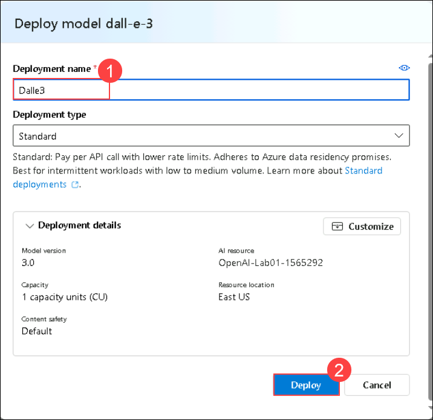

# ラボ 05: DALL-E モデルを使用して画像を生成する

## ラボシナリオ
Azure OpenAI サービスには、DALL-E という名前の画像生成モデルが含まれています。このモデルを使用して、望む画像を説明する自然言語のプロンプトを送信すると、提供された説明に基づいてオリジナルの画像を生成します。

この演習では、DALL-E バージョン 3 モデルを使用して、自然言語のプロンプトに基づいて画像を生成します。

## ラボの目的
このラボでは、次のタスクを完了します:

- タスク 1: DALL-E プレイグラウンドで画像生成を探索する
- タスク 2: REST API を使用して画像を生成する
- タスク 2.1: アプリ環境を準備する
- タスク 2.2: アプリケーションを構成する
- タスク 2.3: アプリケーションコードを確認する
- タスク 3: アプリを実行する

## 推定時間: 60 分

### タスク 1: DALL-E プレイグラウンドで画像生成を探索する

このタスクでは、Azure AI Foundry ポータルの DALL-E プレイグラウンドを使用して画像生成を実験します。

1. **Azure portal** で **Azure OpenAI** を検索し、**Azure OpenAI** を選択します。

      

2. **Azure AI Services** ページで、左側のブレードから **Azure OpenAI (1)** が選択されていることを確認します。その後、OpenAI-Lab01-<inject key="DeploymentID" enableCopy="false"></inject> を選択します。

      

3. Azure OpenAI リソースペインで、**Go to Azure AI Foundry portal** をクリックすると、**Azure AI Foundry portal** に移動します。

      

4. **Azure AI Foundry portal** ページで、左側のペインから **Shared Resources** の下にある **Deployments (1)** を選択します。その後、**+ Deploy Model** をクリックし、**Deploy Base Model (2)** を選択します。

      

5. **dall-e-3** を検索し、**Confirm** をクリックします。

      

6. **Deploy model** ポップアップインターフェイス内で、*Deployment name* に **Dalle3** を入力し、その他の設定はデフォルトのままにして **Deploy** をクリックします。

      
              
4. 左側のナビゲーションペインから **Images (1)** を選択し、**Prompt (2)** ボックスに生成したい画像の説明（例えば *An elephant on a skateboard*（スケボーを乗る象））を入力し、**Generate (3)** を選択して生成された画像を表示します。
   
      

5. プロンプトを変更して、より具体的な説明を提供します。例えば *An elephant on a skateboard in the style of Picasso*（ピカソのスタイルで、スケボーを乗る象）。その後、新しい画像を生成し、結果を確認します。

      

      > **注意**: 画像はスクリーンショットと異なる場合があります。

### タスク 2: REST API を使用して画像を生成する

Azure OpenAI サービスは、DALL-E モデルによって生成された画像を含むコンテンツ生成のためのプロンプトを送信するための REST API を提供しています。

#### タスク 2.1: アプリ環境を準備する

このタスクでは、Python または C# のシンプルなアプリを使用して REST API を呼び出し、画像を生成し、Azure portal 内の Cloud Shell コンソールインターフェイスでコードを実行します。

1. [Azure portal](https://portal.azure.com?azure-portal=true) で、上部の検索ボックスの右側にある **[>_]** (*Cloud Shell*) ボタンを選択します。Cloud Shell ペインがポータルの下部に開きます。

    

    > **注意**: **Cloud Shell timed out** のポップアップが表示された場合は、**Reconnect** をクリックします。

2. Cloud Shell ペインの左上に表示されているシェルの種類が *Bash* に切り替わっていることを確認します。*PowerShell* の場合は、ドロップダウンメニューを使用して *Bash* に切り替えます。

3. ターミナルが開いたら、**Settings** をクリックし、**Go to Classic Version** を選択します。

   

4. ターミナルが開始したら、次のコマンドを入力して作業するアプリケーションコードをダウンロードします。

    ```bash
   rm -r azure-openai -f
   git clone https://github.com/MicrosoftLearning/mslearn-openai azure-openai
    ```

    ファイルは **azure-openai** というフォルダーにダウンロードされます。C# と Python の両方のアプリケーションが提供されています。両方のアプリは同じ機能を持っています。

5. 次のコマンドを実行して、好みの言語のフォルダーに移動します。

      **Python**

    ```bash
   cd azure-openai/Labfiles/05-image-generation/Python
    ```

      **C#**

    ```bash
   cd azure-openai/Labfiles/05-image-generation/CSharp
    ```

6. 次のコマンドを使用して、組み込みのコードエディタを開き、作業するコードファイルを確認します。

    ```bash
   code .
    ```
   
#### タスク 2.2: アプリケーションを構成する

このタスクでは、アプリケーションの構成ファイルを使用して、Azure OpenAI サービスアカウントに接続するための詳細情報を保存します。

1. コードエディタで、使用する言語に応じてアプリの構成ファイルを選択します。

    - C#: `appsettings.json`
    - Python: `.env`
    
2. Azure OpenAI サービスの **Endpoint** と **Key1** を含むように構成値を更新します。その後、左ペインからファイルを右クリックしてファイルを保存します。

    > **Tip**: Cloud Shell ペインの上部で分割を調整して Azure ポータルを表示し、Azure OpenAI サービスの **Keys and Endpoint** ページからエンドポイントとキーの値を取得できます。

3. **Python** を使用している場合、構成ファイルを読み取るために使用される **python-dotenv** パッケージをインストールする必要があります。コンソールプロンプトペインで、現在のフォルダが **~/azure-openai/Labfiles/05-image-generation/Python** であることを確認します。その後、次のコマンドを入力します。

    ```bash
   pip install python-dotenv
    ```

#### タスク 2.3: アプリケーションコードを確認する

このタスクでは、REST API を呼び出して画像を生成するために使用されるコードを確認します。

1. コードエディタペインで、アプリケーションのメインコードファイルを選択します。

    - C#: `Program.cs`
    - Python: `generate-image.py`

2. ファイルに含まれているコードを確認し、次の重要な機能に注目します。

   >**注意** : 左ペインからファイルを右クリックし、**Save** をクリックします。
   
    - このコードは、サービスのエンドポイントに https リクエストを送信し、ヘッダーにサービスのキーを含めます。これらの値は構成ファイルから取得されます。
    - プロセスは、画像生成リクエストを開始するための 2 つの REST リクエストと、結果を取得するための別のリクエストで構成されます。
    最初のリクエストには次のデータが含まれます。
        - 生成する画像を説明するユーザー提供のプロンプト
        - 生成する画像の数（この場合は 1）
        - 生成する画像の解像度（サイズ）。
    - 最初のリクエストの応答ヘッダーには、結果を取得するための後続のコールバックで使用される **operation-location** 値が含まれています。
    - コードは、画像生成タスクのステータスが *succeeded* になるまでコールバック URL をポーリングし、その後、生成された画像の URL を抽出して表示します。

> **おめでとうございます** タスクを完了しました！次は、それを検証する時です。以下の手順に従ってください:
> - 対応するタスクの Validate ボタンを押します。成功メッセージが表示された場合、次のタスクに進むことができます。
> - そうでない場合は、エラーメッセージを注意深く読み、ラボガイドの指示に従ってステップを再試行してください。
> - サポートが必要な場合は、cloudlabs-support@spektrasystems.com にお問い合わせください。24 時間年中無休でお手伝いします。

<validation step="0ee48188-10fe-43f5-b696-a2d993d7d714" />

### タスク 3: アプリを実行する

このタスクでは、レビューしたコードを実行して画像を生成します。

1. Cloud Shell bash ターミナルで、お好みの言語のフォルダに移動します。

2. **C#** 言語を使用する場合は、**generate_image.csproj** ファイルを開き、次のコードに置き換えてファイルを保存します。

   ```
      <Project Sdk="Microsoft.NET.Sdk">
      
      <PropertyGroup>
      <OutputType>Exe</OutputType>
      <TargetFramework>net8.0</TargetFramework>
      <ImplicitUsings>enable</ImplicitUsings>
      <Nullable>enable</Nullable>
      </PropertyGroup>
      
       <ItemGroup>
       <PackageReference Include="Azure.AI.OpenAI" Version="1.0.0-beta.14" />
       <PackageReference Include="Microsoft.Extensions.Configuration" Version="8.0.*" />
       <PackageReference Include="Microsoft.Extensions.Configuration.Json" Version="8.0.*" />
       </ItemGroup>
      
       <ItemGroup>
         <None Update="appsettings.json">
           <CopyToOutputDirectory>PreserveNewest</CopyToOutputDirectory>
          </None>
        </ItemGroup>
      
       </Project>
      ```

3. コンソールプロンプトペインで、アプリケーションを実行するための適切なコマンドを入力します：

    **Python**

    ```bash
   pip install requests
   python generate-image.py
    ```

    **C#**

    ```bash
   dotnet run
    ```

2. プロンプトが表示されたら、画像の説明を入力します。例えば、*A giraffe flying a kite*（凧を飛ばすキリン）など。

    >**注意**: プロンプトの入力後に問題が発生した場合は、次の手順に従ってください。

     - **Azure AI Foundry portal** に戻ります。トップメニューバーから **Switch to the old look** のトグルをオンにします。**Feedback** ウィンドウが表示された場合は **Skip** をクリックします。

        

     - **Deployment** で **Dalle 3** が選択されていることを確認します。

        

     - **Prompt** ボックスに生成したい画像の説明を入力し（例えば *An elephant on a skateboard*（スケボーを乗る象））、**Generate** を選択して生成された画像を表示します。

       >**注意**: **The API deployment for this resource does not exist** エラーが発生した場合は、2 分間待ってから再試行してください。 
       
       >**注意**: 旧バージョンの起動には 10～15 分かかることがあります。

     - CloudShell に戻り、ステップ 3 を再実行します。
    
3. 画像が生成されるのを待ちます。ハイパーリンクがコンソールペインに表示されます。その後、ハイパーリンクを選択して新しいブラウザタブを開き、生成された画像を確認します。

   
   
5. 生成された画像を含むタブを閉じて、別のプロンプトで新しい画像を生成するためにアプリを再実行します。

## まとめ

このラボでは、以下を達成しました:
-   DALL-E モデルによる画像生成の概念を理解する。
-   このモデルを使用してアプリケーションに画像生成を実装する。

### ラボの完了
