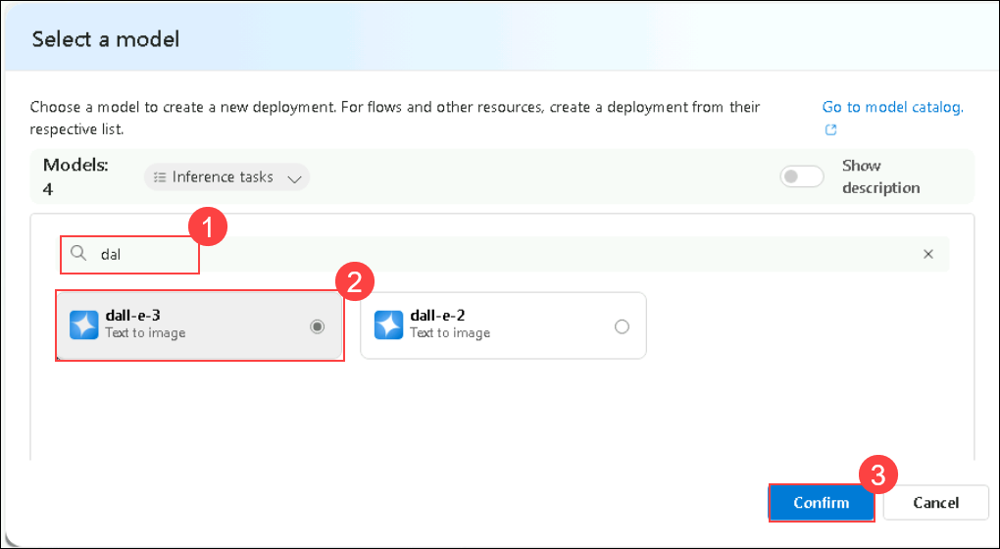
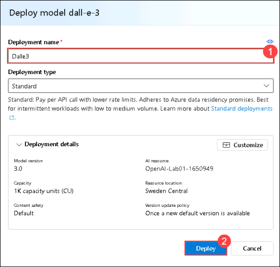
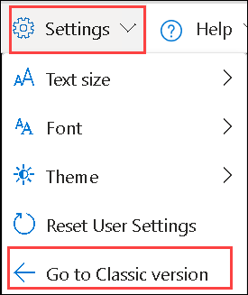
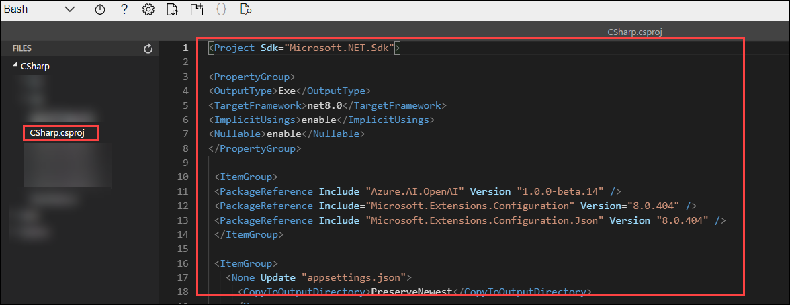

# Lab 05: Generate images with a DALL-E model

## Lab scenario
The Azure OpenAI Service includes an image-generation model named DALL-E. You can use this model to submit natural language prompts that describe a desired image, and the model will generate an original image based on the description you provide.

In this exercise, you'll use a DALL-E version 3 model to generate images based on natural language prompts.

## Lab objectives
In this lab, you will complete the following tasks:

- Task 1: Explore image-generation in the DALL-E playground
- Task 2: Use the REST API to generate images
- Task 2.1: Prepare the app environment
- Task 2.2: Configure your application
- Task 2.3: View application code
- Task 3: Run the app

## Estimated time: 60 minutes

### Task 1: Explore image generation in the DALL-E playground

In this task, you will use the DALL-E playground in Azure AI Foundry portal to experiment with image generation.

1. In the **Azure portal**, search for **Azure OpenAI** and select **Azure OpenAI**.

      

2. On the **Azure AI Services** page, ensure that **Azure OpenAI (1)** is selected from the left blade. Then, select OpenAI-Lab01-<inject key="DeploymentID" enableCopy="false"></inject>

      

3. In the Azure OpenAI resource pane, click on **Go to Azure AI Foundry portal** it will navaigate to **Azure AI Foundry portal**.

      

4. On the **Azure AI Foundry portal** page, select **Deployments (1)** under **Shared Resources** from the left pane. Then, click **+ Deploy Model** and choose **Deploy Base Model (2)**.

      

5. Search for **dall-e-3**, click on **Confirm**

      

6. Within the **Deploy model** pop-up interface, enter the *Deployment name* as **Dalle3 (1)**, and leave the rest of the settings as default and click on **Deploy (2)**.

      
              
4. From the left navigation pane, select **Images (1)**, enter a description of an image you'd like to generate in the **Prompt (2)** box (for example, *An elephant on a skateboard*), and then select **Generate (3)** to view the resulting image.
   
      

5. Modify the prompt to provide a more specific description. For example *An elephant on a skateboard in the style of Picasso*. Then generate the new image and review the results.

      

      > **Note**: The image may appear differently than shown in the screenshot. 

### Task 2: Use the REST API to generate images

The Azure OpenAI service provides a REST API that you can use to submit prompts for content generation - including images generated by a DALL-E model.

#### Task 2.1: Prepare the app environment

In this task, you will use a simple Python or C# app to generate images by calling the REST API and run the code in the Cloud Shell console interface within the Azure portal.

1. In the [Azure portal](https://portal.azure.com?azure-portal=true), select the **[>_]** (*Cloud Shell*) button at the top of the page to the right of the search box. A Cloud Shell pane will open at the bottom of the portal. 

    

    > **Note**: If a **Cloud Shell timed out** pop-up appears, click **Reconnect**.

2. Make sure the type of shell indicated on the top left of the Cloud Shell pane is switched to *Bash*. If it's *PowerShell*, switch to *Bash* by using the drop-down menu.

3. Once the terminal opens, click on **Settings** and select **Go to Classic Version**.

   

4. Once the terminal starts, enter the following command to download the application code you are going to work with.

    ```bash
   rm -r azure-openai -f
   git clone https://github.com/MicrosoftLearning/mslearn-openai azure-openai
    ```

    The files are downloaded to a folder named **azure-openai**. Applications for both C# and Python have been provided. Both apps feature the same functionality.

5. Navigate to the folder for the language of your preference  by running the appropriate command.

      **Python**

    ```bash
   cd azure-openai/Labfiles/05-image-generation/Python
    ```

      **C#**

    ```bash
   cd azure-openai/Labfiles/05-image-generation/CSharp
    ```

6. Use the following command to open the built-in code editor and see the code files you will be working with.

    ```bash
   code .
    ```
   
#### Task 2.2: Configure your application

In this task, you will use a configuration file in the application to store the details needed to connect to your Azure OpenAI service account.

1. In the code editor, select the configuration file for your app - depending on your language preference.

    - C#: `appsettings.json`
    - Python: `.env`
    
2. Update the configuration values to include the **Endpoint** and **Key1** for your Azure OpenAI service. Then save the file by right-clicking the file from the left pane.

    > **Tip**: You can adjust the split at the top of the cloud shell pane to see the Azure portal, and get the endpoint and key values from the **Keys and Endpoint** page for your Azure OpenAI service.

3. If you are using **Python**, you'll also need to install the **python-dotenv** package used to read the configuration file. In the console prompt pane, ensure the current folder is **~/azure-openai/Labfiles/05-image-generation/Python**. Then enter this command:

    ```bash
   pip install python-dotenv
    ```

1. If your using **C#**, navigate to `generate_image.csproj`, delete the existing code, then replace it with the foolowing code and then press **Ctrl+S** to save the file.

    ```
    <Project Sdk="Microsoft.NET.Sdk">

    <PropertyGroup>
    <OutputType>Exe</OutputType>
    <TargetFramework>net8.0</TargetFramework>
    <ImplicitUsings>enable</ImplicitUsings>
    <Nullable>enable</Nullable>
    </PropertyGroup>

     <ItemGroup>
     <PackageReference Include="Azure.AI.OpenAI" Version="1.0.0-beta.14" />
     <PackageReference Include="Microsoft.Extensions.Configuration" Version="8.0.404" />
     <PackageReference Include="Microsoft.Extensions.Configuration.Json" Version="8.0.404" />
     </ItemGroup>

     <ItemGroup>
       <None Update="appsettings.json">
         <CopyToOutputDirectory>PreserveNewest</CopyToOutputDirectory>
        </None>
     </ItemGroup>

    </Project>
    ```    

         

1. Navigate to the folder for your preferred language and install the necessary packages.

     **C#**:

    ```
    export DOTNET_ROOT=$HOME/.dotnet
    export PATH=$DOTNET_ROOT:$PATH
    mkdir -p $DOTNET_ROOT
    ```     

     >**Note**: Azure Cloud Shell often does not have admin privileges, so you need to install .NET in your home directory. So here Your creating a separate `.dotnet` directory under your home directory to isolate your configuration.
     - `DOTNET_ROOT` specifies where your .NET runtime and SDK are located (in your `$HOME/.dotnet directory`).
     - `PATH=$DOTNET_ROOT:$PATH` ensures that the locally installed .NET SDK can be accessed globally by your terminal.
     - `mkdir -p $DOTNET_ROOT` this creates the directory where the .NET runtime and SDK will be installed.

1.  Run the following command to install the required SDK version locally:     

     ```
     wget https://dotnet.microsoft.com/download/dotnet/scripts/v1/dotnet-install.sh
     chmod +x dotnet-install.sh
     ./dotnet-install.sh --version 8.0.404 --install-dir $DOTNET_ROOT
     ```

      >**Note**: These commands download and prepare the official `.NET` installation script, grant it execute permissions, and install the required .NET SDK version (8.0.404) in the `$DOTNET_ROOT` directory as we dont have the admin privileges to install it globally.

1. Enter the following command to restore the workload.

    ```
    dotnet workload restore
    ```

     >**Note**: Restores any required workloads for your project, such as additional tools or libraries that are part of the .NET SDK.
    
1. Enter the following command to add the `Azure.AI.OpenAI` NuGet package to your project, which is necessary for integrating with Azure OpenAI services.

    ```
    dotnet add package Azure.AI.OpenAI --version 1.0.0-beta.14
    ```

#### Task 2.3: View application code

In this task, you will explore the code used to call the REST API and generate an image.

1. In the code editor pane, select the main code file for your application:

    - C#: `Program.cs`
    - Python: `generate-image.py`

2. Review the code that the file contains, noting the following key features:

   >**Note** : right-click on the file from the left pane, and hit **Save**
   
    - The code makes https requests to the endpoint for your service, including the key for your service in the header. Both of these values are obtained from the configuration file.
    - The process consists of <u>two</u> REST requests: One to initiate the image-generation request, and another to retrieve the results.
    The initial request includes the following data:
        - The user-provided prompt that describes the image to be generated
        - The number of images to be generated (in this case, 1)
        - The resolution (size) of the image to be generated.
    - The response header from the initial request includes an **operation-location** value that is used for the subsequent callback to get the results.
    - The code polls the callback URL until the status of the image-generation task is *succeeded*, and then extracts and displays a URL for the generated image.

> **Congratulations** on completing the task! Now, it's time to validate it. Here are the steps:
> - Hit the Validate button for the corresponding task. If you receive a success message, you can proceed to the next task. 
> - If not, carefully read the error message and retry the step, following the instructions in the lab guide.
> - If you need any assistance, please contact us at cloudlabs-support@spektrasystems.com. We are available 24/7 to help you out.

<validation step="0ee48188-10fe-43f5-b696-a2d993d7d714" />

### Task 3: Run the app

In this task, you will run the reviewed code to generate some images.

1. In the Cloud Shell bash terminal, navigate to the folder for your preferred language.

3. In the console prompt pane, enter the appropriate command to run your application:

    **Python**

    ```bash
   pip install requests
   python generate-image.py
    ```

    **C#**

    ```bash
   dotnet run
    ```

2. When prompted, enter a description for an image. For example, *A giraffe flying a kite*.

    >**Note**: If you encounter an issue after entering prompts kindly follow the below steps:

     - Navigate back to **Azure AI Foundry portal**. From the top menu bar, turn on the toggle for **Switch to the old look**. click on **Skip** when **Feedback** window prompted.

        

     - In **Deployment**, ensure that **Dalle 3** is selected.

        

     - Enter a description of an image you'd like to generate in the **Prompt** box (for example, *An elephant on a skateboard*), and then select **Generate** to view the resulting image.

       >**Note**: if you encounter error **The API deployment for this resource does not exist**, kindly wait 2 mins and try again to generate. 
       
       >**Note**: It might take 10–15 minutes for the old version to come up.

     - Navigate back to CloudShell and reperform step no 3. 
    
3. Wait for the image to be generated - a hyperlink will be displayed in the console pane. Then select the hyperlink to open a new browser tab and review the image that was generated.

   
   
5. Close the tab containing the generated image and re-run the app to generate a new image with a different prompt.

## Summary

In this lab, you have accomplished the following:
-   understand the concepts of image generation via the DALL-E model.
-   Implement image-generation into your applications using this model

### You have successfully completed the lab.
