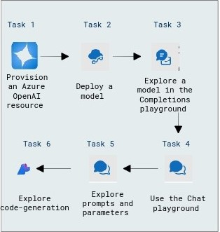

# Get started with Azure OpenAI Service

### Overall Estimated Duration: 1 hour

## Overview

This lab introduces the Azure OpenAI Service, which brings OpenAI's advanced generative AI models to the Azure platform. You'll leverage Azure's security, scalability, and integration capabilities to develop robust AI solutions. In this exercise, you'll learn how to provision the Azure OpenAI Service as a resource and explore OpenAI models using the Azure AI Foundry portal.

## Objective

This lab is aimed to give learners hands-on experience with Azure OpenAI resources, deploy and explore models using the Completions and Chat playgrounds, and experiment with prompts, parameters, and code generation. By the end of this lab, you will be able to:

- **Get started with the Azure OpenAI Service:** This hands-on exercise aims to teach you the fundamentals of using Azure OpenAI Service to integrate advanced AI models into your apps. Participants will set up and begin utilizing the Azure OpenAI Service to integrate AI models into their applications.

## Pre-requisites

- **Development Skills:** Basic programming knowledge and experience with APIs and SDKs.

- **AI Concepts:** Understanding prompt engineering, code development, and image generation using models such as DALL-E.

- **Content Management:** Understanding data integration for RAG and content filtering techniques.

## Architecture

The architecture leverages Azure OpenAI Service to deploy and explore OpenAI models. An Azure resource is provisioned, and the Completions and Chat playgrounds are used for interactive exploration. Prompts, parameters, and code generation are optimized to create efficient AI-driven solutions with Azure's scalability and security.

## Architecture Diagram

 

## Explanation of Components

The architecture for this lab involves the following key components:

- **Azure OpenAI Resource:** Provision an Azure OpenAI resource to enable access to OpenAI's generative AI capabilities on the Azure platform.

- **Model Deployment:** Deploy a selected OpenAI model to make it accessible for testing and integration.

- **Completions Playground:** Explore the deployed model in the Completions playground to understand how it generates text-based outputs for specific prompts.

- **Chat Playground:** Use the Chat playground to interact with the model in a conversational manner, leveraging its natural language understanding capabilities.

- **Code Generation:** Explore the model's ability to generate code snippets and other structured outputs, showcasing its utility in development scenarios.

## Getting Started with Lab

1. Once the environment is provisioned, a virtual machine (JumpVM) and lab guide will get loaded in your browser. Use this virtual machine throughout the workshop to perform the lab. You can see the number on the lab guide bottom area to switch to different exercises of the lab guide.

   
   
1. To get the lab environment details, you can select the **Environment Details** tab. Additionally, the credentials will also be emailed to your email address provided during registration. You can start, stop, and restart virtual machines from the **Resources** tab.

   

## Lab Guide Zoom In/Zoom Out

1. To adjust the zoom level for the environment page, click the **A↕ : 100%** icon located next to the timer in the lab environment.

   

## Login to Azure Portal
1. In the JumpVM, click on Azure portal shortcut of Microsoft Edge browser which is created on desktop.

   
   
1. On **Sign into Microsoft Azure** tab you will see login screen, in that enter following email/username and then click on **Next**. 
   * Email/Username: <inject key="AzureAdUserEmail"></inject>
   
     
     
1. Now enter the following password and click on **Sign in**.
   * Password: <inject key="AzureAdUserPassword"></inject>
   
     
     
1. If you see the pop-up **Action Required**, click **Ask Later**.

     
     
    > If you are getting popup **save password**, then select **Save & Turn on** option.
       
1. If you see the pop-up **Stay Signed in?**, click **No**.

1. If you see the pop-up **You have free Azure Advisor recommendations!**, close the window to continue the lab.

1. If a **Welcome to Microsoft Azure** popup window appears, click **Maybe Later** to skip the tour.

1. Now you will see Azure Portal Dashboard, click on **Resource groups** from the Navigate panel to see the resource groups.

     

1. Confirm you have a resource group **openai-<inject key="Deployment-id" enableCopy="false"/>** present as shown in the below screenshot. You need to use the **openai-<inject key="Deployment-id" enableCopy="false"/>** resource group throughout the entire process of lab execution.

     
   
1. Use **Next** button from lower right corner to move on to the next page.

   

This hands-on lab empowers participants to master Azure OpenAI Service by guiding them through setup, SDK integration, and prompt engineering. It also covers code generation, image creation with DALL-E, RAG data integration, and content filtering for comprehensive learning.
 
## Support Contact
 
The CloudLabs support team is available 24/7, 365 days a year, via email and live chat to ensure seamless assistance at any time. We offer dedicated support channels tailored specifically for both learners and instructors, ensuring that all your needs are promptly and efficiently addressed.

Learner Support Contacts:
- Email Support: cloudlabs-support@spektrasystems.com
- Live Chat Support: https://cloudlabs.ai/labs-support

Now, click on **Next** from the lower right corner to move on to the next page.

  

### Happy Learning!!
