# Lab 02: Utilize prompt engineering in your app

## Lab scenario

When working with the Azure OpenAI Service, how developers shape their prompt greatly impacts how the generative AI model will respond. Azure OpenAI models are able to tailor and format content if requested in a clear and concise way. In this exercise, you'll learn how different prompts for similar content help shape the AI model's response to better satisfy your requirements.

In the scenario for this exercise, you will perform the role of a software developer working on a wildlife marketing campaign. You are exploring how to use generative AI to improve advertising emails and categorize articles that might apply to your team. The prompt engineering techniques used in the exercise can be applied similarly for a variety of use cases.

## Lab objectives
In this lab, you will complete the following tasks:

- Task 1: Provision an Azure OpenAI resource
- Task 2: Deploy a model
- Task 3: Apply prompt engineering in chat playground
- Task 4: Configure your application
- Task 5: Run your application

## Estimated time: 60 minutes

### Task 1: Provision an Azure OpenAI resource

In this task, you'll create an Azure resource in the Azure portal, selecting the OpenAI service and configuring settings such as region and pricing tier. This setup allows you to integrate OpenAI's advanced language models into your applications.

1. In the **Azure portal**, search for **Azure OpenAI (1)** and select **Azure OpenAI (2)**.

   .png)

2. On **AI Foundry | Azure OpenAI** blade, click on **+ Create**.

   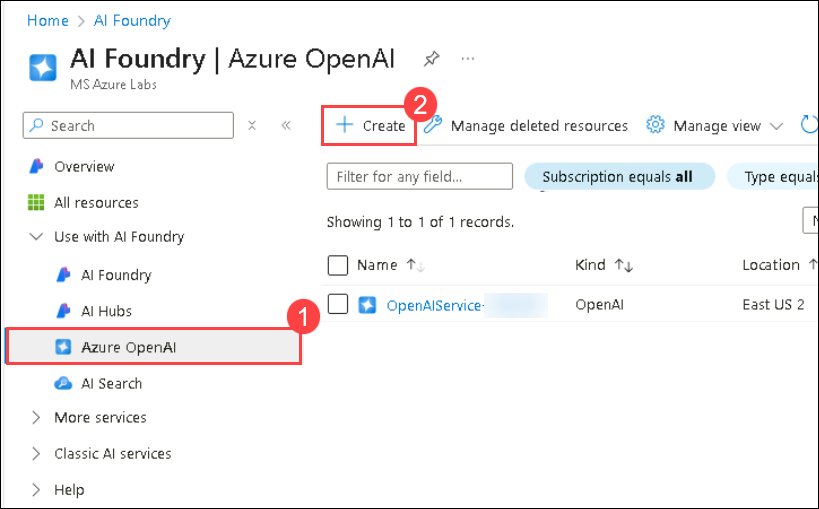

3. Create an **Azure OpenAI** resource with the following settings 

    - **Subscription**: Default - Pre-assigned subscription **(1)**.
    - **Resource group**: openai-<inject key="Deployment-ID" enableCopy="false"></inject> **(2)**
    - **Region**: Select **France Central** **(3)**
    - **Name**: OpenAI-Lab03-<inject key="Deployment-ID" enableCopy="false"></inject> **(4)**
    - **Pricing tier**: Standard S0 **(5)**
    -  Click on **Next** **(6)**
  
       .png "Create Azure OpenAI resource")

       >**Note**: Please deploy the OpenAI resource in **France Central** Region.

4. Click on **Next** again and subsequently click on **Create**.

   

5. Wait for deployment to complete. Then go to the deployed Azure OpenAI resource in the Azure portal by clicking on **Go to resource** button.

   

1. In the **OpenAI-<inject key="Deployment-ID" enableCopy="false"></inject>** resource group, select **OpenAI-Lab03-<inject key="Deployment-ID" enableCopy="false"></inject>** to access Azure OpenAI.

6. To capture the Keys and Endpoints values, on **OpenAI-Lab03-<inject key="Deployment-ID" enableCopy="false"></inject>** blade:
      - Select **Keys and Endpoint (1)** under **Resource Management**.
      - Click on **Show Keys (2)**.
      - Copy **Key 1 (3)** and ensure to paste it into a text editor such as Notepad for future reference.
      - Finally, copy the **Endpoint (4)** API URL by clicking on copy to clipboard. Paste it in a text editor such as Notepad for later use.

        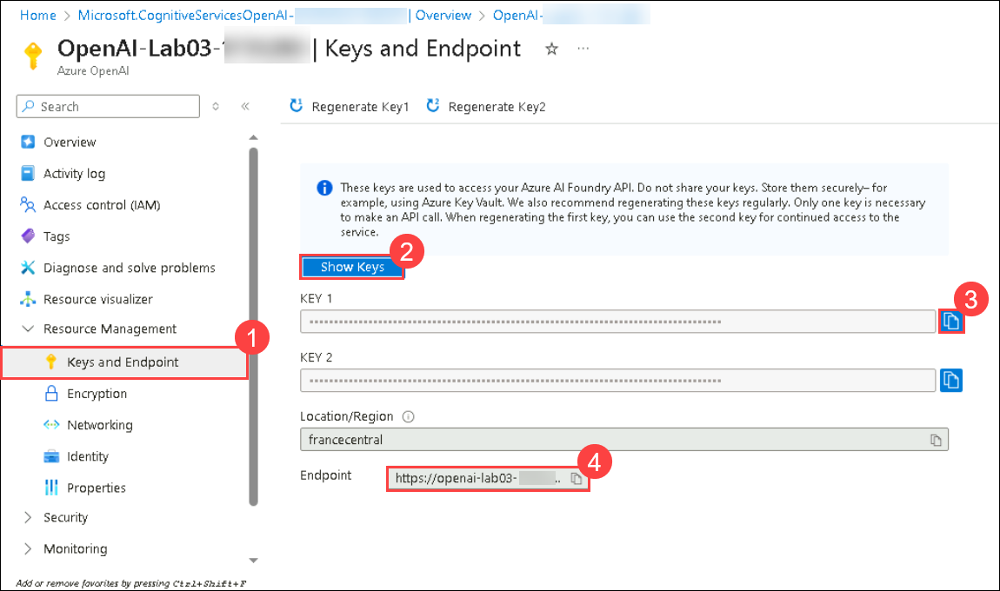

#### Validation

> **Congratulations** on completing the task! Now, it's time to validate it. Here are the steps:
> - Hit the Validate button for the corresponding task. If you receive a success message, you can proceed to the next task. 
> - If not, carefully read the error message and retry the step, following the instructions in the lab guide.
> - If you need any assistance, please contact us at Cloudlabs-support@spektrasystems.com. We are available 24/7 to help you out.

<validation step="500ab73f-41d7-4883-ab2c-110281939c65" />

### Task 2: Deploy a model

In this task, you'll deploy a specific AI model instance within your Azure OpenAI resource to integrate advanced language capabilities into your applications.

1. In the **Azure portal**, search for **Azure OpenAI (1)** and select **Azure OpenAI (2)**.

   .png)

2. On **AI Foundry | Azure OpenAI** blade, select **OpenAI-Lab03-<inject key="Deployment-ID" enableCopy="false"></inject>**

   

1. In the Azure OpenAI resource pane, click on **Go to Azure AI Foundry portal**. It will navigate to the **Azure AI Foundry portal**.

   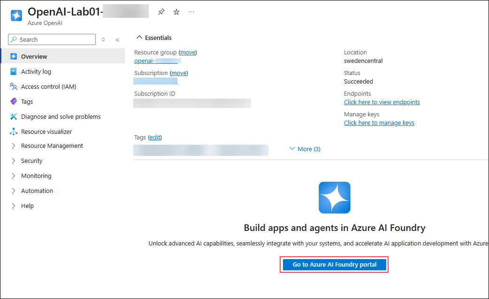

   > **Note:** If you don’t see an option like the one shown in the image above, refer to the image below to navigate to Azure AI Foundry. 
      

5. In the **Deployments (1)** page, click on **+ Deploy model (2)**, Choose **Deploy base Model (3)**.

   .png)

6. Search for **gpt-35-turbo (1)**, select it **(2)**, and click on **Confirm (3)**.

   .png)

7. Within the **Deploy model** pop-up interface, enter the following details:
    - **Deployment name**: text-turbo **(1)**
    - **Deployment type**: Standard **(2)**
    - **Model version**: 0125 (Default) **(3)**
    - **Tokens per Minute Rate Limit (thousands)**: 10K **(4)**
    - **Enable dynamic quota**: Enabled **(5)**
    - Click on **Deploy** **(6)**

        >**Note**: Click on customize and collapse button to expand the other options.

        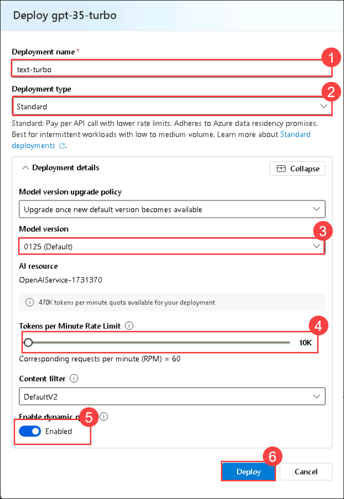

        >**Note**: If you encounter an issue indicating that no model is found, please revert to the old version and attempt to deploy the model again. You can switch back to the new version once it's deployed.

        > **Note**: You can ignore the "Failed to fetch deployments quota information" notification.
        
        > **Note**: Each Azure OpenAI model is optimized for a different balance of capabilities and performance. We'll use the **3.5 Turbo** model series in the **GPT-3** model family in this exercise, which is highly capable of language understanding. This exercise only uses a single model, however, deployment and usage of other models you deploy will work in the same way.
   
#### Validation

> **Congratulations** on completing the task! Now, it's time to validate it. Here are the steps:
> - Hit the Validate button for the corresponding task. If you receive a success message, you can proceed to the next task. 
> - If not, carefully read the error message and retry the step, following the instructions in the lab guide.
> - If you need any assistance, please contact us at Cloudlabs-support@spektrasystems.com. We are available 24/7 to help you out.

<validation step="5b357640-1ad5-4345-a277-affb04231f21" />

### Task 3: Apply prompt engineering in chat playground

In this task, you will examine how prompt engineering improves model responses in the playground by experimenting with prompts, such as writing a Python app for animals with fun names.

1. In [Azure AI Foundry](https://oai.azure.com/?azure-portal=true), navigate to the **Chat** under Playgrounds section in the left pane.

   .png)

1. In the **Setup** section at the top, select **text-turbo (version:0125)** **(1)**, input `You are a helpful AI assistant` **(2)** as the model's instructions and context, then click on **Apply changes (3)**. Finally, click on **Continue**.

   .png)

   .png)

3. Scroll down and in the **Chat session** section, enter the following prompt and press *Enter*.

   ```code
   1. Create a list of animals
   2. Create a list of whimsical names for those animals
   3. Combine them randomly into a list of 25 animal and name pairs
   ```
   
   >**Note:** Kindly refresh the screen in case you encounter any error message and perform the above step again.

4. The model will likely respond with an answer to satisfy the prompt, split into a numbered list. This is a good response, but not what we're looking for.

   .png)

5. Next, update the system message to include instructions `You are an AI assistant helping write python code. Complete the app based on provided comments` **(2)**. Click **Apply changes** **(3)** and subsequently click on **Continue**.

   .png)

   .png)

6. Format the instructions as Python comments. Send the following prompt to the model.

   ```code
   # 1. Create a list of animals
   # 2. Create a list of whimsical names for those animals
   # 3. Combine them randomly into a list of 25 animal and name pairs
   ```

7. The model should correctly respond with complete Python code doing what the comments requested.

8. Next we'll see the impact of few shot prompting when attempting to classify articles. Return to the system message, enter `You are a helpful AI assistant` again, click on **Apply changes** and subsequently click on **Continue**. This will create a new chat session.

9. Send the following prompt to the model.

   ```code
   Severe drought likely in California

   Millions of California residents are bracing for less water and dry lawns as drought threatens to leave a large swath of the region with a growing water shortage.
   
   In a remarkable indication of drought severity, officials in Southern California have declared a first-of-its-kind action limiting outdoor water use to one day a week for nearly 8 million residents.
   
   Much remains to be determined about how daily life will change as people adjust to a drier normal. But officials are warning the situation is dire and could lead to even more severe limits later in the year.
   ```

10. The response will likely be some information about the drought in California. While not a bad response, it's not the classification we're looking for.
11. In the **Setup** section near the system message, click **+ Add section (1)**, select **Example (2)** from the dropdown, and add the following example.

    **User:**

    ```code
    New York Baseballers Wins Big Against Chicago

    New York Baseballers mounted a big 5-0 shutout against the Chicago Cyclones last night, solidifying their win with a 3-run homerun late in the bottom of the 7th inning.

    Pitcher Mario Rogers threw 96 pitches with only two hits for New York, marking his best performance this year.

    The Chicago Cyclones' two hits came in the 2nd and the 5th innings but were unable to get the runner home to score.
    ```

    **Assistant:**

    ```code
    Sports
    ```

    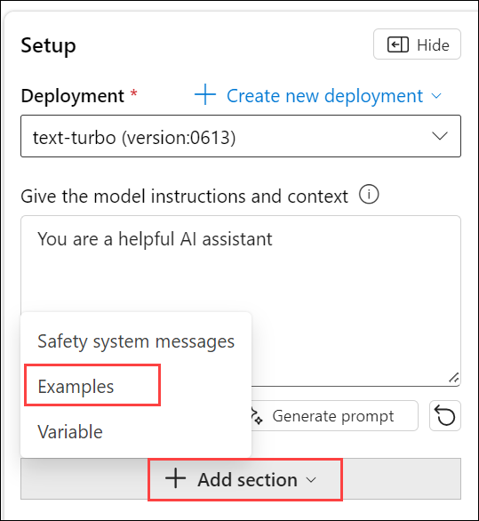

12. Click **+ Add section (1)** again, select **Example (2)** from the dropdown, and add another example with the provided text.

    **User:**

    ```code
    Joyous moments at the Oscars

    The Oscars this past week were quite something!

    Though a certain scandal might have stolen the show, this year's Academy Awards were full of moments that filled us with joy and even moved us to tears.
    These actors and actresses delivered some truly emotional performances, along with some great laughs, to get us through the winter.

    From Robin Kline's history-making win to a full performance by none other than Casey Jensen herself, don't miss tomorrow's rerun of all the festivities.
    ```

    **Assistant:**

    ```code
    Entertainment
    ```

    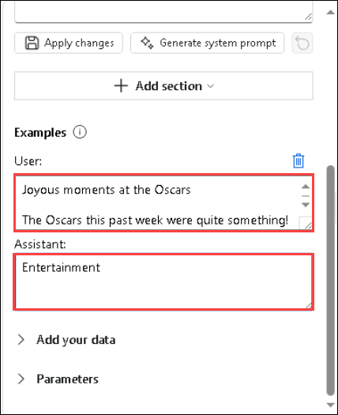

13. Select **Apply changes** to the assistant setup, click **Continue**, and send the same prompt about the California drought, provided here again for convenience.

    ```code
    Severe drought likely in California

    Millions of California residents are bracing for less water and dry lawns as drought threatens to leave a large swath of the region with a growing water shortage.

    In a remarkable indication of drought severity, officials in Southern California have declared a first-of-its-kind action limiting outdoor water use to one day a week for nearly 8 million residents.

    Much remains to be determined about how daily life will change as people adjust to a drier normal. But officials are warning the situation is dire and could lead to even more severe limits later in the year.
    ```

14. This time the model should respond with an appropriate classification, even without instructions.
    > **Note:** If you notice a delay in the response, try clearing the chat and starting again.

### Task 4: Configure your application

In this task, you will complete key parts of the provided C# or Python application to enable it to use your Azure OpenAI resource with asynchronous API calls, as both apps feature the same functionality.

1. Open **Visual Studio Code** from the desktop.

1. Click on **File (1)** and select **Open Folder (2)**.

      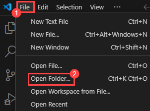

1. Navigate to **`C:/Users/azureuser` (1)**, select **azure-openai (2)** and click on **Select Folder (3)**.

   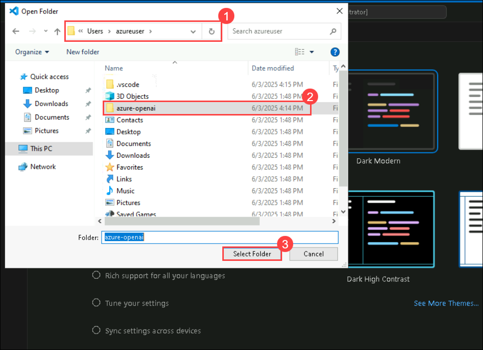

1. After opening the folder, go to `Labfiles/03-prompt-engineering` using the left navigation pane in **Visual Studio Code**.


   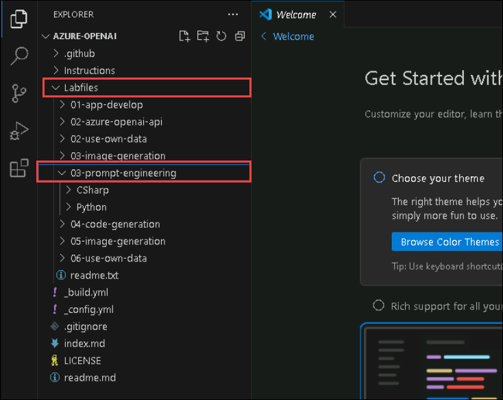
   > **Note:** Applications for both C# and Python have been provided, as well as a text files that provide the prompts. Both apps feature the same functionality.

1. After navigating to **03-prompt-engineering** in the left navigation pane, expand either the **CSharp** or **Python** folder based on your preferred programming language. Each folder contains language-specific files for an app where you'll integrate Azure OpenAI functionality.

2. Open the configuration file for your language.

    - C#: `appsettings.json`
    
    - Python: `.env`
    
3. Update the configuration values to include the **endpoint** and **key** from the Azure OpenAI resource you created, as well as the model name that you deployed, `text-turbo`. Then save the file by right-clicking on the file from the left pane and hit **Save**

   - **C#**: 

     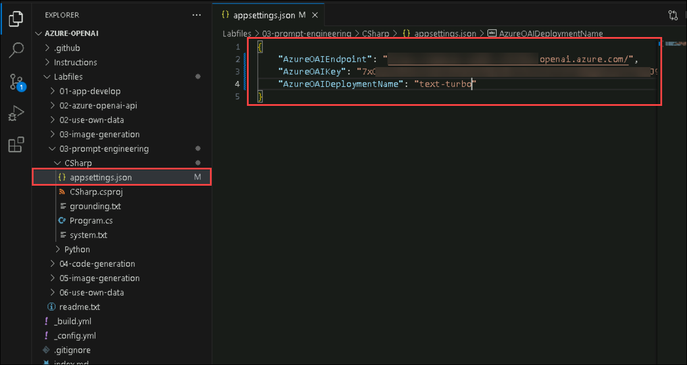 

   - **Python**: 

     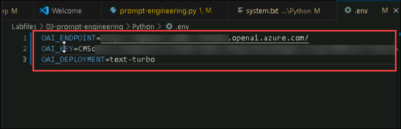 

1. Navigate to **03-prompt-engineering (1)** and click on **Open in Integrated Terminal (2)** and enter the below commands

      

     **C#**:

    ```
    cd CSharp
    irm https://dot.net/v1/dotnet-install.ps1 | iex
    ```

    **Python**
    ```bash
    cd Python
    choco install python --force
    ```
    > **Note:** Once the Python packages are installed, restart VS Code.

1. After restarting VS Code following the installation of Python packages, open a new terminal and run the following command to install the dotenv package.

    **Python**

    ```bash
    pip install python-dotenv
    ```

1. Enter the following command to add the `Azure.AI.OpenAI` NuGet package to your project, which is necessary for integrating with Azure OpenAI services.

     **C#**:

    ```
    dotnet add package Azure.AI.OpenAI --version 1.0.0-beta.14
    ```

    **Python**

    ```bash
    pip install openai==1.55.3
    ```

5. Navigate to your preferred language folder, select the code file, and add the necessary libraries.

    **C#**: Program.cs

    ```csharp
   // Add Azure OpenAI package
   using Azure.AI.OpenAI;
    ```

    **Python**: prompt-engineering.py

    ```python
    # Add Azure OpenAI package
    from openai import AsyncAzureOpenAI
    ```

6. Open up the application code for your language and add the necessary code for configuring the client.

    **C#**: Program.cs

    ```csharp
   // Configure the Azure OpenAI client
   OpenAIClient client = new OpenAIClient(new Uri(oaiEndpoint), new AzureKeyCredential(oaiKey));
    ```

    **Python**: prompt-engineering.py

   ```python
    # Configure the Azure OpenAI client
    client = AsyncAzureOpenAI(
        azure_endpoint = azure_oai_endpoint, 
        api_key=azure_oai_key,  
        api_version="2024-02-15-preview"
        )
    ```

7. In the function that calls the Azure OpenAI model, add the code to format and send the request to the model.

    **C#**: Program.cs

    ```csharp
           // Format and send the request to the model
         var chatCompletionsOptions = new ChatCompletionsOptions()
         {
             Messages =
             {
                 new ChatRequestSystemMessage(systemMessage),
                 new ChatRequestUserMessage(userMessage)
             },
             Temperature = 0.7f,
             MaxTokens = 800,
             DeploymentName = oaiDeploymentName
         };
         
         // Get response from Azure OpenAI
         Response<ChatCompletions> response = await client.GetChatCompletionsAsync(chatCompletionsOptions);
    ```

    **Python**: prompt-engineering.py

   ```python
    # Format and send the request to the model
    messages =[
        {"role": "system", "content": system_message},
        {"role": "user", "content": user_message},
    ]
    
    print("\nSending request to Azure OpenAI model...\n")

    # Call the Azure OpenAI model
    response = await client.chat.completions.create(
        model=model,
        messages=messages,
        temperature=0.7,
        max_tokens=800
    )
    ```

8. The  modified code should look like as shown below:

    **C#**
      
      ```csharp
        // Implicit using statements are included
         using System.Text;
         using System.Text.Json;
         using Microsoft.Extensions.Configuration;
         using Microsoft.Extensions.Configuration.Json;
         using Azure;
         
         // Add Azure OpenAI package
         using Azure.AI.OpenAI;
         
         // Build a config object and retrieve user settings.
         IConfiguration config = new ConfigurationBuilder()
             .AddJsonFile("appsettings.json")
             .Build();
         string? oaiEndpoint = config["AzureOAIEndpoint"];
         string? oaiKey = config["AzureOAIKey"];
         string? oaiDeploymentName = config["AzureOAIDeploymentName"];
         
         bool printFullResponse = false;
         
         do {
             // Pause for system message update
             Console.WriteLine("-----------\nPausing the app to allow you to change the system prompt.\nPress any key to continue...");
             Console.ReadKey();
             
             Console.WriteLine("\nUsing system message from system.txt");
             string systemMessage = System.IO.File.ReadAllText("system.txt"); 
             systemMessage = systemMessage.Trim();
         
             Console.WriteLine("\nEnter user message or type 'quit' to exit:");
             string userMessage = Console.ReadLine() ?? "";
             userMessage = userMessage.Trim();
             
             if (systemMessage.ToLower() == "quit" || userMessage.ToLower() == "quit")
             {
                 break;
             }
             else if (string.IsNullOrEmpty(systemMessage) || string.IsNullOrEmpty(userMessage))
             {
                 Console.WriteLine("Please enter a system and user message.");
                 continue;
             }
             else
             {
                 await GetResponseFromOpenAI(systemMessage, userMessage);
             }
         } while (true);
         
         async Task GetResponseFromOpenAI(string systemMessage, string userMessage)  
         {   
             Console.WriteLine("\nSending prompt to Azure OpenAI endpoint...\n\n");
         
             if(string.IsNullOrEmpty(oaiEndpoint) || string.IsNullOrEmpty(oaiKey) || string.IsNullOrEmpty(oaiDeploymentName) )
             {
                 Console.WriteLine("Please check your appsettings.json file for missing or incorrect values.");
                 return;
             }
             
             // Configure the Azure OpenAI client
             OpenAIClient client = new OpenAIClient(new Uri(oaiEndpoint), new AzureKeyCredential(oaiKey));
         
             // Format and send the request to the model
             var chatCompletionsOptions = new ChatCompletionsOptions()
             {
                 Messages =
                 {
                     new ChatRequestSystemMessage(systemMessage),
                     new ChatRequestUserMessage(userMessage)
                 },
                 Temperature = 0.7f,
                 MaxTokens = 800,
                 DeploymentName = oaiDeploymentName
             };
         
         // Get response from Azure OpenAI
         Response<ChatCompletions> response = await client.GetChatCompletionsAsync(chatCompletionsOptions);
             
             ChatCompletions completions = response.Value;
             string completion = completions.Choices[0].Message.Content;
             
             // Write response full response to console, if requested
             if (printFullResponse)
             {
                 Console.WriteLine($"\nFull response: {JsonSerializer.Serialize(completions, new JsonSerializerOptions { WriteIndented = true })}\n\n");
             }
         
             // Write response to console
             Console.WriteLine($"\nResponse:\n{completion}\n\n");
         }      
      ```
   
     **Python**
   
      ```python
   import os
   import asyncio
   from dotenv import load_dotenv
   
   # Add Azure OpenAI package
   from openai import AsyncAzureOpenAI
   
   # Set to True to print the full response from OpenAI for each call
   printFullResponse = False
   
   async def main(): 
           
       try: 
       
           # Get configuration settings 
           load_dotenv()
           azure_oai_endpoint = os.getenv("AZURE_OAI_ENDPOINT")
           azure_oai_key = os.getenv("AZURE_OAI_KEY")
           azure_oai_deployment = os.getenv("AZURE_OAI_DEPLOYMENT")
           
           # Configure the Azure OpenAI client
           client = AsyncAzureOpenAI(
               azure_endpoint = azure_oai_endpoint, 
               api_key=azure_oai_key,  
               api_version="2024-02-15-preview"
               )
   
           while True:
               # Pause the app to allow the user to enter the system prompt
               print("------------------\nPausing the app to allow you to change the system prompt.\nPress anything then enter to continue...")
               input()
   
               # Read in system message and prompt for user message
               system_text = open(file="system.txt", encoding="utf8").read().strip()
               user_text = input("Enter user message: ")
               if user_text.lower() == 'quit' or system_text.lower() == 'quit':
                   print('Exiting program...')
                   break
               
               await call_openai_model(system_message = system_text, 
                                       user_message = user_text, 
                                       model=azure_oai_deployment, 
                                       client=client
                                       )
   
       except Exception as ex:
           print(ex)
   
   async def call_openai_model(system_message, user_message, model, client):
       # Format and send the request to the model
       messages =[
           {"role": "system", "content": system_message},
           {"role": "user", "content": user_message},
       ]
   
       print("\nSending request to Azure OpenAI model...\n")
   
       # Call the Azure OpenAI model
       response = await client.chat.completions.create(
           model=model,
           messages=messages,
           temperature=0.7,
           max_tokens=800
       )
   
   
       if printFullResponse:
           print(response)
   
       print("Response:\n" + response.choices[0].message.content + "\n")
   
   if __name__ == '__main__': 
       asyncio.run(main())
      ```

9. To save the changes made to the file, right-click on the file and hit **Save** or press **CTRL+S**.

### Task 5: Run your application

In this task, you will run your configured app to send a request to your model and observe the response. You'll notice that the only difference between the options is the content of the prompt, while all other parameters (such as token count and temperature) remain consistent across requests.

1. In the folder of your preferred language, open `system.txt` in Cloudshell. For each of the iterations, you'll enter the **System message** in this file and save it. Each iteration will pause first for you to change the system message.

2. In the VScode terminal, navigate to the folder for your preferred language.

3. If your using as **C#** language kindly open **CSharp.csproj** file replace with following code and save the file with **CTRL+S**.

   ```
   <Project Sdk="Microsoft.NET.Sdk">
   
   <PropertyGroup>
   <OutputType>Exe</OutputType>
   <TargetFramework>net8.0</TargetFramework>
   <ImplicitUsings>enable</ImplicitUsings>
   <Nullable>enable</Nullable>
   </PropertyGroup>
   
    <ItemGroup>
    <PackageReference Include="Azure.AI.OpenAI" Version="1.0.0-beta.14" />
    <PackageReference Include="Microsoft.Extensions.Configuration" Version="8.0.*" />
    <PackageReference Include="Microsoft.Extensions.Configuration.Json" Version="8.0.*" />
    </ItemGroup>
   
    <ItemGroup>
      <None Update="appsettings.json">
        <CopyToOutputDirectory>PreserveNewest</CopyToOutputDirectory>
       </None>
     </ItemGroup>
   
    </Project> 
   ``` 

4. In the interactive terminal pane, ensure the folder context is the folder for your preferred language. Then enter the following command to run the application.

    - **C#**: `dotnet run`
    
    - **Python**: `python prompt-engineering.py`

    >**Note:** If you see a message like *"Press any key to continue..."*, please press **Enter**.

5. For the first iteration, enter the following prompts:

    **System message (system.txt)**

    ```prompt
    You are an AI assistant
    ```
     
    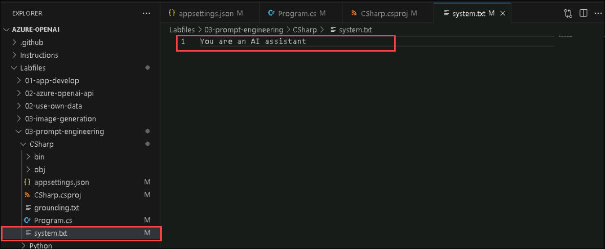

    **User message:**

    ```prompt
    Write an intro for a new wildlife Rescue
    ```
    
    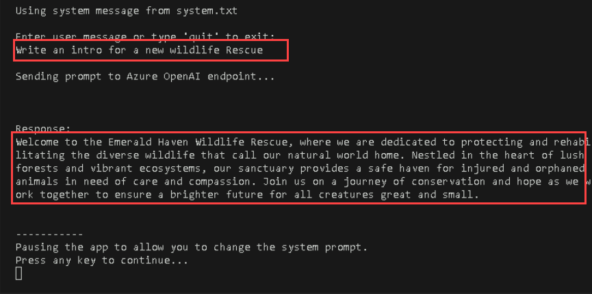

6. Observe the output. The AI model will likely produce a good generic introduction to a wildlife rescue.
7. Next, enter the following prompts which specify a format for the response:

    **System message (system.txt)**

    ```prompt
    You are an AI assistant helping to write emails
    ```
    **User message:**

    ```prompt
    Write a promotional email for a new wildlife rescue, including the following: 
       - Rescue name is Contoso 
       - It specializes in elephants 
       - Call for donations to be given at our website
    ```
    > **Note:** You will see a pop-up, click on **Paste as one line**
    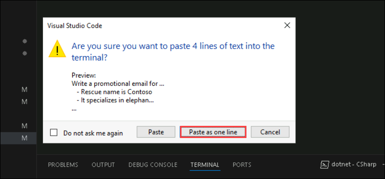

8. Observe the output. This time, you'll likely see the format of an email with the specific animals included, as well as the call for donations.

9. Next, enter the following prompts that additionally specify the content:

    **System message (system.txt)**

    ```prompt
    You are an AI assistant helping to write emails
    ```

    **User message:**

    ```prompt
    Write a promotional email for a new wildlife rescue, including the following: 
    - Rescue name is Contoso 
    - It specializes in elephants, as well as zebras and giraffes 
    - Call for donations to be given at our website 
    \n Include a list of the current animals we have at our rescue after the signature, in the form of a table. These animals include elephants, zebras, gorillas, lizards, and jackrabbits.
    ```
    > **Note:** You will see a pop-up, click on **Paste as one line**
    

10. Observe the output, and see how the email has changed based on your clear instructions.
11. Next, enter the following prompts where we add details about tone to the system message:

    **System message (system.txt)**

    ```prompt
    You are an AI assistant that helps write promotional emails to generate interest in a new business. Your tone is light, chit-chat oriented and you always include at least two jokes.
    ```

    **User message:**

    ```prompt
    Write a promotional email for a new wildlife rescue, including the following: 
    - Rescue name is Contoso 
    - It specializes in elephants, as well as zebras and giraffes 
    - Call for donations to be given at our website 
    \n Include a list of the current animals we have at our rescue after the signature, in the form of a table. These animals include elephants, zebras, gorillas, lizards, and jackrabbits.
    ```
    > **Note:** You will see a pop-up, click on **Paste as one line**

12. Observe the output. This time you'll likely see the email in a similar format, but with a much more informal tone. You'll likely even see jokes included!

13. For the final iteration, we're deviating from email generation and exploring *grounding context*. Here you provide a simple system message, and change the app to provide the grounding context as the beginning of the user prompt. The app will then append the user input, and extract information from the grounding context to answer our user prompt.
14. Open the file `grounding.txt` and briefly read the grounding context you'll be inserting.
15. In your app immediately after the comment ***Format and send the request to the model*** and before any existing code, add the following code snippet to read text in from `grounding.txt` to augment the user prompt with the grounding context.

    **C#**: Program.cs

    ```csharp
    // Format and send the request to the model
    Console.WriteLine("\nAdding grounding context from grounding.txt");
    string groundingText = System.IO.File.ReadAllText("grounding.txt");
    userMessage = groundingText + userMessage;
    ```

    **Python**: prompt-engineering.py

    ```python
    # Format and send the request to the model
    print("\nAdding grounding context from grounding.txt")
    grounding_text = open(file="grounding.txt", encoding="utf8").read().strip()
    user_message = grounding_text + user_message
    ```

    > **Note:** Ensure that all indentation errors are corrected before moving forward.

16. Save the file with **CTRL+S** and rerun your app.
17. Enter the following prompts (with the **system message** still being entered and saved in `system.txt`).

    **System message (system.txt)**

    ```prompt
    You're an AI assistant who helps people find information. You'll provide answers from the text provided in the prompt, and respond concisely.
    ```

    **User message:**

    ```prompt
    What animal is the favorite of children at Contoso?
    ```

## Summary

In this lab, you have accomplished the following:
- Provision an Azure OpenAI resource
- Deploy an OpenAI model within the Azure OpenAI Foundry
- Use the functionalities of the Azure OpenAI to generate and improvise code for your production applications.

### You have successfully completed the lab.

